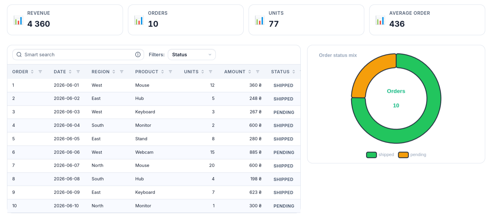

# Grid View Spec

[](https://pypi.org/project/grid-view-spec/)
[](https://pypi.org/project/grid-view-spec/)
[](https://alpiua.github.io/grid-view-spec/)
[](https://github.com/alpiua/grid-view-spec-demo)
[](LICENSE)

**Declarative dashboard architecture for Python, Django, FastAPI, Starlette, and Headless AI runtimes.**

Compose complex data interfaces — tables, filters, KPI metric strips, ECharts, forms, and PDF/XLSX export pipelines — from a single, strictly typed **`GridViewSpec`** Python contract. The host application keeps 100% ownership of database queries, permissions, and business logic; GridViewSpec validates and renders the structural layout tree.

**[Documentation](https://alpiua.github.io/grid-view-spec/)** · **[Interactive Live Demo](https://github.com/alpiua/grid-view-spec-demo)** · **[MCP Server](https://alpiua.github.io/grid-view-spec/tools/mcp-server/)** · **[PyPI Package](https://pypi.org/project/grid-view-spec/)**

---



---

## Key Principles & Architecture

GridViewSpec establishes a clean, non-leaky architectural boundary between host data and declarative UI structure:

| Layer | Owner | Responsibilities |
|-------|-------|------------------|
| **Data & Policy** | **Host Application** | ORM/SQL querysets, authorization, multi-tenancy, row serialization, and custom business rules. |
| **Contract** | **`GridViewSpec`** | Declarative layout tree (`GridViewArea`), block definitions (`GridViewTable`, `GridViewToolbar`, `GridViewKpi`, …), validation (`validate_spec`), and canonical JSON wire format. |
| **Renderer & Runtime** | **GridViewSpec Engine** | Semantic HTML compilation, design tokens (`--cm-*`), client hydration (`gridviewspec.min.js`), column visibility modals, debounced filtering, and PDF/XLSX export. |

---

## Spec Hierarchy & Structure

A `GridViewSpec` consists of two primary parts: a collection of reusable **blocks** and an **area tree layout** that positions them on the screen:

```text
GridViewSpec (id="orders_dashboard")
├── blocks: Tuple[GridViewBlock, ...]
│   ├── GridViewTable        ── Table columns, sorting, pagination, and backend ("simple" | "ag_grid")
│   ├── GridViewToolbar      ── Search input, quick filter presets, and action buttons
│   ├── GridViewFilters      ── Debounced dropdowns, faceted filters, and multiselect menus
│   ├── GridViewKpi          ── KPI metric cards and aggregate stat strips
│   ├── GridViewCharts       ── Interactive ECharts (donut, line, bar, time-series)
│   ├── GridViewForm         ── Declarative input forms, fieldsets, and validation rules
│   ├── GridViewHeader / Nav ── Breadcrumbs, titles, entity badges, and section navigation
│   └── GridViewTabs / Modal ── Portaled drawers, tabs, and overlay dialogs
└── layout: GridViewLayout
    └── root: GridViewArea   ── Recursive tree of areas (type="stack" | "split" | "grid" | "tabs" | "scroll")
```

---

## Multi-Backend Support

GridViewSpec is **framework-agnostic**. The same typed Python spec can be rendered across multiple host frameworks or consumed headlessly:

### 1. Framework Render Backends

| Backend | PyPI Extra | Ideal For | Key Mechanism |
|---------|------------|-----------|---------------|
| **Django** | `[django]` | Server-rendered Django web apps & admin portals | Template tags (``), ORM `GridPreference` models, and built-in export routes. |
| **FastAPI** | `[fastapi]` | Modern async API & microservice web interfaces | `mount_page(router, ...)` helpers, dependency injection, and ASGI static file mounts. |
| **Starlette** | `[starlette]` | Lightweight async Python applications | `page_route(spec, rows)` handlers and ASGI static serving. |
| **Jinja2** | Core (`jinja2`) | Flask, custom template pipelines, static generation | Standalone `render_grid_view_spec(spec, rows, host=...)` with zero Django dependencies. |
| **Headless / JSON** | Core / `[mcp]` | AI coding agents, microservices, mobile APIs | Pure JSON wire contracts (`spec_to_wire` / `spec_from_wire`) and RFC 6902 JSON patch mutations. |

### 2. Table Engines (`GridViewTable.backend`)

* **`backend="simple"`**: Lightweight, accessible, server-rendered standard HTML `<table>`. Includes client-side sorting, column visibility/pinning modals (SortableJS), smart search syntax, and zero heavy JS dependencies (10–100 rows/page).
* **`backend="ag_grid"`**: High-throughput virtualized data canvas for large datasets (1,000 to 100,000+ records) with infinite scrolling and asynchronous streaming JSON feeds.

---

## Installation & Extras

Install the core package from PyPI, or include modular extras tailored to your stack:

```bash
# Standard Django application (template tags, routes & UI runtime)
pip install "grid-view-spec[django]"

# Model Context Protocol (MCP) server for AI coding assistants (Claude, Cursor, Antigravity)
pip install "grid-view-spec[mcp]"

# Async FastAPI or Starlette integration
pip install "grid-view-spec[fastapi]"
# or:
pip install "grid-view-spec[starlette]"

# Document export backends
pip install "grid-view-spec[pdf]"     # WeasyPrint PDF generator
pip install "grid-view-spec[xlsx]"    # XlsxWriter Excel generator

# Complete bundle (all backends, exporters, and MCP tooling)
pip install "grid-view-spec[django,fastapi,mcp,pdf,xlsx]"
```

---

## Quick Start Examples

### 1. Django Integration

**`views.py`**
```python
from django.shortcuts import render
from grid_view_spec import GridViewSpec, validate_spec
from grid_view_spec.types import (
    GridViewArea,
    GridViewColumn,
    GridViewLayout,
    GridViewTable,
)

def orders_dashboard(request):
    # Host owns data loading and authorization
    rows = [
        {"id": 1, "customer": "Acme Corp", "amount": 1250.0, "status": "SHIPPED"},
        {"id": 2, "customer": "Globex", "amount": 420.5, "status": "PENDING"},
    ]

    # Declare the UI structure
    spec = GridViewSpec(
        id="orders_view",
        blocks=(
            GridViewTable(
                id="orders_table",
                backend="simple",
                columns=(
                    GridViewColumn(id="id", label="#", field="id", width="60px"),
                    GridViewColumn(id="customer", label="Customer", field="customer"),
                    GridViewColumn(id="amount", label="Total", field="amount", type="currency"),
                    GridViewColumn(id="status", label="Status", field="status"),
                ),
            ),
        ),
        layout=GridViewLayout(root=GridViewArea(id="root", blocks=("orders_table",))),
    )

    # Validate the contract before rendering
    result = validate_spec(spec)
    assert result.ok, [d.message for d in result.diagnostics]

    return render(request, "orders.html", {"spec": spec, "rows": rows})
```

**`orders.html`**
```django

<!DOCTYPE html>
<html>
<head>
  
</head>
<body>
  <main>
    
  </main>
  
</body>
</html>
```

### 2. FastAPI / Starlette Integration

```python
from fastapi import FastAPI
from grid_view_spec import GridViewSpec
from grid_view_spec.backends.fastapi import mount_page
from grid_view_spec.types import GridViewArea, GridViewColumn, GridViewLayout, GridViewTable

app = FastAPI()

spec = GridViewSpec(
    id="fastapi_grid",
    blocks=(
        GridViewTable(
            id="items_table",
            backend="simple",
            columns=(
                GridViewColumn(id="name", label="Item Name", field="name"),
                GridViewColumn(id="qty", label="Quantity", field="qty", type="number"),
            ),
        ),
    ),
    layout=GridViewLayout(root=GridViewArea(id="root", blocks=("items_table",))),
)

rows = [{"name": "Widget A", "qty": 42}, {"name": "Widget B", "qty": 17}]

# Mounts the rendered HTML page endpoint and serves static assets
mount_page(app, "/dashboard", spec=spec, rows=rows)
```

### 3. Headless JSON & AI Agent Workflows

```python
from grid_view_spec.validate import spec_from_wire, spec_to_wire, validate_spec

# Deserializing pure wire JSON from an AI agent, database, or microservice
spec = spec_from_wire(raw_json_dict)

# Strict structural & security policy validation
result = validate_spec(spec)
if result.ok:
    canonical_wire = spec_to_wire(spec)
```

---

## AI Assistant & Model Context Protocol (MCP)

GridViewSpec includes an official **Model Context Protocol (MCP)** server (`gridviewspec-mcp`) allowing AI coding assistants (Claude Code, Cursor, Windsurf, Antigravity, Copilot) to discover component schemas, validate layouts, and apply atomic patches without hallucinations:

```bash
# Add to your editor's .mcp.json or Claude Desktop config
{
  "mcpServers": {
    "gridviewspec-mcp": {
      "command": "gridviewspec-mcp"
    }
  }
}
```

Available MCP Tools:
* `gridview_catalog` — Introspects available blocks, area types, host backends, and protocols.
* `gridview_schema` — Returns full JSON Schema definitions for any block or type.
* `gridview_validate` — Validates candidate specs and returns actionable diagnostics.
* `gridview_normalize` — Normalizes and resolves default properties into canonical JSON.
* `gridview_examples` — Returns reference production fixtures (split panes, charts, faceted tables).
* `gridview_apply_patch` — Applies atomic RFC 6902 JSON patch operations with pre/post validation.

---

## Documentation Index

* 📖 **Official Documentation Website:** **[https://alpiua.github.io/grid-view-spec/](https://alpiua.github.io/grid-view-spec/)**
* 🎮 **Interactive Live Demo Showcase:** **[https://github.com/alpiua/grid-view-spec-demo](https://github.com/alpiua/grid-view-spec-demo)**
* 📦 **PyPI Package Repository:** **[https://pypi.org/project/grid-view-spec/](https://pypi.org/project/grid-view-spec/)**

Comprehensive guides, references, and integration walkthroughs are available online at **[alpiua.github.io/grid-view-spec](https://alpiua.github.io/grid-view-spec/)** and in the local **[`docs/`](docs/)** directory:

### 🚀 Getting Started & Concepts
* **[Getting Started Guide](docs/getting-started.md)** — Quick walkthrough for your first page.
* **[Architecture & Overview](docs/concepts/overview.md)** — Core design principles and rendering pipeline.
* **[Data vs. Spec Boundary](docs/concepts/data-vs-spec.md)** — Who owns what: host data vs. UI contracts.
* **[Host Backends](docs/concepts/backends.md)** — Comparison of Django, Jinja2, Starlette, and FastAPI runtimes.

### 📐 Specification & Layout
* **[GridViewSpec Contract](docs/spec/index.md)** — Root specification fields, configuration, and metadata.
* **[Area Tree Layout](docs/spec/layout.md)** — Multi-pane layouts, nested split grids, stacks, and tabs.
* **[Validation Engine](docs/spec/validation.md)** — Structural integrity checks, diagnostic codes, and policy enforcement.

### 🧩 Blocks & Components
* **[Block Catalog](docs/blocks/index.md)** — Complete catalog of all supported UI primitives.
* **[Tables & Columns](docs/tables/index.md)** — Simple HTML tables, AG Grid, renderers, and formatters.
* **[Toolbars, Search & Actions](docs/blocks/toolbar-filters-actions.md)** — Smart search query syntax, action menus, and presets.
* **[Faceted Filters](docs/filtering/semantics.md)** — Debounced dropdowns, multiselect, date ranges, and facet counters.
* **[KPI & Metric Strips](docs/visualization/kpi-charts.md)** — Summary metric cards and aggregate trend badges.
* **[ECharts Visualizations](docs/visualization/kpi-charts.md)** — Donut charts, line trends, and interactive time-series.
* **[Forms & Fieldsets](docs/blocks/forms.md)** — Form blocks, conditional fields, and input validators.
* **[Overlays, Modals & Tabs](docs/blocks/overlays-tabs.md)** — Portaled modal dialogs, drawers, and tab navigation.

### 🔌 Framework Integrations
* **[Host Contract Protocol](docs/integration/host-contract.md)** — The `GridViewHost` protocol and route requirements.
* **[Django Integration](docs/integration/django.md)** — Setting up `INSTALLED_APPS`, URL routing, and templates.
* **[HTMX & Partial Swaps](docs/integration/htmx-assets.md)** — Fragment rendering and dynamic DOM swapping.
* **[CSS Theming & Tokens](docs/integration/theming.md)** — Customizing color themes, borders, and typography (`--cm-*`).
* **[JavaScript Runtime](docs/integration/runtime.md)** — Lifecycle of `gridviewspec.min.js` and client scoping.

### 📄 Export Pipelines
* **[Export Page Pattern](docs/export/page-pattern.md)** — Unified request-aware data loaders for UI and exports.
* **[PDF Export (WeasyPrint)](docs/export/pdf.md)** — Generating pixel-perfect PDF documents from table specs.
* **[XLSX Export (Excel)](docs/export/xlsx.md)** — Exporting formatted, styled spreadsheets matching active filters.

### 🛠️ Reference & Tools
* **[Python Types Reference](docs/reference/python-types.md)** — Complete public type import map.
* **[Template Tags Reference](docs/reference/template-tags.md)** — Django template tags and asset loaders.
* **[MCP Server Guide](docs/tools/mcp-server.md)** — Setting up and using the AI Agent MCP server.
* **[JSON Schema Reference](docs/reference/json-schema.md)** — Raw JSON schema definitions for wire payloads.

---

## Development

```bash
# Install dependencies with development & test tools
uv sync

# Run the comprehensive test suite
uv run pytest -q

# Run strict static type checking
uv run basedpyright --warnings src/grid_view_spec tests

# Build and verify frontend assets
cd frontend && npm run build && npm run typecheck

# Build and verify local documentation
uv run mkdocs build --strict
```

---

## License

MIT License — see the [LICENSE](LICENSE) file for details.

