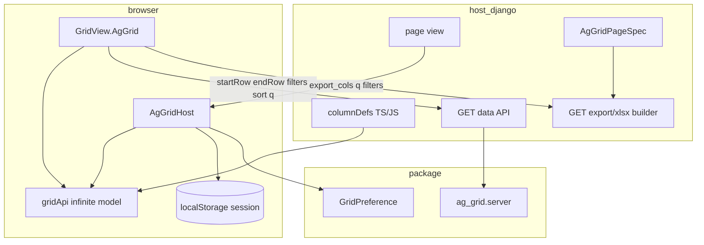
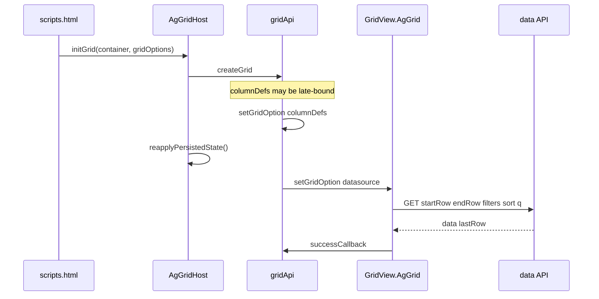
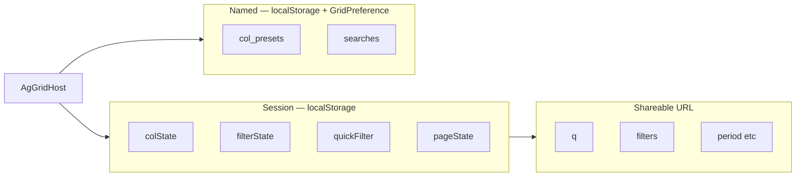

# AG-Grid integration

Extension layer for [AG Grid Community](https://www.ag-grid.com/) 31.x in Django: toolbar,
`AgGridHost`, session persistence, infinite-model HTTP contract, server XLSX sync.

| Component | Owner |
|-----------|-------|
| `gridApi`, `columnDefs`, cell renderers, filter components | Host |
| JSON data API, ORM field maps, row serialization | Host |
| `AgGridPageSpec`, XLSX column resolution | Host (spec) + package (helpers) |
| `AgGridHost`, toolbar, modal, search bar | Package |
| `GridView.AgGrid`, `django_grid_view.ag_grid` | Package |
| `GridPreference` (named presets, saved searches) | Package model; host mounts save URL |

## Architecture



## Infinite data API contract

### Response

```json
{
  "data": [
    { "id": 1, "patient_code": "abc", "doctors": "Dr. Ada" }
  ],
  "lastRow": 45000
}
```

| Field | Type | Rule |
|-------|------|------|
| `data` | `object[]` | One object per row; keys = `columnDefs[].field` / `colId` |
| `lastRow` | `int` | Total row count after server filters (not page size) |

Empty keys may be omitted in sparse rows; export uses `AgGridPageSpec` column order, not `Object.keys(row)`.

### Request query parameters

| Param | Source | Type | Purpose |
|-------|--------|------|---------|
| `startRow` | `createInfiniteDatasource` | int | Block start (0-based) |
| `endRow` | `createInfiniteDatasource` | int | Block end (exclusive) |
| `filters` | AG Grid `filterModel` | JSON object | Server-side column filters |
| `sort` | AG Grid sort model | JSON array | Server-side sort |
| `q` | Search bar (`manager._searchText`) | string | Quick search |
| `cols` | Visible columns | comma-separated | Multi-column search scope |
| `export_cols` | `syncExportHref` only | comma-separated | XLSX column ids (not sent on infinite fetch) |
| `action` | Host | string | e.g. `dictionary` for set-filter values |
| `field` | Host | string | Column id when `action=dictionary` |

Host-specific params (period, tab, …) pass via `getExtraParams` in JS and replay in export builders.

### Filter JSON (`filters` param)

Set filter (custom or AG set):

```json
{ "status": { "values": ["Active", "Pending"] } }
```

Text filter:

```json
{ "patient_code": { "filterType": "text", "type": "contains", "filter": "abc" } }
```

Supported text `type` values in `apply_grid_filters`: `contains`, `notContains`, `equals`, `notEqual`, `startsWith`, `endsWith`.

Pass `format_filter_value(col_id, display_value)` when DB values differ from filter labels.

### Sort JSON (`sort` param)

```json
[{ "colId": "registered_esoz", "sort": "desc" }]
```

Only the first entry is applied; host supplies `field_map: colId → ORM path`.

### Dictionary action

```
GET /api/products/?action=dictionary&field=record_match_status
→ { "values": ["…", "…"] }
```

Wire `dictionaryUrl` in `gridOptions.context`.

### Python: `InfiniteGridParams`

```python
from django_grid_view.ag_grid import (
    apply_grid_filters,
    apply_grid_sort,
    parse_infinite_params,
)

params = parse_infinite_params(request)  # default_page_size=100
# params.start_row, params.end_row, params.search_query
# params.visible_cols, params.filters, params.sort_model
# params.action, params.action_field
```

## AgGridPageSpec contract

```python
from django_grid_view.types import AgGridColumnSpec, AgGridPageSpec

PRODUCTS_PAGE_SPEC = AgGridPageSpec(
    grid_id="products",
    columns=(
        AgGridColumnSpec("sku", "SKU"),
        AgGridColumnSpec("name", "Name"),
        AgGridColumnSpec("cost", "Cost", hide=True),
    ),
)
```

| `AgGridColumnSpec` field | Default | Meaning |
|--------------------------|---------|---------|
| `col_id` | — | AG Grid `colId` / row key |
| `label` | — | XLSX header, UI labels |
| `hide` | `False` | Default visibility when no live grid snapshot |
| `exportable` | `True` | Included in export resolution |

| `resolve_export_columns(spec, request)` input | Result |
|-----------------------------------------------|--------|
| `export_cols=a,b,c` (subset of exportable ids) | Those ids in request order |
| `export_cols` absent or empty | All columns with `exportable=True` and `hide=False` |

Constant: `EXPORT_COLS_PARAM = "export_cols"`.

## JavaScript contract

Load assets once per page (base template, outside HTMX swaps):

```django


```

AG Grid Community + SortableJS from CDN in the same base template.

### Boot sequence



```javascript
manager.gridApi.setGridOption("columnDefs", ProductColumns);
manager.reapplyPersistedState();
manager.gridApi.setGridOption(
  "datasource",
  GridView.AgGrid.createInfiniteDatasource({
    url: "/api/products-data/",
    manager: manager,
    getExtraParams: () => ({ period: "2025-01" }),
    onLastRow: (count) => { /* toolbar counter */ },
  })
);
```

### `gridOptions.context`

| Key | Default | Contract |
|-----|---------|----------|
| `gridId` | — | Equals `grid_id` in `scripts.html` and `GridPreference.grid_id` |
| `storageScope` | — | Suffix: `agGridState_{gridId}__{storageScope}` |
| `syncUrlState` | `true` | `history.replaceState` for `q`, `filters`, `urlPageStateKeys` |
| `urlPageStateKeys` | keys from `getPageState()` | Domain params mirrored to URL |
| `getPageState()` | — | Returns `{ period: ["2024-01"], … }` for filter bar |
| `applyPageState(state, opts)` | — | Restores domain filter bar |
| `onFilterChanged(manager)` | — | Hook after AG filter change (export sync) |
| `onDataReload(manager)` | — | Hook after manual search reload; otherwise export links are synced automatically |
| `restoreQuickFilter` | `true` | Restore search from localStorage when URL has no `q` |
| `dictionaryUrl` | — | Base URL for set-filter dictionary fetch |

### Export href sync

```javascript
GridView.AgGrid.syncExportHref(linkEl, manager, {
  getExtraParams: () => ({ period: "2025-01" }),
  exportColumns: true,  // writes export_cols (default true)
});
```

`syncExportHref` accepts either a runtime handle or a grid id string. `syncExportLinks`
updates every `[data-cm-export-sync][data-cm-grid-id="…"]` link for the grid.

```javascript
GridView.AgGrid.syncExportHref(linkEl, "products", {
  getExtraParams: () => ({ period: "2025-01" }),
});
GridView.AgGrid.syncExportLinks("products");
```

Call on first load and on filter/column/search changes; invoke again in link `onclick` before navigation.

| `syncExportHref` option | Default | Effect |
|-------------------------|---------|--------|
| `exportColumns` | `true` | Visible column ids → `export_cols` |
| `includeVisibleCols` | `false` | Also set `cols` on export URL |

## Page wiring

### Template

```django


<div id="products-grid" class="ag-theme-quartz-dark"></div>


```

### Host view

```python
import json
from django_grid_view.models import GridPreference

def products_view(request):
    presets, searches = {}, []
    if request.user.is_authenticated:
        pref = GridPreference.objects.filter(user=request.user, grid_id="products").first()
        if pref:
            presets, searches = pref.col_presets, pref.searches
    return render(request, "products.html", {
        "ag_grid_presets": json.dumps(presets),
        "ag_grid_searches": json.dumps(searches),
    })
```

### Save preferences URL (host-mounted)

Package ships `save_grid_settings` view; host registers it with name **`api_grid_preferences`**:

```python
from django_grid_view.views import save_grid_settings

urlpatterns = [
    path("api/grid/preferences/", save_grid_settings, name="api_grid_preferences"),
]
```

### XLSX link

```django
<a href=""
   id="products-xlsx"
   onclick="syncProductsExport();">XLSX</a>
```

```python
register_xlsx_builder("products", build_products_xlsx_report, filename_fn=…)
```

## Persistence

Column settings UI (`modal.html`, presets, drag/pin) is implemented once in `grid-view.js` as `GridView.ColumnSettings`. `AgGridHost` delegates to it after `gridApi` init; Simple Table uses the DOM table adapter. See [Simple Table — column settings](simple-table.md#column-settings).

Three storage layers:



| Layer | Key / model | Contents |
|-------|-------------|----------|
| Session | `agGridState_{grid_id}` or `…__{storageScope}` | `colState`, `filterState`, `quickFilter`, `pageState` |
| Named presets | `GridPreference.col_presets` | User-named `getColumnState()` snapshots |
| Saved searches | `GridPreference.searches` | Quick-search bookmark strings |

Session layout auto-saves on column/filter/search/domain-filter changes. Named presets and searches save via `POST api_grid_preferences`. Last column layout is not auto-persisted to Django.

### Session JSON

```json
{
  "colState": [{ "colId": "name", "width": 220, "hide": false }],
  "filterState": { "doctors": { "values": ["Dr. Ada"] } },
  "quickFilter": "uuid-fragment",
  "pageState": { "period": ["2024-01", "2024-02"] }
}
```

### Restore priority

| Field | Source order |
|-------|--------------|
| Quick search | URL `?q=` → localStorage |
| AG filters | URL `?filters=` (JSON) → localStorage |
| Domain filters | URL keys in `urlPageStateKeys` → `pageState` in localStorage |

Cross-tab: `storage` event on session key reapplies state and purges infinite cache.

See [Saved preferences](preferences.md) for `POST` body schema.

## Integration checklist

| # | Requirement |
|---|-------------|
| 1 | AG Grid + Sortable CDN in base template |
| 2 | `` once per page |
| 3 | `grid_id` = `context.gridId` = `GridPreference.grid_id` |
| 4 | `ag_grid_presets`, `ag_grid_searches` in view context |
| 5 | `api_grid_preferences` → `save_grid_settings`; `migrate django_grid_view` |
| 6 | Data API: `{ data, lastRow }` + `parse_infinite_params` |
| 7 | XLSX: `AgGridPageSpec` + `resolve_export_columns` + `syncExportHref` |
| 8 | Late `columnDefs`: `reapplyPersistedState()` before datasource |

## Runtime constraints

| Rule | Detail |
|------|--------|
| HTMX | AG Grid CDN and bundle load outside swapped fragments |
| Search | Infinite model uses server `q`; not `quickFilterText` |
| Export | Server XLSX via registered builder — [guides/xlsx-export.md](guides/xlsx-export.md) |
| License | AG Grid Community 31.x APIs only |

## Filtered KPI strip

```django

```

```javascript
GridView.bindGridKpis({ gridAdapter: GridView.createAgGridAdapter(gridApi) });
```

See [Charts and KPIs](charts-and-kpis.md).

## Reference: host integration

| Layer | Module |
|-------|--------|
| Spec | `dashboard/items/ag_grid/spec.py` |
| API | `ag_grid/api.py`, `queryset.py`, `fields.py`, `serializers.py` |
| XLSX | `export.py` — builder key `items_grid` |
| Columns | your frontend `columnDefs` |
| Templates | `_grid_options.html`, `_grid_scripts.html`, `_toolbar.html` |

Typical config: `grid_id="items"`, `storageScope="items-grid"`, data endpoint `GET /api/items/data/`.

## API reference

- [Python types — AG-Grid](reference/python-types.md#ag-grid)
- [JavaScript API](reference/javascript.md)
- [Template tags](reference/template-tags.md#ag-grid-helpers)
- [Saved preferences](preferences.md)
