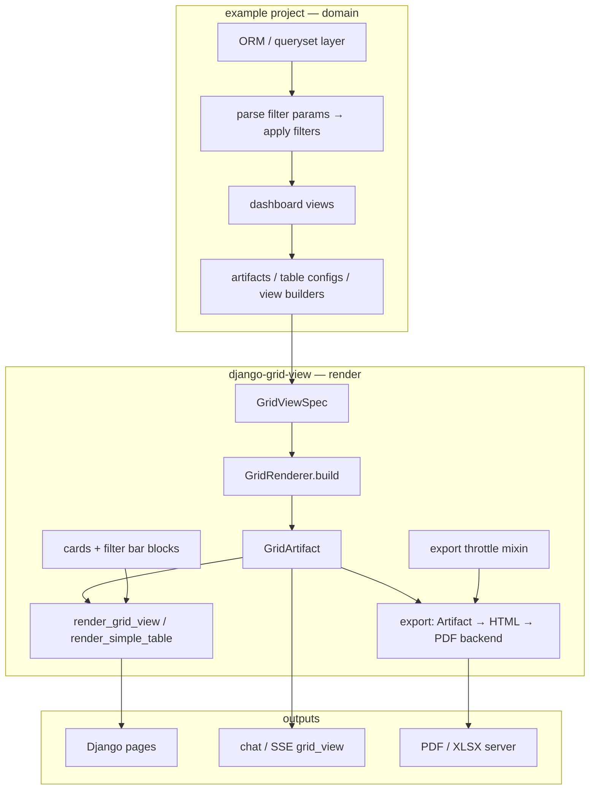

# Architecture

This document summarizes how **django-grid-view** is structured and how a host Django
project integrates with it.

## Purpose

`django-grid-view` provides reusable **grid view** rendering for Django applications:

1. **Simple Table** — server-rendered HTML tables (sort, search, export)
2. **AG-Grid** — HTMX-safe lifecycle, preferences, infinite row model helpers
3. **Grid View** — unified KPI cards, ECharts charts, tabular data, optional filter bar and card grids
4. **Export** (optional extras) — artifact → HTML (Jinja2) → PDF (WeasyPrint), static chart PNG, throttle helpers


## Target integration (example project)

A typical dashboard keeps **domain data and queries** in the host app and passes
**structure + rows** into the package renderer. Chat, HTML pages, and PDF export are
three consumers of the same `GridArtifact`, not three parallel render paths.



**Single contract:** `GridViewSpec + rows[] → build_artifact_from_view()` (or
`GridRenderer.build`). The host owns labels, URLs, filter options, and ORM filters; the
package owns widgets, templates, `grid-view.min.js`, and export adapters.

### Responsibility split

| Layer | django-grid-view | example project (host) |
|-------|------------------|----------------------|
| CSS, toolbar, KPI, chips, cards | `grid-view.css`, partials, `CardGridSpec`, `FilterBarSpec` | domain labels, tones, layout blocks |
| Tables | `Column`, `SimpleTableConfig`, `ColumnSpec` | domain columns, row serializers |
| Charts / KPI | `ChartSpec`, `KpiSpec`, ECharts bind | builders from aggregated querysets |
| Server XLSX | declarative `XlsxReport` + xlsxwriter (openpyxl optional) | register host `…/export/xlsx/?builder=` builders |
| Server PDF | artifact → HTML + PDF backend plugins | rows + thin view wrappers |
| Inline edit (hook) | `EditActionSpec` + JS callback | PATCH endpoints, validation, policy |
| Rate limit | `ExportThrottleMixin` / decorator | URL wiring, limits per endpoint |
| Filter / search UI | `FilterBarSpec`, widgets, URL/DOM sync, `AgGridHost` session state | options + `FilterState` → ORM |
| Filter / search data | — | models, care-type lists, period helpers |
| AG-Grid infinite API | `parse_infinite_params`, `apply_grid_filters`, `apply_grid_sort` | ORM queryset, field maps, row serializer |
| AG-Grid export columns | `AgGridPageSpec`, `resolve_export_columns` | XLSX builder replays data API |
| AG-Grid client wiring | `GridView.AgGrid`, `AgGridHost`, `scripts.html` | `columnDefs`, data API URL, page hooks |

## AG-Grid mode

Large interactive grids: host supplies `columnDefs` and JSON data API; package supplies
toolbar, `AgGridHost`, `GridView.AgGrid`, and `django_grid_view.ag_grid` server helpers.

Contract and diagrams: [AG-Grid integration](ag-grid.md).

## Layer model

```
Data (Python)          Spec (declarative)        Render (adapters)
─────────────────────────────────────────────────────────────────
rows: list[dict]   +   GridViewSpec          →   GridArtifact
                                               ├─ SimpleTableConfig
                                               ├─ AgGridColumnDefs
                                               ├─ ResolvedKpi[]
                                               ├─ ChartRuntimeConfig[]
                                               ├─ CardGridSpec / FilterBarSpec (optional)
                                               └─ export HTML / PDF (optional)
```

**Rule:** Numbers always come from Python `rows`. The LLM (chat visualizer) supplies structure only.

### Ownership boundaries

| Layer | Responsibility |
|-------|----------------|
| **Package** | Types, parser, `GridRenderer`, adapters, static JS bundles, CSS, i18n, export/throttle |
| **Consumer app** | `rows` (SQL/ORM), domain labels/URLs, AG-Grid instance, filter → queryset |
| **Chat / LLM** | `GridViewSpec` JSON only; no row data or KPI numbers |

The package **does not** instantiate AG-Grid. KPI numbers come from Python `rows` only.

## ChartSpec and AG-Grid

| `data_source` | Behavior |
|---------------|----------|
| `static` | Use `rows` from `GridArtifact` |
| `grid_filtered` | Visible rows from AG-Grid via `GridView.createAgGridAdapter` |

See [JavaScript API](reference/javascript.md).

## Front-end bundle

### PyPI vs Node

| Who | Node required? | Why |
|-----|----------------|-----|
| **Production host** (`pip install`) | No | Wheel ships pre-built `.min.js` under `static/` |
| **Host-app developer** | No | Django `` / `collectstatic` only |
| **django-grid-view maintainer** | Yes (local or CI) | `frontend/` → esbuild → committed artifacts |

Node is **not** in `[project.dependencies]`. Consumers never run `npm install`.

### What ships in the wheel

| File | Role |
|------|------|
| `grid-view.min.js` | Main IIFE — Simple Table, KPI, charts, filter bar, search (`GridView`) |
| `column-settings.min.js` | Column presets modal (Sortable); loaded with `` |
| `ag-grid-cdn.js` | Loads AG-Grid community CDN (pinned version) |
| `ag-grid-host.js` | `AgGridHost` class (toolbar, persistence, export sync) |
| `ag-grid-boot.js` | Reads `.cm-ag-grid-boot-config` JSON; HTMX `registerBoot` |
| `ag-grid-smart-filter.js` | Optional AG-Grid filter plugin (styles in `grid-view.css`) |
| `ag-grid-advanced-search.js` | Smart quick-filter factory |
| `ag-grid-tooltip.js` | Custom tooltip component |
| `chart-static-boot.js` | ECharts poll + HTMX `afterSwap` for static charts |
| `grid-artifact-boot.js` | Boot `[data-cm-grid-artifact-boot]` → `GridView.init` |
| `kpi-static-boot.js` | Static KPI strip initializer |
| `grid-view.css` / `.min.css` | Table, toolbar, KPI, smart-filter chrome (built from `frontend/styles/`) |

Source lives in `frontend/src/` (TypeScript + esbuild). CI runs `npm run build`, `typecheck`, `lint`, and `npm run test:conformance` (Python↔JS filter/search/KPI parity via shared JSON fixtures).

Python types in `types/chart_bind.py` and `types/kpi_bind.py` define wire contracts mirrored in `frontend/src/types/`.

Host apps import public types from `django_grid_view.types` ([Python types](reference/python-types.md)); `py.typed` is shipped in the wheel.

### Load order (Simple Table / Grid View pages)

```django
   {# once per page #}
```

`bundle.html` injects, in order:

1. Inline boot — `window.GridView.preferencesUrl`, `window.GridViewI18n`
2. `grid-view.min.js`
3. `column-settings.min.js`

Inclusion tags (`render_simple_table`, `render_grid_view`, …) set `load_assets=True` on first use and include `bundle.html` when the host did not call `` already.

Optional globals the host may define **before** the bundle:

| Global | Purpose |
|--------|---------|
| `window.echarts` | Required for charts (CDN in host base template) |
| `window.agGrid` | Loaded by `ag-grid-cdn.js` on AG-Grid pages |
| `window.Sortable` | Column drag-reorder (host base template) |
| `window.CMPeriodFilter` | Optional period widget hook for filter bar |

Page-specific boot scripts (`chart-static-boot.js`, `grid-artifact-boot.js`) are included by chart/grid templates — no inline business logic in HTML.

### AG-Grid page load order

Via ``:

1. Inline `window.__djangoGridViewCdn.agGridUrl` (pinned AG-Grid CDN)
2. `ag-grid-cdn.js`
3. `ag-grid-host.js`
4. JSON boot config (`.cm-ag-grid-boot-config`)
5. `ag-grid-boot.js`

Plugin partials add their static JS/CSS (`smart_filter.html`, etc.).

See [JavaScript API](reference/javascript.md) for runtime APIs and [AG-Grid integration](ag-grid.md) for host wiring.

### Python↔JS parity (maintainers)

Filter and smart-search semantics are locked by shared fixtures:

- `tests/fixtures/filter_conformance.json`
- `tests/fixtures/smart_search_conformance.json`

pytest (`tests/test_filter_conformance.py`) and `npm run test:conformance` in `frontend/` must agree.

KPI **aggregates** (compare `rawValue` only — formatting differs by locale):

- `tests/fixtures/kpi_conformance.json`
- Python: `resolve_kpis()` in `render/kpi.py`
- JS: `resolveKpis()` in `frontend/src/grid-view/kpi.ts`
- Included in `npm run test:conformance`

Chart **semantic** data (categories, series values, pie slices) uses:

- `tests/fixtures/chart_resolve_conformance.json`
- Python: `resolve_chart_data()` in `render/charts.py`
- JS: `resolveChartData()` in `frontend/src/grid-view/resolve-chart.ts`
- `npm run test:chart-conformance`

Matplotlib PDF export reads `ResolvedChartData` only — no direct row parsing in renderers.

## Internationalization

Package chrome uses Django `locale/` (en + uk) and `window.GridViewI18n` injected before the bundle.

## Package modules

| Module | Responsibility |
|--------|----------------|
| `types/` | Enums, specs, JSON parsing (`filters`, `cards`, wire types, `AgGridPageSpec`) |
| `ag_grid/` | Infinite API param parsing, filter/sort helpers, export column resolution |
| `render/` | `GridRenderer`, KPI/chart resolution, `simple_table_context`, `grid_preferences` |
| `tables.py` | `Column`, `SimpleTableConfig` |
| `export/` | HTML report, PDF/XLSX backends, static charts, throttle, `hrefs` |
| `templatetags/` | Inclusion tags only (`render_grid_view`, `render_simple_table`, …) |
| `models.py` | `GridPreference` |
| `templates/django_grid_view/` | Thin templates + JSON boot configs + `` script tags |
| `static/django_grid_view/` | Pre-built `.min.js`, `grid-view.min.css` (non-min artifacts for debug) |

## Server PDF export

One HTTP entry for all host apps — **no per-page PDF views in the consumer**:

```
GET /api/export/pdf/?builder=<key>&<same query as the HTML page>
  → register_pdf_builder(key)(request) → GridArtifact
  → artifact_to_html(artifact)  # layout.blocks + artifact.table + chart PNGs
  → PdfBackend (WeasyPrint) → bytes
```

Host projects mount `export_pdf` / `export_xlsx` and set `DJANGO_GRID_VIEW_EXPORT_*_URL` — see [Getting started](getting-started.md).

| Layer | Owner |
|-------|--------|
| ORM → rows, `SimpleTableConfig`, `GridArtifact` | Host (`register_pdf_builder`) |
| HTML assembly, throttle, WeasyPrint | Package |

**Customize layout:** optional Jinja `template` on `register_pdf_builder` — not `GridViewSpec` in the URL (numbers must be rebuilt server-side).

See [PDF export guide](guides/pdf-export.md) for registration, `export_pdf_href`, block types, and troubleshooting.

## Optional dependencies

| Extra | Install | Use |
|-------|---------|-----|
| `[pdf]` | `pip install django-grid-view[pdf]` | WeasyPrint PDF export |
| `[static-charts]` | `pip install django-grid-view[static-charts]` | Matplotlib PNG for PDF/embed |

Dev environments often pin the same packages so type checkers resolve imports; production hosts install only the extras they need.

## Related documents

- [Grid View artifacts](grid-view-artifacts.md)
- [AG-Grid integration](ag-grid.md)
- [GridViewSpec reference](reference/grid-view-spec.md)
- [Charts and KPIs](charts-and-kpis.md)
- [Chat visualizer](guides/chat-visualizer.md)
