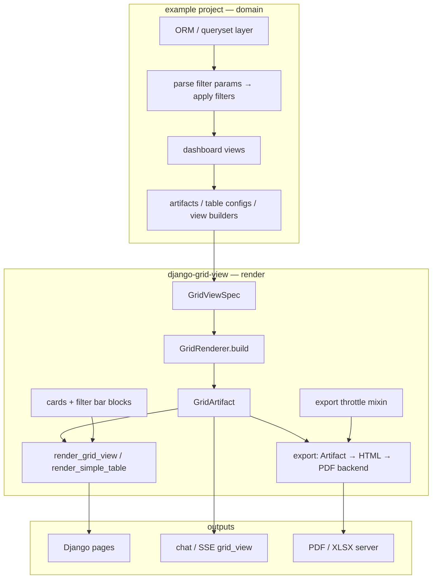

# Architecture

This document summarizes how **django-grid-view** is structured and how a host Django
project integrates with it.

## Purpose

`django-grid-view` provides reusable **grid view** rendering for Django applications:

1. **Simple Table** — server-rendered HTML tables (sort, search, export)
2. **AG-Grid** — HTMX-safe lifecycle, preferences, infinite row model helpers
3. **Grid View** — unified KPI cards, ECharts charts, tabular data, optional filter bar and card grids
4. **Export** (optional extras) — artifact → HTML (Jinja2) → PDF (WeasyPrint), static chart PNG, throttle helpers


## Target integration (example project)

A typical dashboard keeps **domain data and queries** in the host app and passes
**structure + rows** into the package renderer. Chat, HTML pages, and PDF export are
three consumers of the same `GridArtifact`, not three parallel render paths.



**Single contract:** `GridViewSpec + rows[] → build_artifact_from_view()` (or
`GridRenderer.build`). The host owns labels, URLs, filter options, and ORM filters; the
package owns widgets, templates, `grid-view.js`, and export adapters.

### Responsibility split

| Layer | django-grid-view | example project (host) |
|-------|------------------|----------------------|
| CSS, toolbar, KPI, chips, cards | `table.css`, partials, `CardGridSpec`, `FilterBarSpec` | domain labels, tones, layout blocks |
| Tables | `Column`, `SimpleTableConfig`, `ColumnSpec` | domain columns, row serializers |
| Charts / KPI | `ChartSpec`, `KpiSpec`, ECharts bind | builders from aggregated querysets |
| Server XLSX | declarative `XlsxReport` + xlsxwriter (openpyxl optional) | register host `…/export/xlsx/?builder=` builders |
| Server PDF | artifact → HTML + PDF backend plugins | rows + thin view wrappers |
| Inline edit (hook) | `EditActionSpec` + JS callback | PATCH endpoints, validation, policy |
| Rate limit | `ExportThrottleMixin` / decorator | URL wiring, limits per endpoint |
| Filter / search UI | `FilterBarSpec`, widgets, URL/DOM sync, `AgGridHost` session state | options + `FilterState` → ORM |
| Filter / search data | — | models, care-type lists, period helpers |
| AG-Grid infinite API | `parse_infinite_params`, `apply_grid_filters`, `apply_grid_sort` | ORM queryset, field maps, row serializer |
| AG-Grid export columns | `AgGridPageSpec`, `resolve_export_columns` | XLSX builder replays data API |
| AG-Grid client wiring | `GridView.AgGrid`, `AgGridHost`, `scripts.html` | `columnDefs`, data API URL, page hooks |

## AG-Grid mode

Large interactive grids: host supplies `columnDefs` and JSON data API; package supplies
toolbar, `AgGridHost`, `GridView.AgGrid`, and `django_grid_view.ag_grid` server helpers.

Contract and diagrams: [AG-Grid integration](ag-grid.md).

## Layer model

```
Data (Python)          Spec (declarative)        Render (adapters)
─────────────────────────────────────────────────────────────────
rows: list[dict]   +   GridViewSpec          →   GridArtifact
                                               ├─ SimpleTableConfig
                                               ├─ AgGridColumnDefs
                                               ├─ ResolvedKpi[]
                                               ├─ ChartRuntimeConfig[]
                                               ├─ CardGridSpec / FilterBarSpec (optional)
                                               └─ export HTML / PDF (optional)
```

**Rule:** Numbers always come from Python `rows`. The LLM (chat visualizer) supplies structure only.

### Ownership boundaries

| Layer | Responsibility |
|-------|----------------|
| **Package** | Types, parser, `GridRenderer`, adapters, `grid-view.js`, CSS, i18n, export/throttle |
| **Consumer app** | `rows` (SQL/ORM), domain labels/URLs, AG-Grid instance, filter → queryset |
| **Chat / LLM** | `GridViewSpec` JSON only; no row data or KPI numbers |

The package **does not** instantiate AG-Grid. KPI numbers come from Python `rows` only.

## ChartSpec and AG-Grid

| `data_source` | Behavior |
|---------------|----------|
| `static` | Use `rows` from `GridArtifact` |
| `grid_filtered` | Visible rows from AG-Grid via `GridView.createAgGridAdapter` |

See [JavaScript API](reference/javascript.md).

## Front-end bundle

All browser code lives in **`static/django_grid_view/grid-view.js`** — one IIFE, no Vite build. Python types in `types/chart_bind.py` define the chart runtime contract.

Host apps import public types from `django_grid_view.types` ([Python types](reference/python-types.md)); `py.typed` is shipped in the wheel.

## Internationalization

Package chrome uses Django `locale/` (en + uk) and `window.GridViewI18n` injected before the bundle.

## Package modules

| Module | Responsibility |
|--------|----------------|
| `types/` | Enums, specs, JSON parsing (`filters`, `cards`, wire types, `AgGridPageSpec`) |
| `ag_grid/` | Infinite API param parsing, filter/sort helpers, export column resolution |
| `render/` | `GridRenderer`, KPI/chart resolution |
| `tables.py` | `Column`, `SimpleTableConfig` |
| `export/` | HTML report, PDF/XLSX backends, static charts, throttle |
| `templatetags/` | Inclusion tags (`render_grid_view`, `render_filter_bar`, cards) |
| `models.py` | `GridPreference` |
| `templates/django_grid_view/` | `scripts.html` (`AgGridHost`), plugins, partials |
| `static/django_grid_view/` | `grid-view.js`, `table.css` |

## Server PDF export

One HTTP entry for all host apps — **no per-page PDF views in the consumer**:

```
GET /api/export/pdf/?builder=<key>&<same query as the HTML page>
  → register_pdf_builder(key)(request) → GridArtifact
  → artifact_to_html(artifact)  # layout.blocks + artifact.table + chart PNGs
  → PdfBackend (WeasyPrint) → bytes
```

Host projects mount `export_pdf` / `export_xlsx` and set `DJANGO_GRID_VIEW_EXPORT_*_URL` — see [Getting started](getting-started.md).

| Layer | Owner |
|-------|--------|
| ORM → rows, `SimpleTableConfig`, `GridArtifact` | Host (`register_pdf_builder`) |
| HTML assembly, throttle, WeasyPrint | Package |

**Customize layout:** optional Jinja `template` on `register_pdf_builder` — not `GridViewSpec` in the URL (numbers must be rebuilt server-side).

See [PDF export guide](guides/pdf-export.md) for registration, `export_pdf_href`, block types, and troubleshooting.

## Optional dependencies

| Extra | Install | Use |
|-------|---------|-----|
| `[pdf]` | `pip install django-grid-view[pdf]` | WeasyPrint PDF export |
| `[static-charts]` | `pip install django-grid-view[static-charts]` | Matplotlib PNG for PDF/embed |

Dev environments often pin the same packages so type checkers resolve imports; production hosts install only the extras they need.

## Related documents

- [Grid View artifacts](grid-view-artifacts.md)
- [AG-Grid integration](ag-grid.md)
- [GridViewSpec reference](reference/grid-view-spec.md)
- [Charts and KPIs](charts-and-kpis.md)
- [Chat visualizer](guides/chat-visualizer.md)
