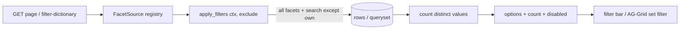

# Faceted filtering

Faceted filters recompute each filter's available options and row counts against the
**currently filtered** table. A facet narrows every other facet, but you can still broaden
a multiselect facet you just changed (exclude-own semantics). Counts stay in sync with
search and every other active filter.



## When to use

| Surface | Mechanism | Trigger |
|---------|----------|---------|
| Toolbar `GridViewFilters` bar | `facets=True` + HTMX fragment refresh | Filter or search change re-renders the spec (bar + table) |
| AG-Grid column set filter | `FacetSource` registry + `/grid/filter-dictionary/` | SmartFilter opens / types — fetches JSON `{values:[{value,count}]}` |

Both share one counting core (`compute_row_facets` / `compute_queryset_facets`) and one
`FacetSource` registry. Only facetable filter types are counted: `select`, `multiselect`, `set`.

## Exclude-own semantics

`apply_filters(exclude)` must return the row subset (or queryset) filtered by **every active
facet + search except `exclude`**. The host already owns that filtering logic — the package
only counts and rebuilds options.

```python
def apply_filters(ctx, exclude):
    qs = Doctor.objects.all()
    for param, value in active_filters(ctx):
        if param == exclude:
            continue  # keep this facet's own selection out of its own counts
        qs = apply_one(qs, param, value)
    qs = apply_queryset_search(qs, ctx.GET.get("q", ""), fields=SEARCH_FIELDS)
    return qs
```

Effect: with `department_type=adult` selected, the `care` facet counts rows in the adult
slice; the `department_type` facet itself still shows counts for the full slice (you can add
another `department_type`), while zero-count options are dimmed (`disabled=True`).

## Counting core

Two adapters share option-building (`build_faceted_options`):

| Adapter | Source | Use when |
|---------|--------|----------|
| `grid_view_spec.search.facets.compute_row_facets` | in-memory `Sequence[RowDict]` | Starlette/Forge, small/materialized rows |
| `grid_view_spec.backends.django.facets.compute_queryset_facets` | Django `QuerySet` | ORM-backed hosts (one grouped `values(field).annotate(Count)` per facet) |

Both return `dict[param, tuple[GridViewFilterOption, ...]]` with `count` and `disabled` set.
Apply them to the schema with `apply_faceted_options(schema, facets)` (uses
`dataclasses.replace`, leaving non-faceted filters untouched).

### Static vs dynamic options

- **Static options** (declared on the filter) keep their order and labels; each gets
  `count` and `disabled=(count == 0)`. The layout is stable.
- **Dynamic facets** (no declared `options`) derive options from observed values, sorted by
  label. Pass `keep_zero=False` to drop zero-count dynamic options.

### `field_for_filter`

The data field a facet counts. Defaults to `filter.param`; override per-option via
`GridViewFilterOption.meta={"field": "brand_name"}` when the param name differs from the
data path (common with ORM lookups like `brand__name`).

### Predicate facets

When a facet's values are not a groupable column (date periods, computed classes), use
`faceted_options_by_predicate(filter_def, count_value)` — the host supplies
`count_value(value)` returning the row count when that single option is applied on top of
the other-facets-filtered source. Each declared option gets `count` + `disabled`.

## FacetSource registry

`grid_view_spec.search.facet_registry` resolves a grid's faceting inputs at request time.
A host registers, per grid id, how to obtain the schema and the filtered source:

```python
from grid_view_spec.search.facet_registry import FacetSource, register_facet_source

register_facet_source(
    "doctors",
    FacetSource(
        schema=lambda ctx: tuple(ctx["page"].spec_filters_schema()),   # Sequence[GridViewFilter]
        apply_filters=lambda ctx, exclude: ctx["page"].facet_queryset(exclude),
        column_field=lambda field: DOCTOR_FIELD_MAP.get(field, field),  # AG-Grid colId → ORM lookup
        is_orm=True,
    ),
)
```

| `FacetSource` field | Role |
|---------------------|------|
| `schema(ctx)` | The grid's `GridViewFilter` schema for this request |
| `apply_filters(ctx, exclude)` | Source filtered by every active filter + search except `exclude` (Django `QuerySet` or row `Sequence`) |
| `field_for(filter)` | Data field to count (default `field_for_filter`) |
| `column_field(field)` | Maps an AG-Grid column field id to the value path used for counting (`"brand"` → `"brand__name"`); identity by default |
| `is_orm` | `True` selects the ORM adapter, `False` the row adapter (used by host fragment handlers) |

`exclude_for_field(source, schema, field)` resolves the `exclude` token for a column: if a
toolbar facet maps to the same data field, exclude that facet's `param` (toolbar and column
views agree); otherwise exclude the raw field (column filter).

## AG-Grid column set filter (dictionary endpoint)

The package ships the JSON endpoint backing AG-Grid SmartFilter facets:

```
GET /grid/filter-dictionary/?grid=<grid_id>&field=<col_id>&<current filter/search params>
→ { "values": [{"value": "Adult", "count": 42}, …] }
```

`grid_view_spec.backends.django.urls` mounts it as `api_column_filter_dictionary`. The view:

1. Resolves `FacetSource` via `get_facet_source(grid)` (returns `{"values": []}` if unregistered).
2. Computes `exclude = exclude_for_field(source, schema, field)`.
3. Counts via `queryset_value_counts(apply_filters(req, exclude), source.column_field(field))`.

Wire it in AG-Grid `gridOptions.context.dictionaryUrl` (see [AG-Grid](../tables/ag-grid.md)):

```javascript
gridOptions.context = {
  gridId: "doctors",
  dictionaryUrl: "/grid/filter-dictionary/",
  // …
};
```

## Toolbar FilterBar facets (HTMX fragment)

For the page filter bar, set `facets=True` on `GridViewFilters` and provide a fragment
endpoint that re-renders the spec (bar + table) with counted options:

```python
GridViewFilters(
    id="page_filters",
    target="records_table",
    presentation="panel",
    schema=(department_type_filter, care_filter),
    facets=True,
    fragment_endpoint="/doctors/fragment/filters/",
    fragment_target="#block-records_table",
    fragment_swap="outerHTML",
    auto_apply=False,
)
```

The frontend detects `data-cm-facets="1"` and, on any filter/search change, refreshes the
**whole spec** (not just the table) so option counts recompute. The fragment handler rebuilds
the filter schema with counts and returns the re-rendered spec/HTML:

```python
from grid_view_spec.search.facets import apply_faceted_options
from grid_view_spec.backends.django.facets import compute_queryset_facets
from grid_view_spec.search.facet_registry import get_facet_source


def doctors_filters_fragment(request):
    source = get_facet_source("doctors")
    schema = tuple(source.schema(request))
    facets = compute_queryset_facets(
        schema,
        apply_filters=lambda exclude: source.apply_filters(request, exclude),
    )
    faceted_schema = apply_faceted_options(schema, facets)
    page = build_doctors_page(request, filters_schema=faceted_schema)
    return render(request, "doctors/_spec_fragment.html", {"page": page})
```

## Domain facet via callback — NSZU example

NSZU doctors grid, faceted by `department_type` (adult/child) and `care` (ambulatory/stationary),
backed by a Django queryset. One `apply_filters` callback serves both the AG-Grid dictionary
endpoint and the toolbar fragment.

```python
# dashboard/doctors/facets.py
from grid_view_spec.search.facet_registry import FacetSource, register_facet_source
from grid_view_spec.backends.django.search import apply_queryset_search

SEARCH_FIELDS = ("last_name", "first_name", "specialty__name")

# AG-Grid colId → ORM lookup path used for counting
DOCTOR_FIELD_MAP = {
    "department_type": "department__type__code",
    "care": "care",
    "specialty": "specialty__name",
}


def doctors_facet_queryset(request, exclude):
    """QuerySet filtered by every active facet + search except `exclude`."""
    qs = Doctor.objects.select_related("department__type", "specialty")
    for param in ("department_type", "care", "specialty"):
        if param == exclude:
            continue
        value = request.GET.get(param, "").strip()
        if value:
            qs = qs.filter(**{DOCTOR_FIELD_MAP[param]: value})
    qs = apply_queryset_search(qs, request.GET.get("q", ""), fields=SEARCH_FIELDS)
    return qs


def doctors_facet_schema(request):
    """Facetable GridViewFilter schema for this request (counts added later)."""
    return (
        GridViewFilter(id="department_type", label="Тип відділення", param="department_type",
                       type="multiselect", options=DEPARTMENT_TYPE_OPTIONS),
        GridViewFilter(id="care", label="Напрям", param="care", type="select",
                       options=CARE_OPTIONS),
        GridViewFilter(id="specialty", label="Спеціальність", param="specialty", type="select"),
    )


def register_doctors_facets() -> None:
    register_facet_source(
        "doctors",
        FacetSource(
            schema=lambda req: doctors_facet_schema(req),
            apply_filters=lambda req, exclude: doctors_facet_queryset(req, exclude),
            column_field=lambda field: DOCTOR_FIELD_MAP.get(field, field),
            is_orm=True,
        ),
    )
```

Register once at startup (e.g. `AppConfig.ready()`):

```python
# dashboard/apps.py
class DashboardConfig(AppConfig):
    def ready(self):
        from .doctors.facets import register_doctors_facets
        register_doctors_facets()
```

Mount the dictionary route and set `facets=True` on the filter bar:

```python
# urls.py
urlpatterns = [
    path("", include("grid_view_spec.backends.django.urls")),  # includes /grid/filter-dictionary/
]
```

```python
# page_data.py — filter bar block
GridViewFilters(
    id="doctors_filters",
    target="doctors_table",
    presentation="panel",
    schema=faceted_schema,          # rebuilt with counts in the fragment handler
    facets=True,
    fragment_endpoint="/doctors/fragment/filters/",
)
```

Result: selecting `department_type=adult` dims any `care` option with zero adult doctors,
the `specialty` facet counts only adult doctors, and the `department_type` facet itself
still lets you add `child` (exclude-own). Counts refresh on every search keystroke and
facet toggle via the HTMX fragment.

## Wire round-trip

`GridViewFilterOption.count` (`int | None`) and `disabled` (`bool`) are part of the wire
shape — a spec with counted options round-trips through `spec_to_wire` / `decode_spec`
unchanged. `GridViewFilters.facets` is boolean (default `False`).

```python
from grid_view_spec.validate import spec_to_wire
from grid_view_spec.wire_decode import decode_spec

decoded = decode_spec(spec_to_wire(spec))
assert decoded.blocks[0].facets is True
assert decoded.blocks[0].schema[0].options[1].disabled is True
```

## Validation

`gridview_validate` accepts faceted specs. The `facets` flag and option `count`/`disabled`
are schema-declared (`GridViewFilterOption`, `GridViewFilters` in `grid-view-spec.v2.json`).
A spec authored with `facets=True` and static options validates as `ok: true`; counts are
runtime-computed by the host, not required to author a valid spec.

## Related

- [Filter semantics](semantics.md) — search/column matching contract
- [Server filtering](server.md) — single loader for HTML + export
- [AG-Grid](../tables/ag-grid.md) — `dictionaryUrl`, set-filter wiring
- [Django integration](../integration/django.md) — mounting routes, `AppConfig.ready()`
- [Theming with CSS tokens](../integration/theming.md) — unified table styling