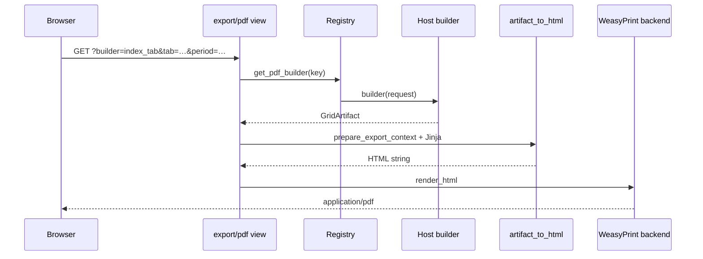

# Server-side PDF export

django-grid-view provides a **single HTTP endpoint** for PDF downloads. Host applications
register named **builders** that construct a `GridArtifact` from the current request; the
package renders printable HTML (Jinja2) and converts it to PDF (WeasyPrint by default).

HTML pages, chat visualizers, and PDF export therefore share one data contract:
`GridViewSpec` + `rows` → `GridArtifact`.

## Install

```bash
pip install django-grid-view[pdf]
# optional chart rasterization for PDF:
pip install django-grid-view[static-charts]
```

Configure the PDF backend (optional):

```python
# settings.py
GRID_VIEW_PDF_BACKEND = "weasyprint"  # default
```

Mount the export view in your host API (package `django_grid_view.urls` is empty):

```python
from django.urls import path
from django_grid_view.export.pdf_view import export_pdf

urlpatterns = [
    path("export/pdf/", export_pdf, name="api_export_pdf"),
]
```

```python
# settings.py
DJANGO_GRID_VIEW_EXPORT_PDF_URL = "api_export_pdf"
```

The export endpoint (with `/api/` prefix in typical hosts):

```
GET /api/export/pdf/?builder=<key>&<same query params as the HTML page>
```

## Register a builder (host app)

In `AppConfig.ready()` (or another startup hook):

```python
from django_grid_view.export.registry import register_pdf_builder

from myapp.pdf_builders import build_index_tab_pdf_artifact


def ready(self):
    register_pdf_builder(
        "index_tab",
        build_index_tab_pdf_artifact,
        filename_fn=lambda request, artifact: f"index_{request.GET.get('tab')}.pdf",
    )
```

Builder signature:

```python
def build_index_tab_pdf_artifact(request: HttpRequest) -> GridArtifact:
    # 1. Parse filters from request.GET (same as the HTML view)
    # 2. Query ORM / aggregate domain rows
    # 3. Build SimpleTableConfig (optional) and GridViewSpec
    # 4. return build_artifact_from_view(spec, rows, table=table_config)
```

| Parameter | Purpose |
|-----------|---------|
| `builder` | Callable `(HttpRequest) → GridArtifact` |
| `template` | Jinja template under `django_grid_view/export/templates/` (default `artifact_report.html`) |
| `filename_fn` | Optional `(request, artifact) → str` for `Content-Disposition` |
| `filter_specs_fn` | Optional `(request) → Sequence[FilterSpec]`; used for subtitle filter lines |

Unknown `builder` keys return HTTP 404.

## Link from templates

Load the tag library and point the PDF button at the unified endpoint:

```django

<a href=""
   target="_blank" class="cm-export-btn cm-export-btn--pdf">PDF</a>
```

`export_pdf_href` reverses `DJANGO_GRID_VIEW_EXPORT_PDF_URL` (default `api_export_pdf`) and
adds `builder` plus non-empty query parameters. Pass the **same** `period`, `tab`,
`department_id`, `doctor_id`, `record_id`, etc. that the HTML page uses so the PDF matches
on-screen filters.

Prefer shared partials or `` in templates — avoid hardcoding `/export/pdf/`
in Python or JavaScript (`build_export_href` / `cmExportHref` use the same contract).

For pages with FilterBar/column filters, pass a `filter_specs_fn` when registering the
builder. `export_pdf` combines `q`, `col_q`, and active `FilterSpec` values into subtitle
lines via `build_export_meta_lines`.

## Rendering pipeline



### Block order

PDF layout follows `GridViewSpec.layout.blocks`. Supported block types:

| Block | Source |
|-------|--------|
| `title` | `spec.title`, optional `subtitle` query param |
| `kpis` | `artifact.kpis` (resolved from `spec.kpis` + rows) |
| `chart` | Matplotlib PNG per `spec.charts` (`chart_images_from_artifact`) |
| `table` | `artifact.table` via `SimpleTableConfig` → `simple_table_print_context` (includes grouped `__section__` totals) |
| `cards` | `spec.cards` + `artifact.rows` |
| `tabs` / `card_groups` | `spec.tabs` + `spec.card_groups` |

Blocks `toolbar`, `filters`, and `ag_grid` are skipped in PDF.

Customize the Jinja shell with `register_pdf_builder(..., template="my_report.html")`.
Templates live in `django_grid_view/export/templates/` or you can copy `artifact_report.html`
as a starting point. **Do not** pass `GridViewSpec` in the URL — numbers must be rebuilt
server-side in the builder (security).

## Rate limiting

`export_pdf` is wrapped with `export_throttle` (default: 5 requests per 60 seconds per user
and builder key). Reuse `export_throttle` on other export views:

```python
from django_grid_view.export import export_throttle

@export_throttle(max_requests=10, window_seconds=120)
def my_csv_export(request): ...
```

## Programmatic use

```python
from django_grid_view.export import artifact_to_html, pdf_response_from_html
from django_grid_view.export.charts_png import chart_images_from_artifact

artifact = build_my_artifact(request)
images = chart_images_from_artifact(artifact)
html = artifact_to_html(artifact, chart_images=images, subtitle="…")
return pdf_response_from_html(html, "report.pdf")
```

## Example host registry

`myapp/dashboard/pdf_builders.py` can register keys like:

| Builder key | Page |
|-------------|------|
| `category_tab` | Category tab (table + chart) |
| `entity_summary` | Summary page (KPIs + table + cards) |
| `entity_modal` | Detail modal (`entity_id`, `tab`, `period`) |
| `record_detail` | Single record modal (`record_id` or legacy `pk`) |
| `saved_report` | Saved query report (`saved_id`) |

Keep shared `SimpleTableConfig` factories in one module so HTML and PDF use identical columns and totals.

There is no `window.print()` export path in the dashboard or chat UI — all PDF buttons link
to the host export route (e.g. `/api/export/pdf/`).

## Troubleshooting

| Symptom | Check |
|---------|--------|
| Empty table in PDF | `artifact.table` set in builder; `layout.blocks` includes `table` |
| Wrong period / totals | Builder uses same `page_id` and `normalize_periods_*` as HTML view |
| 404 Unknown builder | `register_pdf_builder` runs in `AppConfig.ready()` |
| 429 Too many requests | Throttle window; adjust decorator or cache backend |
| Missing charts | Install `[static-charts]`; chart rows must match `ChartSpec` keys |
| WeasyPrint import error | Install `[pdf]` extra and system deps (Cairo, Pango) |

## Related

- [Architecture — PDF export](../architecture.md#server-pdf-export)
- [Grid View artifacts](../grid-view-artifacts.md)
- [Charts and KPIs](../charts-and-kpis.md)
