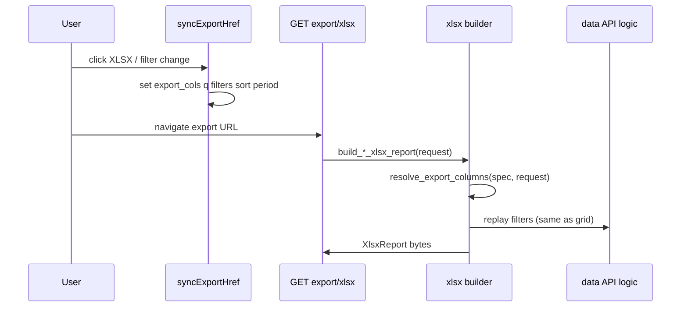

# Server-side XLSX export

django-grid-view provides a **single HTTP endpoint** for Excel downloads, mirroring the PDF
contract. Host applications register named **builders** that return a declarative
`XlsxReport`; the package renders bytes with **xlsxwriter** by default.

## Install

```bash
pip install django-grid-view[xlsx]
# optional second engine (same declarative layout, future template fill):
pip install django-grid-view[xlsx-all]
```

Configure the engine (optional):

```python
# settings.py
GRID_VIEW_XLSX_ENGINE = "xlsxwriter"  # default
# GRID_VIEW_XLSX_ENGINE = "openpyxl"  # same XlsxReport layout; template fill planned
```

Mount in your host API:

```python
from django_grid_view.export.xlsx_view import export_xlsx

urlpatterns = [
    path("export/xlsx/", export_xlsx, name="api_export_xlsx"),
]
```

```python
DJANGO_GRID_VIEW_EXPORT_XLSX_URL = "api_export_xlsx"
```

Endpoint (example with `/api/` prefix):

```
GET /api/export/xlsx/?builder=<key>&<same query params as the HTML page>
```

## Declarative layout

```python
from django_grid_view.export.xlsx import XlsxReport, XlsxSheet, XlsxMergeRange

report = XlsxReport(
    sheets=[
        XlsxSheet(
            name="Report",
            title_rows=[["Operations report"], ["Period: 2025-01"]],
            header_rows=[["#", "Name", "Records"]],
            data_rows=[[1, "Item A", 120], [2, "Item B", 80]],
            footer_rows=[["Total", "", 200]],
            merges=[XlsxMergeRange(0, 0, 0, 2)],  # title row merge
            col_widths=[],  # optional
        )
    ]
)
```

| Piece | Purpose |
|-------|---------|
| `title_rows` | Banner lines above the table (org name, period, filters) |
| `header_rows` | One or more header lines (grouped headers = multiple rows) |
| `data_rows` | Body |
| `footer_rows` | Totals row(s) |
| `merges` | Excel merges (0-based) |
| `freeze_panes` | `(row, col)` freeze after headers |

## From SimpleTableConfig

```python
from django_grid_view.export.xlsx import report_from_simple_table

report = report_from_simple_table(
    table_config,
    sheet_name="Groups",
    title_rows=[["Operations dashboard"], [f"Period: {period}"]],
    request=request,
    filter_specs=filter_specs,
)
```

Uses the same column renderers as PDF (HTML stripped to plain text). When `request` is
passed, active `q`, `col_q`, and `FilterSpec` values are merged into title/meta rows.

For live Simple Table column settings, resolve the table first:

```python
from django_grid_view.export.table_columns import resolve_simple_table_for_export

table = resolve_simple_table_for_export(page.table, request)
report = report_from_simple_table(table, request=request, filter_specs=filter_specs)
```

## Register a builder

```python
from django_grid_view.export.xlsx import register_xlsx_builder

register_xlsx_builder(
    "index_tab",
    build_index_tab_xlsx_report,
    filename_fn=lambda request, report: f"index_{request.GET.get('tab')}.xlsx",
)
```

Builder signature: `(HttpRequest) -> XlsxReport`.

## Link from templates

```django

<a href="">XLSX</a>
```

Pass the **same GET parameters** as the HTML view (period, tab, filters).

### AG-Grid pages



| Step | Owner | Contract |
|------|-------|----------|
| Column labels | `AgGridPageSpec` | `label_for(col_id)` |
| Column selection | `resolve_export_columns(spec, request)` | `export_cols` param or spec defaults |
| Row data | Host builder | Same queryset/filters as data API |

```python
from django_grid_view.ag_grid import resolve_export_columns

def build_items_grid_xlsx(request):
    col_ids = resolve_export_columns(ITEMS_PAGE_SPEC, request)
    labels = [ITEMS_PAGE_SPEC.label_for(c) for c in col_ids]
    rows = fetch_all_rows_like_grid(request)
    return XlsxReport(
        sheets=[XlsxSheet(
            name="Items",
            header_rows=[labels],
            data_rows=[[row.get(c, "") for c in col_ids] for row in rows],
        )]
    )
```

| `export_cols` | Exported columns |
|---------------|------------------|
| Present | Active visible columns, request order after dropping non-exportable ids |
| Absent | `exportable=True` and `hide=False` in spec |

Full contract: [AG-Grid integration](../ag-grid.md).

## Engines

| Engine | Install | Output |
|--------|---------|--------|
| **xlsxwriter** | default `[xlsx]` | Programmatic workbooks |
| **openpyxl** | `[xlsx-all]` | Same `XlsxReport` layout |

Excel export is server-side only: register a builder per screen; `syncExportHref` passes grid state on AG-Grid pages.

## Throttling

`export/xlsx/` uses the same `@export_throttle` decorator as PDF (per user + builder key).

## Example host registry

See `myapp/dashboard/xlsx_builders.py` — keys can mirror PDF keys:
`category_tab`, `entity_summary`, `entity_modal`, `record_detail`, `saved_report`.
