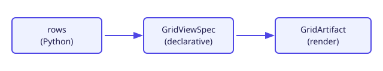

# Django Grid View

**django-grid-view** is a reusable Django app for declarative data views in dashboards and chat UIs.

Install from PyPI:

```bash
pip install django-grid-view
```

## Three ways to render data

### Simple Table

Server-rendered lists with sort, search, and export.

- **Python:** `SimpleTableConfig`
- **Template:** ``

### AG-Grid pages

Extension on [AG Grid Community](https://www.ag-grid.com/) 31.x — infinite model, toolbar, persistence.

- **Python:** `AgGridPageSpec`, `django_grid_view.ag_grid`, host JSON data API
- **Template:** ``, `GridView.AgGrid`

See [AG-Grid integration](ag-grid.md).

### Grid View

KPI strip, ECharts, table, optional filter bar and card grids — one spec.

- **Python:** `GridRenderer` / `build_artifact_from_view`
- **Template:** ``, ``, ``



**Core rule:** numeric KPI and chart values always come from Python `rows`. Specs and LLM output describe structure only.

See [Architecture](architecture.md) for how a host project wires domain queries, artifacts, chat, and PDF export.

## Quick links

- [Getting started](getting-started.md) — install, Django setup, first table
- [Architecture](architecture.md) — integration diagram and responsibility split
- [Grid View artifacts](grid-view-artifacts.md) — `GridViewSpec` → `GridArtifact`
- [Server filtering contract](guides/server-filtering-contract.md) — one queryset path for table/chart/export
- [Changelog](changelog.md) — release notes
- [LLM context bundle](llm/django-grid-view-llm-context.md) — single file for agents ([about the bundle](llm/context.md))
- [GridViewSpec reference](reference/grid-view-spec.md) — JSON Schema contract
- [Python types](reference/python-types.md) — imports for host apps (pyright/mypy)

## Publishing this documentation

The docs site is built with [MkDocs Material](https://squidfunk.github.io/mkdocs-material/) and deployed to GitHub Pages via the `Docs` workflow. Repository maintainers: enable **Settings → Pages → Build and deployment → GitHub Actions**, then set the repository **Website** to `https://alpiua.github.io/django-grid-view/`.

## Links

- [PyPI](https://pypi.org/project/django-grid-view/)
- [GitHub](https://github.com/alpiua/django-grid-view)
- [Issue tracker](https://github.com/alpiua/django-grid-view/issues)
