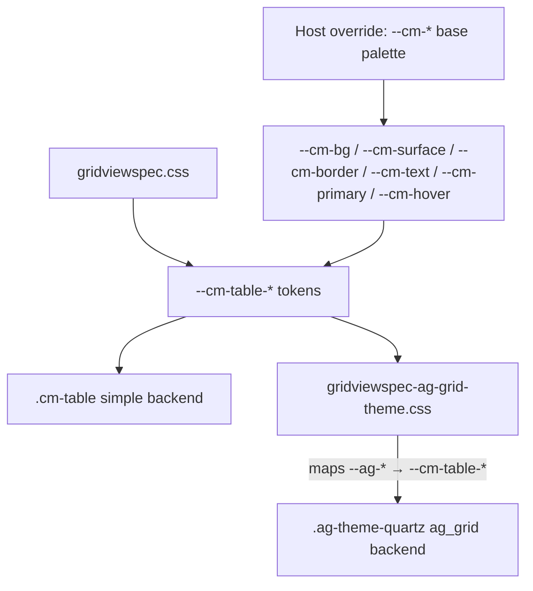

# Theming with CSS tokens

Both table backends — `simple` (server-rendered HTML) and `ag_grid` (AG Grid Community) —
read from one set of CSS custom properties. Override the tokens once and both table types,
plus the toolbar, filters, KPI, cards, and callouts, follow the same palette.



## Token layers

| Layer | Defined by | Examples | Purpose |
|-------|-----------|---------|---------|
| Base `--cm-*` | **host** (package only consumes, with inline fallbacks) | `--cm-bg`, `--cm-surface`, `--cm-border`, `--cm-text`, `--cm-muted`, `--cm-primary`, `--cm-hover`, `--cm-stripe-bg`, `--cm-accent-green-fg` | App palette — theme every surface uniformly |
| Table `--cm-table-*` | package (`tokens.css`) | `--cm-table-font-size`, `--cm-table-row-height`, `--cm-table-header-bg`, `--cm-table-surface-bg`, `--cm-table-border-color`, `--cm-table-row-hover-bg`, `--cm-table-cell-padding-x` | Table geometry + chrome; derive from base tokens |
| Semantic `--cm-tone-*` | package (`semantic-tones.css`) | `--cm-tone-info-*`, `--cm-tone-success-*`, `--cm-tone-warning-*`, `--cm-tone-danger-*` | Tones for callouts, banners, badges, period pills |
| AG-Grid `--ag-*` | package (`gridviewspec-ag-grid-theme.css`) maps them to `--cm-table-*` / `--cm-*` | `--ag-font-size`, `--ag-row-height`, `--ag-background-color`, `--ag-border-color`, `--ag-header-background-color` | Bridge so AG Grid reads the same tokens as Simple Table |

The package ships **no base palette** — `--cm-bg`, `--cm-surface`, `--cm-border`,
`--cm-text`, `--cm-muted`, `--cm-primary`, `--cm-hover` are consumed with inline fallbacks
(e.g. `var(--cm-primary, #2563eb)`). Without host overrides the package renders with neutral
fallbacks; for a unified brand theme, define the base tokens.

## Loading the CSS

```django

          {# gridviewspec.min.css — tokens + all blocks #}
{# …page body… #}
      {# AG-Grid pages only: ag-grid CSS + gridviewspec-ag-grid-theme.min.css #}
```

`part='css'` is required on every grid page; it defines `--cm-table-*`, `--cm-page-*`,
`--cm-tone-*`, and all block styles. `part='ag_grid'` adds AG-Grid's own stylesheet plus the
theme bridge that maps `--ag-*` → `--cm-table-*`.

For Starlette/Forge, the same files are served from `/static/grid_view_spec/` (see
`grid_view_spec.backends.starlette.static`).

## Overriding tokens

Define the base palette once in your base template, **after** the package CSS so the cascade
wins. A `:root` override themes the whole app; a scoped selector themes one grid.

```django



<link rel="stylesheet" href="?v=2">  {# after gridviewspec.css #}
```

```css
/* app/theme.css — unify both table backends with one palette */
:root {
  --cm-bg: #ffffff;
  --cm-surface: #ffffff;
  --cm-border: rgba(15, 23, 42, 0.12);
  --cm-text: #0f172a;
  --cm-muted: #64748b;
  --cm-primary: #4f46e5;          /* brand accent: buttons, active icon, focused chrome */
  --cm-hover: rgba(79, 70, 229, 0.08);
  --cm-stripe-bg: rgba(15, 23, 42, 0.03);

  /* Optional: tighten table geometry for both simple + ag_grid */
  --cm-table-font-size: 0.8125rem;
  --cm-table-row-height: 32px;
  --cm-table-cell-padding-x: 10px;
}
```

Because `--cm-table-header-bg: var(--cm-table-head-bg, var(--cm-bg))`,
`--cm-table-surface-bg: var(--cm-table-shell-bg, var(--cm-surface))`,
`--cm-table-border-color: var(--cm-border)`, and
`--cm-table-row-hover-bg: var(--cm-hover)`, setting the base tokens recolors both table
backends automatically. AG-Grid follows via the theme bridge
(`--ag-background-color: var(--cm-table-surface-bg)`, `--ag-border-color: var(--cm-table-border-color)`, …).

### Override levels

| You set… | Effect |
|----------|--------|
| `--cm-*` base | Recolors tables, toolbar, filters, cards, callouts, KPI — everything |
| `--cm-table-*` | Table-only chrome (geometry, header/cell sizing, surface/shadow) without touching other blocks |
| `--cm-table-shell-bg` / `--cm-table-head-bg` | One-off shell/header overrides that beat the base-derived defaults |
| `--cm-tone-*` | Semantic tones for callouts/badges/pills (independent of the app palette) |

## Dark mode

The package has no built-in dark palette; drive it from the host. Match the docs site or use
`prefers-color-scheme`, or a `.dark` / `[data-theme="dark"]` scope:

```css
@media (prefers-color-scheme: dark) {
  :root {
    --cm-bg: #0f172a;
    --cm-surface: #111827;
    --cm-border: rgba(148, 163, 184, 0.25);
    --cm-text: #e2e8f0;
    --cm-muted: #94a3b8;
    --cm-primary: #818cf8;
    --cm-hover: rgba(129, 140, 248, 0.14);
    --cm-stripe-bg: rgba(255, 255, 255, 0.03);
  }
}
```

AG-Grid reads `--cm-table-*` via the theme bridge for both `.ag-theme-quartz` and
`.ag-theme-quartz-dark`, so the same dark override recolors AG-Grid tables too.

## Scoped theming (per grid)

Override tokens on a wrapper element to theme one grid without affecting the rest of the page:

```html
<div class="doctor-grid-theme">
  
</div>
```

```css
.doctor-grid-theme {
  --cm-primary: #0d9488;       /* teal accent for this grid only */
  --cm-table-row-height: 36px;
}
```

Token overrides cascade into `.cm-table` (Simple Table) and `.ag-theme-quartz` (AG-Grid)
inside the wrapper, so both backends respond to the scope.

## Tuning table density

Table geometry tokens are safe to override directly — both backends read them:

```css
:root {
  --cm-table-font-size: 0.75rem;       /* row text size */
  --cm-table-line-height: 1.4;
  --cm-table-row-height: 30px;         /* body row height */
  --cm-table-header-height: 34px;      /* header row height */
  --cm-table-cell-padding-x: 10px;     /* horizontal cell padding */
  --cm-table-cell-padding-y: 6px;
  --cm-table-surface-radius: 10px;      /* table card corners */
  --cm-table-filter-panel-width: 320px;/* column filter popover */
}
```

## Reference: token list

| Token | Default / fallback | Used by |
|------|--------------------|---------|
| `--cm-bg` | *(host)* | Table header bg, page surfaces |
| `--cm-surface` | *(host)* | Cards, callouts, filter panels, table shell |
| `--cm-border` | *(host)* | Dividers, table borders, button borders |
| `--cm-text` | *(host)* | Body text, cell text |
| `--cm-muted` | *(host)* | Secondary text, header labels |
| `--cm-primary` | `#2563eb` | Accent: primary buttons, active sort/filter icon |
| `--cm-hover` | *(host)* | Row hover, icon hover bg |
| `--cm-stripe-bg` | `rgba(255,255,255,0.03)` | Zebra stripe rows |
| `--cm-accent-green-fg` | *(host)* | Active filter/sort icon color (falls back to `--cm-primary`) |
| `--cm-table-font-size` | `0.6875rem` | Cell + AG-Grid font size |
| `--cm-table-row-height` | `28px` | Body row height (both backends) |
| `--cm-table-header-height` | `32px` | Header row height (both backends) |
| `--cm-table-cell-padding-x` | `12px` | Horizontal cell padding (both backends) |
| `--cm-table-header-bg` | `var(--cm-bg)` | Header background |
| `--cm-table-surface-bg` | `var(--cm-surface)` | Table card background |
| `--cm-table-border-color` | `var(--cm-border)` | Table + AG-Grid border color |
| `--cm-table-row-hover-bg` | `var(--cm-hover)` | Row hover background |
| `--cm-table-surface-radius` | `12px` | Table card corner radius |

Full list: `frontend/styles/tokens.css` (table/page tokens),
`frontend/styles/semantic-tones.css` (tone tokens),
`src/grid_view_spec/static/grid_view_spec/gridviewspec-ag-grid-theme.css` (AG-Grid bridge).

## Related

- [Simple table](../tables/simple-table.md) — `.cm-table-shell` layout
- [AG-Grid](../tables/ag-grid.md) — `.ag-theme-quartz` theming via the bridge
- [Content callout and banner](../blocks/content-callout.md) — `--cm-tone-*` usage
- [Host contract](host-contract.md) — asset loading order