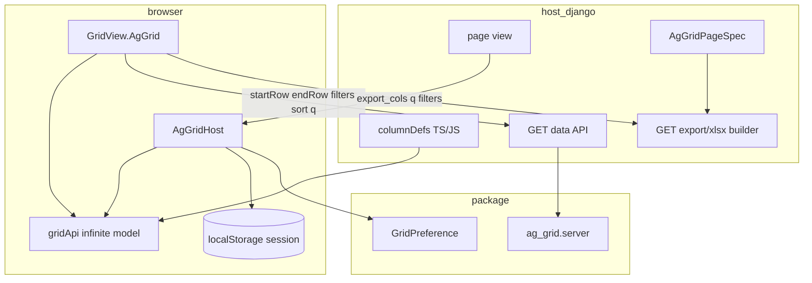
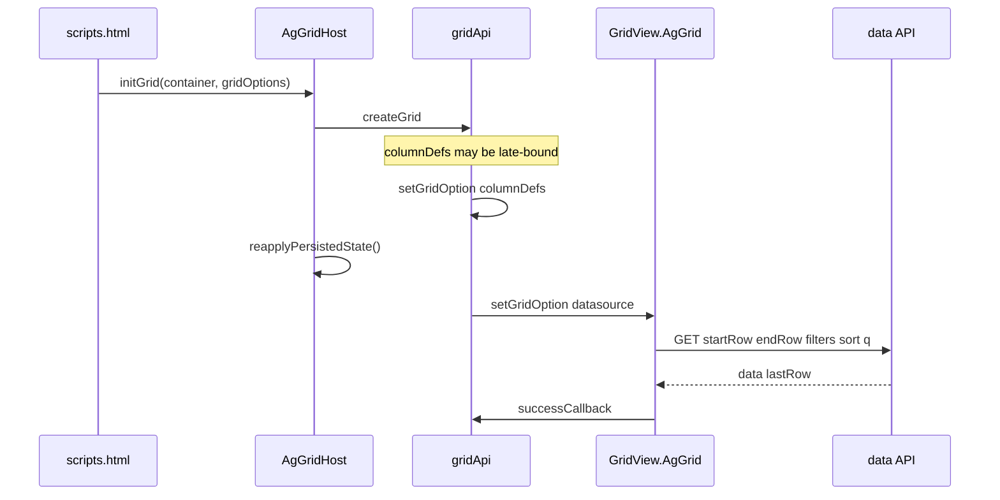
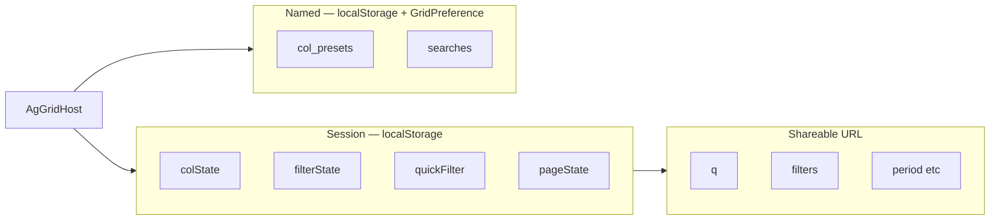
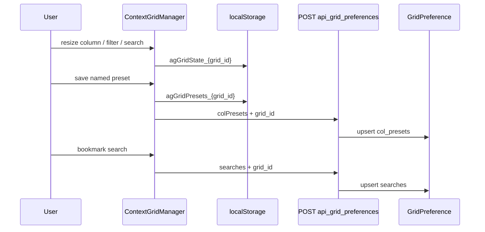
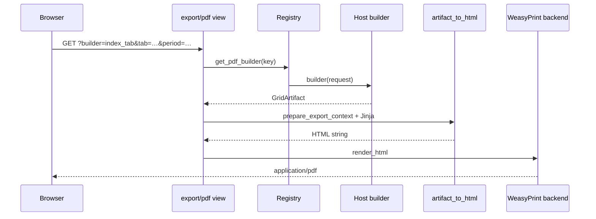
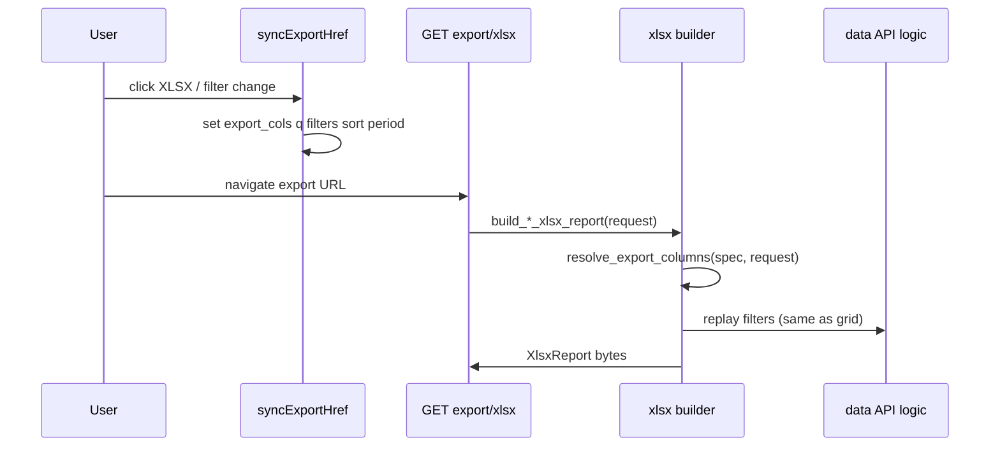

# django-grid-view — LLM context bundle

> Auto-generated by `scripts/build_llm_context.py`. Do not edit by hand.
> Regenerate: `uv run python scripts/build_llm_context.py`

Package: **django-grid-view** (PyPI) · Module: **django_grid_view** · Docs: https://alpiua.github.io/django-grid-view/

---


<!-- source: index.md -->

# Grid View Spec

**grid-view-spec** describes dashboard pages as a tree of blocks: tables, filters, KPIs, charts,
actions, and layout areas. The Python package `grid_view_spec` validates specs, renders HTML, and
exposes export hooks. Host applications supply **rows and business logic**; the spec describes
**structure only**.

The PyPI distribution is still named **`django-grid-view`** (it ships templates, static assets, and
an optional Django backend). The core library imports as `grid_view_spec`.

```bash
pip install django-grid-view
```

## What you build

A typical page loads data in Python, builds a `GridViewSpec`, and renders it:

```python
from grid_view_spec import GridViewSpec, validate_spec
from grid_view_spec.render import render_grid_view_spec

spec = GridViewSpec(id="orders", blocks=(...), layout=...)
validate_spec(spec)  # raises on invalid structure
html = render_grid_view_spec(spec, rows, host=host)
```

In templates (Django backend):

```django


```

One bundle boots the page in the browser: `` loads `grid-view.min.js`, which
calls `GridView.bootScope()` for tables, filters, KPIs, charts, and spec roots.


**Important:** KPI and chart **numbers** always come from Python `rows` (or server-side
resolution). The spec never carries row data or computed aggregates from untrusted input.

## Documentation map

| Topic | Document |
|-------|----------|
| Install and first page | Getting started (see section: getting-started.md) |
| Spec contract (v2) | GridViewSpec reference (see section: reference/grid-view-spec.md) |
| System overview | Architecture (see section: architecture.md) |
| JavaScript runtime | JavaScript API (see section: reference/javascript.md) |
| Template tags | Template tags (see section: reference/template-tags.md) |
| AG-Grid tables | AG-Grid integration (see section: ag-grid.md) |
| PDF / XLSX export | PDF export (see section: guides/pdf-export.md), XLSX export (see section: guides/xlsx-export.md) |
| MCP server (IDE) | MCP server (see section: guides/mcp-server.md) |
| JSON Schema | `schema/grid-view-spec.v2.json` in the repository |

## Backends

| Backend | Use when |
|---------|----------|
| **Django** | Templates, `GridPreference` ORM, export views, `INSTALLED_APPS` |
| **Jinja2 / Starlette / FastAPI** | Headless HTML or API-only hosts (`grid_view_spec.backends.*`) |
| **JSON** | Wire format, MCP, chat pipelines (`spec_to_wire`, `spec_from_wire`) |

Django is one integration path, not a requirement for the spec itself.

## Optional extras

| Extra | Install | Purpose |
|-------|---------|---------|
| `[pdf]` | `pip install django-grid-view[pdf]` | WeasyPrint PDF export |
| `[mcp]` | `pip install "django-grid-view[mcp]"` | CLI **`gridviewspec-mcp`** (installed with the package) |
| `[starlette]` / `[fastapi]` | respective extra | ASGI page routes |

## Links

- [PyPI](https://pypi.org/project/django-grid-view/)
- [GitHub](https://github.com/alpiua/django-grid-view)
- Changelog (see section: changelog.md)

## Publishing this site

Maintainers build docs with MkDocs Material; GitHub Actions deploys to
[https://alpiua.github.io/django-grid-view/](https://alpiua.github.io/django-grid-view/).


---


<!-- source: getting-started.md -->

# Getting started

This guide walks through a minimal **GridViewSpec** page. It assumes a Django host because that is
the most common setup (templates, static files, optional ORM preferences). The same spec API works
with other backends — see Architecture (see section: architecture.md).

## Install

```bash
pip install django-grid-view
```

Local development:

```bash
pip install -e /path/to/django-grid-view
# optional: MCP CLI (`pip install -e ".[mcp]"` or `./scripts/install-mcp-cli.sh`)
```

## Django backend (optional)

Add the app and migrate once for saved column presets:

```python
INSTALLED_APPS = ["django_grid_view"]
```

```bash
python manage.py migrate django_grid_view
```

Mount export and preference routes in **your** URLconf (the package does not ship a root
`urls.py` to include):

```python
from django.urls import path
from grid_view_spec.backends.django.views import export_pdf, export_xlsx, save_grid_prefs

urlpatterns = [
    path("grid/prefs/", save_grid_prefs, name="api_grid_preferences"),
    path("export/pdf/", export_pdf, name="api_export_pdf"),
    path("export/xlsx/", export_xlsx, name="api_export_xlsx"),
]
```

Register PDF/XLSX builders in `AppConfig.ready()` — PDF export (see section: guides/pdf-export.md),
XLSX export (see section: guides/xlsx-export.md).

Optional settings for URL names used by templates:

```python
DJANGO_GRID_VIEW_EXPORT_PDF_URL = "api_export_pdf"
DJANGO_GRID_VIEW_EXPORT_XLSX_URL = "api_export_xlsx"
```

## Page assets

In the site base template, once per page:

```django

   {# in <head> #}
…
   {# before </body> — grid-view.min.js + boot config #}
```

Charts need ECharts in the host template; column drag-reorder needs Sortable. AG-Grid pages load
additional scripts — AG-Grid integration (see section: ag-grid.md).

## First spec page

**1. Build a spec and rows in the view**

```python
from django.shortcuts import render
from grid_view_spec import GridViewSpec, validate_spec
from grid_view_spec.types.layout import GridViewArea, GridViewLayout
from grid_view_spec.types.table_v2 import GridViewColumn, GridViewTable

def orders_list(request):
    rows = [{"name": "Ada", "amount": 120}, {"name": "Bob", "amount": 85}]
    spec = GridViewSpec(
        id="orders",
        blocks=(
            GridViewTable(
                id="orders_table",
                backend="simple",
                columns=(
                    GridViewColumn(id="name", label="Customer", field="name"),
                    GridViewColumn(id="amount", label="Amount", field="amount", format="currency"),
                ),
            ),
        ),
        layout=GridViewLayout(root=GridViewArea(id="root", blocks=("orders_table",))),
    )
    validate_spec(spec)
    return render(request, "orders.html", {"spec": spec, "rows": rows})
```

**2. Render in the template**

```django


```

Open the page — client sort, search, and column settings work through the unified
`grid-view.min.js` runtime.

## Validate before render

```python
from grid_view_spec import validate_spec

validate_spec(spec)  # raises GridViewValidationError on structural errors
```

For IDE workflows, run the MCP server (see section: guides/mcp-server.md) (`gridview_validate` on wire JSON).

## Python imports

| Need | Import |
|------|--------|
| Spec types | `from grid_view_spec import GridViewSpec` |
| Render | `from grid_view_spec.render import render_grid_view_spec` |
| Wire JSON | `from grid_view_spec.validate import spec_to_wire, spec_from_wire` |
| Django host | `from grid_view_spec.backends.django.host import DjangoGridViewHost` |

Public type reference: Python types (see section: reference/python-types.md).

## Next steps

- GridViewSpec reference (see section: reference/grid-view-spec.md) — blocks, layout, schema
- Architecture (see section: architecture.md) — responsibilities and bundle layout
- Host app page export (see section: guides/host-app-page-export.md) — one loader for HTML and export
- Simple Table (previous API) (see section: simple-table.md) — if you maintain older pages


---


<!-- source: architecture.md -->

# Architecture

## Overview

**grid-view-spec** separates three concerns:

1. **Data** — rows, querysets, and aggregates computed in the host application
2. **Spec** — declarative page structure (`GridViewSpec`: blocks + layout)
3. **Render** — HTML, static assets, export pipelines, and browser runtime

```
Host rows + GridViewSpec  →  render_grid_view_spec  →  HTML + asset plan
                                                      →  export builders (optional)
Browser: grid-view.min.js → GridView.bootScope()     →  tables, filters, KPI, charts
```

Numeric KPI and chart values always originate from Python row data (or server-side resolution).
Specs describe shape, labels, and wiring — not untrusted numbers.

## Core modules (`grid_view_spec`)

| Area | Role |
|------|------|
| `types/` | Block dataclasses (`GridViewTable`, `GridViewFilters`, …) |
| `validate/` | Structural validation, wire encode/decode |
| `render/` | Jinja templates under `templates/grid_view/spec/`, block registry |
| `export/` | PDF/XLSX registry, payload builders, HTML reports |
| `backends/django/` | Django host, views, ORM preferences |
| `backends/jinja2/`, `starlette/`, `fastapi/` | Non-Django HTML routes |
| `mcp/` | MCP tools (`gridview_validate`, …) — no framework imports |

JSON Schema for wire interchange: `schema/grid-view-spec.v2.json`.

## Host responsibilities

| Host owns | Package owns |
|-----------|--------------|
| SQL/ORM, filters, authorization | Block templates and `cm-*` CSS |
| Building `GridViewSpec` in page loaders | `grid-view.min.js` runtime |
| Export builder functions (domain rows) | Export HTML assembly, throttle helpers |
| Domain labels, URLs, i18n of data | Package chrome i18n (`GridViewI18n`) |
| AG-Grid `columnDefs` and data API (when used) | `AgGridHost`, toolbar, persistence helpers |

## Backends

### Django

Templates (``), static files, `GridPreference` model, and HTTP views for
export and saved searches. Install `django_grid_view` in `INSTALLED_APPS`.

### Jinja2 / Starlette / FastAPI

`render_html(spec, rows, host=…)` and optional `page_route()` — no Django settings required.

### Wire / MCP

`spec_to_wire` / `spec_from_wire` for JSON storage and the `gridviewspec-mcp` server.

## Front-end bundle

Production wheels ship pre-built assets under `django_grid_view/static/`. Host pages load:

```django

```

which injects i18n boot config and **`grid-view.min.js`**. That single bundle includes column
settings, KPI, charts, filter bar, and spec boot (`GridView.bootScope` on load and HTMX swap).

Additional bundles exist for AG-Grid (`ag-grid-cdn.js`, `ag-grid-host.js`, …) — see
JavaScript API (see section: reference/javascript.md).

Maintainers rebuild assets from `frontend/` with Node (esbuild); application projects do not need
Node at runtime.

## Export flow

1. Page registers a builder key in `grid_view_spec.export.registry`
2. Browser links include `?builder=<key>` and current filter query params
3. Host view resolves the builder → `GridViewExportJob` → PDF or XLSX response

Details: PDF export (see section: guides/pdf-export.md), XLSX export (see section: guides/xlsx-export.md).

## AG-Grid mode

Large interactive grids use AG-Grid on the client. The host provides JSON data APIs and column
definitions; the package provides toolbar integration, preference sync, and server-side filter/sort
parsing helpers. See AG-Grid integration (see section: ag-grid.md).

## Related reading

- GridViewSpec reference (see section: reference/grid-view-spec.md)
- Template tags (see section: reference/template-tags.md)
- Maintainer architecture spec (see section: gridviewspec-architecture.md) — full v2 design document
- Documentation inventory (see section: maintainers/doc-inventory.md) — legacy pages and sunset plan


---


<!-- source: reference/grid-view-spec.md -->

# GridViewSpec

**GridViewSpec** is the page contract for grid-view-spec v2: a flat list of **blocks** plus a **layout**
tree that places block ids into areas (page root, toolbars, cards, tabs, …).

Wire format: [`schema/grid-view-spec.v2.json`](https://github.com/alpiua/django-grid-view/blob/main/schema/grid-view-spec.v2.json)

## Rules

- Row data lives **outside** the spec. Pass rows to `render_grid_view_spec(spec, rows, host=…)`.
- Block ids are unique within a spec. Layout references only existing block ids.
- One search field per table (toolbar XOR table search — enforced by validation).
- Export actions use `GridViewExportAction` with `params.builder` or default to `spec.id`.

## Python

```python
from grid_view_spec import GridViewSpec, validate_spec
from grid_view_spec.render import render_grid_view_spec
from grid_view_spec.types.layout import GridViewArea, GridViewLayout
from grid_view_spec.types.table_v2 import GridViewColumn, GridViewTable

spec = GridViewSpec(
    id="orders",
    blocks=(
        GridViewTable(
            id="orders_table",
            backend="simple",
            columns=(GridViewColumn(id="name", label="Name", field="name"),),
        ),
    ),
    layout=GridViewLayout(root=GridViewArea(id="root", blocks=("orders_table",))),
)
validate_spec(spec)
html = render_grid_view_spec(spec, rows, host=host)
```

Wire JSON:

```python
from grid_view_spec.validate import spec_from_wire, spec_to_wire

wire = spec_to_wire(spec)
restored = spec_from_wire(wire)
```

## Block types (overview)

| Block | Purpose |
|-------|---------|
| `GridViewHeader` | Title, subtitle, optional template content |
| `GridViewToolbar` | Search, actions slot, filter wiring |
| `GridViewFilters` | Filter bar state |
| `GridViewActions` | Export, links, buttons |
| `GridViewTable` | Simple table or AG-Grid backend |
| `GridViewKpi` / charts blocks | KPI strip and ECharts (data from rows) |
| `GridViewCards`, `GridViewGallery`, `GridViewForm`, … | Structured content |
| `GridViewTemplate` | Host template fragment by reference |
| `GridViewOverlay` | Modal / drawer host |

Full catalog: MCP tool `gridview_catalog` or Maintainer spec (see section: gridviewspec-architecture.md).

## Layout

`GridViewLayout` roots an area tree. Areas have `type` (`root`, `toolbar`, `table-card`, …) and
ordered `blocks` id list. Toolbars reference filters and tables through block ids, not embedded
fields.

## Templates (Django)

```django


```

Lazy blocks and HTMX fragments use `load_lazy_block` — see Architecture (see section: architecture.md).

## Validation

```python
from grid_view_spec import validate_spec

validate_spec(spec)
```

IDE / MCP: run `gridview_validate` on wire JSON (MCP server (see section: guides/mcp-server.md)).

## MCP and schema tools

| Tool | Returns |
|------|---------|
| `gridview_catalog` | Block types, registries, authoring rules |
| `gridview_schema` | JSON Schema fragment |
| `gridview_examples` | Fixture specs by case id |
| `gridview_migration_hints` | Maps old template/API names to blocks |
| `gridview_validate` / `gridview_normalize` | Diagnostics + normalized spec |
| `gridview_apply_patch` | Atomic spec edits (A2UI ops) |

Contract reference: [grid-view-spec.mcp](../grid-view-spec.mcp) (repository file).

## Chat and LLM output

Structured output should be a **spec object** matching the schema — not row arrays or numeric KPI
values. See Chat visualizer (see section: guides/chat-visualizer.md).

## Previous wire format (v1)

The v1 schema (`schema/grid-view-spec.v1.json`) used a flat `grid_id` + `columns` list consumed by
`GridRenderer`. That path remains in the Django package for older pages. New work should use v2
blocks and layout described above. Mapping table: Legacy API index (see section: legacy/index.md).


---


<!-- source: ag-grid.md -->

# AG-Grid integration

Extension layer for [AG Grid Community](https://www.ag-grid.com/) 31.x in Django: toolbar,
`AgGridHost`, session persistence, infinite-model HTTP contract, server XLSX sync.

| Component | Owner |
|-----------|-------|
| `gridApi`, `columnDefs`, cell renderers, filter components | Host |
| JSON data API, ORM field maps, row serialization | Host |
| `AgGridPageSpec`, XLSX column resolution | Host (spec) + package (helpers) |
| `AgGridHost`, toolbar, modal, search bar | Package |
| `GridView.AgGrid`, `django_grid_view.ag_grid` | Package |
| `GridPreference` (named presets, saved searches) | Package model; host mounts save URL |

## CDN pins (`conf.py`)

AG-Grid and SortableJS load from CDN on AG-Grid pages. Versions are **pinned in Django settings**, not hardcoded in templates — host apps can override for self-hosting or semver bumps without forking JS.

| Setting | Default | Purpose |
|---------|---------|---------|
| `DJANGO_GRID_VIEW_AG_GRID_VERSION` | `31.3.2` | AG-Grid Community semver (jsDelivr URL built automatically) |
| `DJANGO_GRID_VIEW_AG_GRID_CDN_URL` | *(built from version)* | Full script URL override (self-hosted mirror) |
| `DJANGO_GRID_VIEW_SORTABLE_VERSION` | `1.15.2` | SortableJS for column-settings drag-reorder |
| `DJANGO_GRID_VIEW_SORTABLE_CDN_URL` | *(built from version)* | Full Sortable script URL override |
| `DJANGO_GRID_VIEW_ECHARTS_VERSION` | `5.5.1` | ECharts semver (host base template) |
| `DJANGO_GRID_VIEW_ECHARTS_CDN_URL` | *(built from version)* | Full ECharts script URL override |

```python
# settings.py — optional overrides
DJANGO_GRID_VIEW_AG_GRID_VERSION = "31.3.2"
# DJANGO_GRID_VIEW_AG_GRID_CDN_URL = "https://static.myapp.example/vendor/ag-grid-community.min.js"
DJANGO_GRID_VIEW_SORTABLE_VERSION = "1.15.2"
DJANGO_GRID_VIEW_ECHARTS_VERSION = "5.5.1"
```

Host base template (charts):

```django
<script src="{{ echarts_cdn_url }}"></script>
{# or in view context: from django_grid_view.conf import echarts_cdn_url #}
```

Python helpers: `django_grid_view.conf.ag_grid_cdn_url()`, `sortable_cdn_url()`, `echarts_cdn_url()`.

## Architecture



## Infinite data API contract

### Response

```json
{
  "data": [
    { "id": 1, "sku": "ABC-001", "customer": "Ada" }
  ],
  "lastRow": 45000
}
```

| Field | Type | Rule |
|-------|------|------|
| `data` | `object[]` | One object per row; keys = `columnDefs[].field` / `colId` |
| `lastRow` | `int` | Total row count after server filters (not page size) |

Empty keys may be omitted in sparse rows; export uses `AgGridPageSpec` column order, not `Object.keys(row)`.

### Request query parameters

| Param | Source | Type | Purpose |
|-------|--------|------|---------|
| `startRow` | `createInfiniteDatasource` | int | Block start (0-based) |
| `endRow` | `createInfiniteDatasource` | int | Block end (exclusive) |
| `filters` | AG Grid `filterModel` | JSON object | Server-side column filters |
| `sort` | AG Grid sort model | JSON array | Server-side sort |
| `q` | Search bar (`manager._searchText`) | string | Quick search |
| `cols` | Visible columns | comma-separated | Multi-column search scope |
| `export_cols` | `syncExportHref` only | comma-separated | XLSX column ids (not sent on infinite fetch) |
| `action` | Host | string | e.g. `dictionary` for set-filter values |
| `field` | Host | string | Column id when `action=dictionary` |

Host-specific params (period, tab, …) pass via `getExtraParams` in JS and replay in export builders.

### Filter JSON (`filters` param)

Set filter (custom or AG set):

```json
{ "status": { "values": ["Active", "Pending"] } }
```

Text filter:

```json
{ "sku": { "filterType": "text", "type": "contains", "filter": "abc" } }
```

Supported text `type` values in `apply_grid_filters`: `contains`, `notContains`, `equals`, `notEqual`, `startsWith`, `endsWith`.

Pass `format_filter_value(col_id, display_value)` when DB values differ from filter labels.

### Sort JSON (`sort` param)

```json
[{ "colId": "registered_esoz", "sort": "desc" }]
```

Only the first entry is applied; host supplies `field_map: colId → ORM path`.

### Dictionary action

```
GET /api/products/?action=dictionary&field=record_match_status
→ { "values": ["…", "…"] }
```

Wire `dictionaryUrl` in `gridOptions.context`.

### Python: `InfiniteGridParams`

```python
from django_grid_view.ag_grid import (
    apply_grid_filters,
    apply_grid_sort,
    parse_infinite_params,
)

params = parse_infinite_params(request)  # default_page_size=100
# params.start_row, params.end_row, params.search_query
# params.visible_cols, params.filters, params.sort_model
# params.action, params.action_field
```

## AgGridPageSpec contract

```python
from django_grid_view.types import AgGridColumnSpec, AgGridPageSpec

PRODUCTS_PAGE_SPEC = AgGridPageSpec(
    grid_id="products",
    columns=(
        AgGridColumnSpec("sku", "SKU"),
        AgGridColumnSpec("name", "Name"),
        AgGridColumnSpec("cost", "Cost", hide=True),
    ),
)
```

| `AgGridColumnSpec` field | Default | Meaning |
|--------------------------|---------|---------|
| `col_id` | — | AG Grid `colId` / row key |
| `label` | — | XLSX header, UI labels |
| `hide` | `False` | Default visibility when no live grid snapshot |
| `exportable` | `True` | Included in export resolution |

| `resolve_export_columns(spec, request)` input | Result |
|-----------------------------------------------|--------|
| `export_cols=a,b,c` (subset of exportable ids) | Those ids in request order |
| `export_cols` absent or empty | All columns with `exportable=True` and `hide=False` |

Constant: `EXPORT_COLS_PARAM = "export_cols"`.

## JavaScript contract

Load assets once per page (base template, outside HTMX swaps):

```django


```

AG Grid Community + SortableJS from CDN in the same base template.

### Boot sequence



```javascript
manager.gridApi.setGridOption("columnDefs", ProductColumns);
manager.reapplyPersistedState();
manager.gridApi.setGridOption(
  "datasource",
  GridView.AgGrid.createInfiniteDatasource({
    url: "/api/products-data/",
    manager: manager,
    getExtraParams: () => ({ period: "2025-01" }),
    onLastRow: (count) => { /* toolbar counter */ },
  })
);
```

### `gridOptions.context`

| Key | Default | Contract |
|-----|---------|----------|
| `gridId` | — | Equals `grid_id` in `scripts.html` and `GridPreference.grid_id` |
| `storageScope` | — | Suffix: `agGridState_{gridId}__{storageScope}` |
| `syncUrlState` | `true` | `history.replaceState` for `q`, `filters`, `urlPageStateKeys` |
| `urlPageStateKeys` | keys from `getPageState()` | Domain params mirrored to URL |
| `getPageState()` | — | Returns `{ period: ["2024-01"], … }` for filter bar |
| `applyPageState(state, opts)` | — | Restores domain filter bar |
| `onFilterChanged(manager)` | — | Hook after AG filter change (export sync) |
| `onDataReload(manager)` | — | Hook after manual search reload; otherwise export links are synced automatically |
| `restoreQuickFilter` | `true` | Restore search from localStorage when URL has no `q` |
| `dictionaryUrl` | — | Base URL for set-filter dictionary fetch |

### Export href sync

```javascript
GridView.AgGrid.syncExportHref(linkEl, manager, {
  getExtraParams: () => ({ period: "2025-01" }),
  exportColumns: true,  // writes export_cols (default true)
});
```

`syncExportHref` accepts either a runtime handle or a grid id string. `syncExportLinks`
updates every `[data-cm-export-sync][data-cm-grid-id="…"]` link for the grid.

```javascript
GridView.AgGrid.syncExportHref(linkEl, "products", {
  getExtraParams: () => ({ period: "2025-01" }),
});
GridView.AgGrid.syncExportLinks("products");
```

Call on first load and on filter/column/search changes; invoke again in link `onclick` before navigation.

| `syncExportHref` option | Default | Effect |
|-------------------------|---------|--------|
| `exportColumns` | `true` | Visible column ids → `export_cols` |
| `includeVisibleCols` | `false` | Also set `cols` on export URL |

## Page wiring

### Template

```django


<div id="products-grid" class="ag-theme-quartz-dark"></div>


```

### Host view

```python
import json
from django_grid_view.models import GridPreference

def products_view(request):
    presets, searches = {}, []
    if request.user.is_authenticated:
        pref = GridPreference.objects.filter(user=request.user, grid_id="products").first()
        if pref:
            presets, searches = pref.col_presets, pref.searches
    return render(request, "products.html", {
        "ag_grid_presets": json.dumps(presets),
        "ag_grid_searches": json.dumps(searches),
    })
```

### Save preferences URL (host-mounted)

Package ships `save_grid_settings` view; host registers it with name **`api_grid_preferences`**:

```python
from django_grid_view.views import save_grid_settings

urlpatterns = [
    path("api/grid/preferences/", save_grid_settings, name="api_grid_preferences"),
]
```

### XLSX link

```django
<a href=""
   id="products-xlsx"
   onclick="syncProductsExport();">XLSX</a>
```

```python
register_xlsx_builder("products", build_products_xlsx_report, filename_fn=…)
```

## Persistence

Column settings UI (`modal.html`, presets, drag/pin) lives in `column-settings.min.js` (`GridView.createColumnSettings`). `AgGridHost` delegates to it after `gridApi` init; Simple Table uses the DOM table adapter. Both ship via ``. See [Simple Table — column settings](simple-table.md#shared-column-settings-with-ag-grid).

Three storage layers:



| Layer | Key / model | Contents |
|-------|-------------|----------|
| Session | `agGridState_{grid_id}` or `…__{storageScope}` | `colState`, `filterState`, `quickFilter`, `pageState` |
| Named presets | `GridPreference.col_presets` | User-named `getColumnState()` snapshots |
| Saved searches | `GridPreference.searches` | Quick-search bookmark strings |

Session layout auto-saves on column/filter/search/domain-filter changes. Named presets and searches save via `POST api_grid_preferences`. Last column layout is not auto-persisted to Django.

### Session JSON

```json
{
  "colState": [{ "colId": "name", "width": 220, "hide": false }],
  "filterState": { "customer": { "values": ["Ada"] } },
  "quickFilter": "uuid-fragment",
  "pageState": { "period": ["2024-01", "2024-02"] }
}
```

### Restore priority

| Field | Source order |
|-------|--------------|
| Quick search | URL `?q=` → localStorage |
| AG filters | URL `?filters=` (JSON) → localStorage |
| Domain filters | URL keys in `urlPageStateKeys` → `pageState` in localStorage |

Cross-tab: `storage` event on session key reapplies state and purges infinite cache.

See Saved preferences (see section: preferences.md) for `POST` body schema.

## Integration checklist

| # | Requirement |
|---|-------------|
| 1 | AG Grid + Sortable CDN in base template |
| 2 | `` once per page |
| 3 | `grid_id` = `context.gridId` = `GridPreference.grid_id` |
| 4 | `ag_grid_presets`, `ag_grid_searches` in view context |
| 5 | `api_grid_preferences` → `save_grid_settings`; `migrate django_grid_view` |
| 6 | Data API: `{ data, lastRow }` + `parse_infinite_params` |
| 7 | XLSX: `AgGridPageSpec` + `resolve_export_columns` + `syncExportHref` |
| 8 | Late `columnDefs`: `reapplyPersistedState()` before datasource |

## Runtime constraints

| Rule | Detail |
|------|--------|
| HTMX | AG Grid CDN and bundle load outside swapped fragments |
| Search | Infinite model uses server `q`; not `quickFilterText` |
| Export | Server XLSX via registered builder — guides/xlsx-export.md (see section: guides/xlsx-export.md) |
| License | AG Grid Community 31.x APIs only |

## Filtered KPI strip

```django

```

```javascript
GridView.bindGridKpis({ gridAdapter: GridView.createAgGridAdapter(gridApi) });
```

See Charts and KPIs (see section: charts-and-kpis.md).

## Reference: host integration

| Layer | Module |
|-------|--------|
| Spec | `dashboard/items/ag_grid/spec.py` |
| API | `ag_grid/api.py`, `queryset.py`, `fields.py`, `serializers.py` |
| XLSX | `export.py` — builder key `items_grid` |
| Columns | your frontend `columnDefs` |
| Templates | `_grid_options.html`, `_grid_scripts.html`, `_toolbar.html` |

Typical config: `grid_id="items"`, `storageScope="items-grid"`, data endpoint `GET /api/items/data/`.

## API reference

- [Python types — AG-Grid](reference/python-types.md#ag-grid)
- JavaScript API (see section: reference/javascript.md)
- [Template tags](reference/template-tags.md#ag-grid-helpers)
- Saved preferences (see section: preferences.md)


---


<!-- source: preferences.md -->

# Saved preferences

Named column presets and saved quick-search bookmarks for AG-Grid pages. Session state
(columns, filters, search, domain `pageState`) lives in `localStorage` — see
[AG-Grid integration — Persistence](ag-grid.md#persistence).



## GridPreference model

| Field | Type | Constraint |
|-------|------|------------|
| `user` | FK → `AUTH_USER_MODEL` | Owner |
| `grid_id` | `CharField(100)` | Matches `scripts.html` `grid_id` and `context.gridId` |
| `col_presets` | JSON object | `{ "Preset name": [ colState, … ] }` |
| `searches` | JSON list of strings | Quick-search bookmarks |

Unique: `(user, grid_id)`.

## Host setup

```bash
python manage.py migrate django_grid_view
```

```python
from django_grid_view.views import save_grid_settings

urlpatterns = [
    path("api/grid/preferences/", save_grid_settings, name="api_grid_preferences"),
]
```

URL name **`api_grid_preferences`** is required — `scripts.html` resolves it with ``.

View context for initial load:

```python
return render(request, "page.html", {
    "ag_grid_presets": json.dumps(presets),   # "{}" or preset dict
    "ag_grid_searches": json.dumps(searches), # "[]" or string list
})
```

## Save API contract

| | |
|---|---|
| Method | `POST` |
| URL | Host-defined; name must be `api_grid_preferences` |
| Auth | `login_required` |
| Content-Type | `application/json` |

### Request body

```json
{
  "grid_id": "products",
  "colPresets": {
    "Finance view": [{ "colId": "name", "hide": false, "width": 220 }]
  },
  "searches": ["north region", "priority"]
}
```

| Field | Required | Semantics |
|-------|----------|-----------|
| `grid_id` | yes | Target grid |
| `colPresets` | no | Full replacement of named presets when present |
| `searches` | no | Full replacement of search list when present |

`colPresets` values are AG Grid `getColumnState()` arrays.

### Responses

| Status | Body |
|--------|------|
| `200` | `{"status": "ok"}` |
| `400` | `{"status": "error", "message": "Invalid JSON"}` |
| `400` | `{"status": "error", "message": "Missing grid_id parameter"}` |

Anonymous users: session state in `localStorage` only; save API returns login redirect.

## Security

| Concern | Behavior |
|---------|----------|
| Write scope | Authenticated user; row keyed by `(user, grid_id)` |
| Read scope | View loads prefs for `request.user` only |
| Row-level data | Package stores layout JSON only; host validates sensitive grids |


---


<!-- source: guides/pdf-export.md -->

# Server-side PDF export

django-grid-view provides a **single HTTP endpoint** for PDF downloads. Host applications
register named **builders** that construct a `GridArtifact` from the current request; the
package renders printable HTML (Jinja2) and converts it to PDF (WeasyPrint by default).

HTML pages, chat visualizers, and PDF export therefore share one data contract:
`GridViewSpec` + `rows` → `GridArtifact`.

## Install

```bash
pip install django-grid-view[pdf]
# optional chart rasterization for PDF:
pip install django-grid-view[static-charts]
```

Configure the PDF backend (optional):

```python
# settings.py
GRID_VIEW_PDF_BACKEND = "weasyprint"  # default
```

Mount the export view in your host API (package `django_grid_view.urls` is empty):

```python
from django.urls import path
from django_grid_view.export.pdf_view import export_pdf

urlpatterns = [
    path("export/pdf/", export_pdf, name="api_export_pdf"),
]
```

```python
# settings.py
DJANGO_GRID_VIEW_EXPORT_PDF_URL = "api_export_pdf"
```

The export endpoint (with `/api/` prefix in typical hosts):

```
GET /api/export/pdf/?builder=<key>&<same query params as the HTML page>
```

## Register a builder (host app)

In `AppConfig.ready()` (or another startup hook):

```python
from django_grid_view.export.registry import register_pdf_builder

from myapp.pdf_builders import build_index_tab_pdf_artifact


def ready(self):
    register_pdf_builder(
        "index_tab",
        build_index_tab_pdf_artifact,
        filename_fn=lambda request, artifact: f"index_{request.GET.get('tab')}.pdf",
    )
```

Builder signature:

```python
def build_index_tab_pdf_artifact(request: HttpRequest) -> GridArtifact:
    # 1. Parse filters from request.GET (same as the HTML view)
    # 2. Query ORM / aggregate domain rows
    # 3. Build SimpleTableConfig (optional) and GridViewSpec
    # 4. return build_artifact_from_view(spec, rows, table=table_config)
```

| Parameter | Purpose |
|-----------|---------|
| `builder` | Callable `(HttpRequest) → GridArtifact` |
| `template` | Jinja template under `django_grid_view/export/templates/` (default `artifact_report.html`) |
| `filename_fn` | Optional `(request, artifact) → str` for `Content-Disposition` |
| `filter_specs_fn` | Optional `(request) → Sequence[FilterSpec]`; used for subtitle filter lines |

Unknown `builder` keys return HTTP 404.

## Link from templates

Load the tag library and point the PDF button at the unified endpoint:

```django

<a href=""
   target="_blank" class="cm-export-btn cm-export-btn--pdf">PDF</a>
```

`export_pdf_href` reverses `DJANGO_GRID_VIEW_EXPORT_PDF_URL` (default `api_export_pdf`) and
adds `builder` plus non-empty query parameters. Pass the **same** `period`, `tab`,
`category_id`, `entity_id`, `item_id`, etc. that the HTML page uses so the PDF matches
on-screen filters.

Prefer shared partials or `` in templates — avoid hardcoding `/export/pdf/`
in Python or JavaScript (`build_export_href` / `cmExportHref` use the same contract).

For pages with FilterBar/column filters, pass a `filter_specs_fn` when registering the
builder. `export_pdf` combines `q`, `col_q`, and active `FilterSpec` values into subtitle
lines via `build_export_meta_lines`.

## Rendering pipeline



### Block order

PDF layout follows `GridViewSpec.layout.blocks`. Supported block types:

| Block | Source |
|-------|--------|
| `title` | `spec.title`, optional `subtitle` query param |
| `kpis` | `artifact.kpis` (resolved from `spec.kpis` + rows) |
| `chart` | Matplotlib PNG per `spec.charts` (`chart_images_from_artifact`) |
| `table` | `artifact.table` via `SimpleTableConfig` → `simple_table_print_context` (includes grouped `__section__` totals) |
| `cards` | `spec.cards` + `artifact.rows` |
| `tabs` / `card_groups` | `spec.tabs` + `spec.card_groups` |

Blocks `toolbar`, `filters`, and `ag_grid` are skipped in PDF.

Customize the Jinja shell with `register_pdf_builder(..., template="my_report.html")`.
Templates live in `django_grid_view/export/templates/` or you can copy `artifact_report.html`
as a starting point. **Do not** pass `GridViewSpec` in the URL — numbers must be rebuilt
server-side in the builder (security).

## Rate limiting

`export_pdf` is wrapped with `export_throttle` (default: 5 requests per 60 seconds per user
and builder key). Reuse `export_throttle` on other export views:

```python
from django_grid_view.export import export_throttle

@export_throttle(max_requests=10, window_seconds=120)
def my_csv_export(request): ...
```

## Programmatic use

```python
from django_grid_view.export import artifact_to_html, pdf_response_from_html
from django_grid_view.export.charts_png import chart_images_from_artifact

artifact = build_my_artifact(request)
images = chart_images_from_artifact(artifact)
html = artifact_to_html(artifact, chart_images=images, subtitle="…")
return pdf_response_from_html(html, "report.pdf")
```

## Example host registry

`myapp/dashboard/pdf_builders.py` can register keys like:

| Builder key | Page |
|-------------|------|
| `category_tab` | Category tab (table + chart) |
| `entity_summary` | Summary page (KPIs + table + cards) |
| `entity_modal` | Detail modal (`entity_id`, `tab`, `period`) |
| `item_detail` | Single item modal (`item_id` or legacy `pk`) |
| `saved_report` | Saved query report (`saved_id`) |

Keep shared `SimpleTableConfig` factories in one module so HTML and PDF use identical columns and totals.

There is no `window.print()` export path in the dashboard or chat UI — all PDF buttons link
to the host export route (e.g. `/api/export/pdf/`).

## Troubleshooting

| Symptom | Check |
|---------|--------|
| Empty table in PDF | `artifact.table` set in builder; `layout.blocks` includes `table` |
| Wrong period / totals | Builder uses same `page_id` and `normalize_periods_*` as HTML view |
| 404 Unknown builder | `register_pdf_builder` runs in `AppConfig.ready()` |
| 429 Too many requests | Throttle window; adjust decorator or cache backend |
| Missing charts | Install `[static-charts]`; chart rows must match `ChartSpec` keys |
| WeasyPrint import error | Install `[pdf]` extra and system deps (Cairo, Pango) |

## Related

- [Architecture — export flow](../architecture.md#export-flow)
- Grid View artifacts (see section: grid-view-artifacts.md)
- Charts and KPIs (see section: charts-and-kpis.md)


---


<!-- source: guides/xlsx-export.md -->

# Server-side XLSX export

django-grid-view provides a **single HTTP endpoint** for Excel downloads, mirroring the PDF
contract. Host applications register named **builders** that return a declarative
`XlsxReport`; the package renders bytes with **xlsxwriter** by default.

## Install

```bash
pip install django-grid-view[xlsx]
# optional second engine (same declarative layout, future template fill):
pip install django-grid-view[xlsx-all]
```

Configure the engine (optional):

```python
# settings.py
GRID_VIEW_XLSX_ENGINE = "xlsxwriter"  # default
# GRID_VIEW_XLSX_ENGINE = "openpyxl"  # same XlsxReport layout; template fill planned
```

Mount in your host API:

```python
from django_grid_view.export.xlsx_view import export_xlsx

urlpatterns = [
    path("export/xlsx/", export_xlsx, name="api_export_xlsx"),
]
```

```python
DJANGO_GRID_VIEW_EXPORT_XLSX_URL = "api_export_xlsx"
```

Endpoint (example with `/api/` prefix):

```
GET /api/export/xlsx/?builder=<key>&<same query params as the HTML page>
```

## Declarative layout

```python
from django_grid_view.export.xlsx import XlsxReport, XlsxSheet, XlsxMergeRange

report = XlsxReport(
    sheets=[
        XlsxSheet(
            name="Report",
            title_rows=[["Operations report"], ["Period: 2025-01"]],
            header_rows=[["#", "Name", "Records"]],
            data_rows=[[1, "Item A", 120], [2, "Item B", 80]],
            footer_rows=[["Total", "", 200]],
            merges=[XlsxMergeRange(0, 0, 0, 2)],  # title row merge
            col_widths=[],  # optional
        )
    ]
)
```

| Piece | Purpose |
|-------|---------|
| `title_rows` | Banner lines above the table (org name, period, filters) |
| `header_rows` | One or more header lines (grouped headers = multiple rows) |
| `data_rows` | Body |
| `footer_rows` | Totals row(s) |
| `merges` | Excel merges (0-based) |
| `freeze_panes` | `(row, col)` freeze after headers |

## From SimpleTableConfig

```python
from django_grid_view.export.xlsx import report_from_simple_table

report = report_from_simple_table(
    table_config,
    sheet_name="Groups",
    title_rows=[["Operations dashboard"], [f"Period: {period}"]],
    request=request,
    filter_specs=filter_specs,
)
```

Uses the same column renderers as PDF (HTML stripped to plain text). When `request` is
passed, active `q`, `col_q`, and `FilterSpec` values are merged into title/meta rows.

For live Simple Table column settings, resolve the table first:

```python
from django_grid_view.export.table_columns import resolve_simple_table_for_export

table = resolve_simple_table_for_export(page.table, request)
report = report_from_simple_table(table, request=request, filter_specs=filter_specs)
```

## Register a builder

```python
from django_grid_view.export.xlsx import register_xlsx_builder

register_xlsx_builder(
    "index_tab",
    build_index_tab_xlsx_report,
    filename_fn=lambda request, report: f"index_{request.GET.get('tab')}.xlsx",
)
```

Builder signature: `(HttpRequest) -> XlsxReport`.

## Link from templates

```django

<a href="">XLSX</a>
```

Pass the **same GET parameters** as the HTML view (period, tab, filters).

### AG-Grid pages



| Step | Owner | Contract |
|------|-------|----------|
| Column labels | `AgGridPageSpec` | `label_for(col_id)` |
| Column selection | `resolve_export_columns(spec, request)` | `export_cols` param or spec defaults |
| Row data | Host builder | Same queryset/filters as data API |

```python
from django_grid_view.ag_grid import resolve_export_columns

def build_items_grid_xlsx(request):
    col_ids = resolve_export_columns(ITEMS_PAGE_SPEC, request)
    labels = [ITEMS_PAGE_SPEC.label_for(c) for c in col_ids]
    rows = fetch_all_rows_like_grid(request)
    return XlsxReport(
        sheets=[XlsxSheet(
            name="Items",
            header_rows=[labels],
            data_rows=[[row.get(c, "") for c in col_ids] for row in rows],
        )]
    )
```

| `export_cols` | Exported columns |
|---------------|------------------|
| Present | Active visible columns, request order after dropping non-exportable ids |
| Absent | `exportable=True` and `hide=False` in spec |

Full contract: AG-Grid integration (see section: ag-grid.md).

## Engines

| Engine | Install | Output |
|--------|---------|--------|
| **xlsxwriter** | default `[xlsx]` | Programmatic workbooks |
| **openpyxl** | `[xlsx-all]` | Same `XlsxReport` layout |

Excel export is server-side only: register a builder per screen; `syncExportHref` passes grid state on AG-Grid pages.

## Throttling

`export/xlsx/` uses the same `@export_throttle` decorator as PDF (per user + builder key).

## Example host registry

See `myapp/dashboard/xlsx_builders.py` — keys can mirror PDF keys:
`category_tab`, `entity_summary`, `entity_modal`, `record_detail`, `saved_report`.


---


<!-- source: guides/mcp-server.md -->

# MCP server

The **gridviewspec-mcp** server exposes read-mostly tools for working with GridViewSpec JSON:
catalog, schema, validation, normalization, examples, migration hints, and A2UI patches.

It runs as a separate process (stdio). It does not render HTML and does not need a web framework.

## Install

Installing the package with the **`[mcp]` extra** registers the **`gridviewspec-mcp`** command
automatically — same `pip install`, no separate MCP step.

```bash
pip install "django-grid-view[mcp]"
gridviewspec-mcp --help
```

The script is placed in the **same bin directory as pip** for that install:

| Install mode | CLI location |
|--------------|--------------|
| virtualenv | `venv/bin/gridviewspec-mcp` |
| `pip install --user` | `~/.local/bin/gridviewspec-mcp` |
| system-wide pip | system `bin/` (e.g. `/usr/local/bin`) |

Editable checkout:

```bash
pip install --user -e "/path/to/django-grid-view[mcp]"
# or
./scripts/install-mcp-cli.sh
```

Alternative entry (same server):

```bash
python -m grid_view_spec.mcp --help
```

Deprecated CLI names still work: `grid-view-spec-mcp`, `django-grid-view-mcp`.

## MCP client configuration

Point your MCP client at the installed command. Example `.mcp.json`:

```json
{
  "mcpServers": {
    "gridviewspec-mcp": {
      "command": "gridviewspec-mcp",
      "args": []
    }
  }
}
```

If the client does not inherit your shell `PATH`, use the full path from `which gridviewspec-mcp`.
Template: [.mcp.json.example](../.mcp.json.example).

Optional policy flags in `args`:

```json
"args": ["--policy-allow-raw-html", "--policy-strict-unknown-config"]
```

Fallback when only a venv Python is available:

```json
{
  "command": "/path/to/venv/bin/python",
  "args": ["-m", "grid_view_spec.mcp"]
}
```

Tool names are prefixed with `gridview_`.

## Typical workflow

1. `gridview_catalog` — block types and layout rules  
2. `gridview_migration_hints` — map an old template tag or API name to v2 blocks  
3. `gridview_examples` — start from a fixture (`minimal_valid_spec`, …)  
4. Draft or patch a spec  
5. `gridview_validate` — fix until `ok: true`  
6. `gridview_normalize` — stable field order before commit  

## Tools

| Tool | Purpose |
|------|---------|
| `gridview_catalog` | Supported blocks, area types, registries |
| `gridview_schema` | JSON Schema for `GridViewSpec` or a `$defs` target |
| `gridview_validate` | Structural and policy validation |
| `gridview_normalize` | Defaults and ordering |
| `gridview_examples` | Fixture specs |
| `gridview_migration_hints` | Legacy pattern → v2 mapping |
| `gridview_a2ui_catalog` | A2UI projection catalog |
| `gridview_apply_patch` | Apply atomic patch operations |

Every tool returns the same envelope: `{ ok, tool, data, diagnostics }`.

Full request/response shapes: [grid-view-spec.mcp](../grid-view-spec.mcp) in the repository.

## Upgrade

```bash
pip install --upgrade "django-grid-view[mcp]"
```

Editable installs pick up code changes immediately; re-run `./scripts/install-mcp-cli.sh` only after
dependency or entry-point changes in `pyproject.toml`.

## Host-specific wrappers

Applications may wrap this server (for example with local page examples). The generic tools stay
schema-only so they work across different host codebases.


---


<!-- source: reference/python-types.md -->

# Python types

The package ships **`py.typed`** (PEP 561). Import contracts from the library — do not copy
TypedDict shapes into host code.

## GridViewSpec v2 (`grid_view_spec`)

Current pages use the agnostic core. Row data stays outside the spec.

| Need | Import |
|------|--------|
| Spec root | `from grid_view_spec import GridViewSpec, validate_spec` |
| Wire JSON | `from grid_view_spec.validate import spec_from_wire, spec_to_wire, normalize_spec` |
| Render HTML | `from grid_view_spec.render import render_grid_view_spec` |
| Table block | `from grid_view_spec.types.table_v2 import GridViewTable, GridViewColumn` |
| Layout | `from grid_view_spec.types.layout import GridViewLayout, GridViewArea` |
| Other blocks | `from grid_view_spec.types import …` (KPI, filters, actions, charts) |
| Django host | `from grid_view_spec.backends.django.host import DjangoGridViewHost` |
| Export registry | `from grid_view_spec.export.registry import register_pdf_builder, register_xlsx_builder` |

Example:

```python
from grid_view_spec import GridViewSpec, validate_spec
from grid_view_spec.types.layout import GridViewArea, GridViewLayout
from grid_view_spec.types.table_v2 import GridViewColumn, GridViewTable

spec = GridViewSpec(
    id="orders",
    blocks=(
        GridViewTable(
            id="orders_table",
            backend="simple",
            columns=(GridViewColumn(id="name", label="Name", field="name"),),
        ),
    ),
    layout=GridViewLayout(root=GridViewArea(id="root", blocks=("orders_table",))),
)
validate_spec(spec)
```

Wire interchange:

```python
from grid_view_spec.validate import spec_from_wire, spec_to_wire

wire = spec_to_wire(spec)
restored = spec_from_wire(wire)
```

Full field reference: GridViewSpec (see section: reference/grid-view-spec.md). JSON Schema: `schema/grid-view-spec.v2.json`.

---

## Legacy flat spec {#legacy-flat-spec}

> **Legacy API.** Flat `GridViewSpec` in `django_grid_view.types` with `GridRenderer` and
> `GridArtifact`. Use `grid_view_spec` for new work.

| Need | Import |
|------|--------|
| Table rows | `RowDict` from `django_grid_view.types` |
| Python-built grid | `GridViewSpec`, `ColumnSpec`, `KpiSpec`, `ChartSpec`, `SeriesSpec` |
| Wire / LLM JSON | `GridViewSpecWire`, `ColumnSpecWire`, `JsonObject`, `ViewSpecInput` |
| Chat payload | `GridArtifact`, `GridArtifactJson` |
| Build artifact | `GridRenderer`, `build_artifact_from_view`, `parse_grid_view_spec` |

```python
from django_grid_view.types import ChartSpec, ChartType, ColumnSpec, GridViewSpec, KpiSpec, RowDict, SeriesSpec
from django_grid_view.render import GridRenderer

rows: list[RowDict] = [{"name": "Ada", "amount": 10}]
spec = GridViewSpec(
    grid_id="demo",
    columns=(ColumnSpec(key="name", label="Name"),),
    kpis=(KpiSpec(label="Total", column_key="amount", aggregate="sum"),),
)
artifact = GridRenderer.build(spec, rows)
payload = artifact.to_json()
```

Loose JSON from chat or Router:

```python
from django_grid_view.render import build_artifact_from_view
from django_grid_view.types import JsonObject, RowDict

raw: JsonObject = {"grid_id": "x", "columns": [...]}
artifact = build_artifact_from_view(raw, rows)
```

Wire schema: `schema/grid-view-spec.v1.json`.

Convenience re-exports from `django_grid_view`:

```python
from django_grid_view import GridViewSpec, GridViewSpecWire, build_artifact_from_view, parse_grid_view_spec
```

Prefer `django_grid_view.types` for enums and the full public list (`types.__all__`).

---

## Simple Table

```python
from django_grid_view.tables import Column, ColumnGroup, SimpleTableConfig
from django_grid_view.types import RowDict
```

See Simple Table (see section: simple-table.md).

---

## AG-Grid

```python
from django_grid_view.types import AgGridColumnSpec, AgGridPageSpec
from django_grid_view.ag_grid import (
    apply_grid_filters,
    parse_infinite_params,
    resolve_export_columns,
)
```

See AG-Grid integration (see section: ag-grid.md).

---

## Filter and search toolbar

```python
from django_grid_view.types import FilterOption, FilterSpec, SearchSpec, ToolbarSpec
```

`SearchSpec.backend="server"` serializes `q` for page loaders and export builders.
`backend="ag_grid"` targets AG-Grid quick search.

See Filter semantics (see section: guides/filter-semantics-contract.md).

---

## XLSX export

Layout types and registry:

```python
from django_grid_view.export.xlsx import XlsxCell, XlsxReport, XlsxSheet, report_from_simple_table
from django_grid_view.export.xlsx.registry import register_xlsx_builder
```

Install `django-grid-view[xlsx]`. See XLSX export (see section: guides/xlsx-export.md).

---

## PDF export

```python
from django_grid_view.export.registry import register_pdf_builder
```

Builder returns a `GridArtifact` or v2 export job depending on host setup — see
PDF export (see section: guides/pdf-export.md).

---

## Type checking in host projects

```toml
dependencies = ["django-grid-view>=1.0.0"]

[tool.basedpyright]
typeCheckingMode = "strict"
```

Optional Django app for templates and preferences:

```python
INSTALLED_APPS = ["django_grid_view"]
```

---

## Module stability

| Module | Status |
|--------|--------|
| `grid_view_spec` | Public v2 contract |
| `django_grid_view.types` | Public legacy + shared types |
| `django_grid_view.tables` | Public Simple Table |
| `django_grid_view.render` | Public build helpers |
| `django_grid_view.ag_grid` | Public AG-Grid server helpers |
| `django_grid_view.export` | Optional extras; registries |

Internal modules (`render.spec_parser`, private export helpers) may change without notice.

## See also

- GridViewSpec reference (see section: reference/grid-view-spec.md)  
- Grid View artifacts (see section: grid-view-artifacts.md)  
- Legacy API index (see section: legacy/index.md)


---


<!-- source: reference/template-tags.md -->

# Template tags

Load tags with ``.

## Page assets

| Tag | Purpose |
|-----|---------|
| `` | CSS bundle in `<head>` (`grid-view.min.css`) |
| `` | i18n boot config + `grid-view.min.js` before `</body>` |

Call both once per page. Inclusion tags below can auto-load them on first use if the host forgot.

## GridViewSpec (current)

| Tag | Arguments | Purpose |
|-----|-----------|---------|
| `` | `GridViewSpec`, row sequence | Full v2 page from blocks + layout |
| `` | spec, block id, rows | HTMX / lazy fragment for one block |

Example:

```django

```

See Getting started (see section: getting-started.md) and GridViewSpec reference (see section: reference/grid-view-spec.md).

## Simple Table (legacy)

| Tag | Arguments | Purpose |
|-----|-----------|---------|
| `` | `SimpleTableConfig` | Server-rendered table |

## Grid View artifact (legacy)

| Tag | Arguments | Purpose |
|-----|-----------|---------|
| `` | `GridArtifact`, optional `interactive=True` | KPI + charts + table from flat spec |
| `` | resolved KPIs, `columns=4` | Static KPI strip |
| `` | chart spec, rows | ECharts block |
| `` | `KpiSpec` sequence | AG-Grid KPI (client aggregates) |

## AG-Grid helpers

| Tag | Purpose |
|-----|---------|
| `` | Mount grid + boot scripts (via include — see below) |
| `` | Toolbar + gear |
| `` | Search bar |
| `` | Gear button only |
| `` | Column/search modal |
| `` | Declarative filter bar |
| `` | Unified search input |
| `` | Toolbar search for Simple Table or AG-Grid |

### AG-Grid scripts include

```django

```

| Parameter | Required | Description |
|-----------|----------|-------------|
| `grid_id` | yes | Preference key; must match JS `context.gridId` |
| `options_var` | yes | Global name for grid options (e.g. `"gridOptions"`) |
| `container_id` | yes | DOM id of the grid div |
| `toolbar`, `modal` | no | Include toolbar/modal partials (default true) |

View context may pass `ag_grid_presets` and `ag_grid_searches` as JSON strings for server-stored
presets.

See AG-Grid integration (see section: ag-grid.md).

## Export and CDN helpers

| Tag | Purpose |
|-----|---------|
| `` | PDF export URL |
| `` | XLSX export URL |
| `` | AG-Grid script URL |
| `` | Sortable.js URL |
| `` | ECharts script URL |

Register builders and mount export views — PDF export (see section: guides/pdf-export.md),
XLSX export (see section: guides/xlsx-export.md). For filterable pages, keep query params in sync —
Server filtering contract (see section: guides/server-filtering-contract.md).

## Context helper

`get_grid_state(context, grid_id)` returns column preset and saved-search JSON for toolbars
(`django_grid_view.render.grid_preferences`).


---


<!-- source: reference/javascript.md -->

# JavaScript API

Pre-built bundles ship under `django_grid_view/static/`. The main entry is **`grid-view.min.js`**
(global `GridView`). Host projects do not need Node at runtime.

## Boot

After ``, one script initializes the page:

| API | Purpose |
|-----|---------|
| `GridView.bootScope(scope?)` | Scan a DOM subtree (default `document`) and boot tables, filters, KPI, charts, column settings, GridViewSpec roots, and legacy artifact roots |
| `GridView.boot(root?)` | Boot one element, or re-run scope boot when omitted |

`DOMContentLoaded` and HTMX `afterSwap` call `GridView.bootScope()`. Do not load separate chart, KPI,
or artifact boot scripts.

## Loading scripts

### GridViewSpec, Simple Table, and legacy Grid View

```django


```

Load order:

1. Inline — `GridView.preferencesUrl`, `GridViewI18n`  
2. `grid-view.min.js` — unified runtime  

Inclusion tags (`render_simple_table`, `render_grid_view`, `render_grid_view_spec`, …) can pull in
the bundle automatically if the host did not call ``.

**Globals the host must provide** (before the bundle):

| Global | Required for |
|--------|----------------|
| `echarts` | Charts |
| `Sortable` | Column drag-reorder in settings modal |

Use `` and `` or your own CDN links.

### AG-Grid pages

Load CDN scripts, `ag-grid-host.js`, and boot JSON — see AG-Grid integration (see section: ag-grid.md).

### Legacy artifact roots

Pages with `[data-cm-grid-artifact-boot]` still initialize through `GridView.bootScope()`. Older
per-page boot scripts are no longer shipped; their behaviour is part of `grid-view.min.js`.

## GridView.init

Used by chat panels and SPAs that receive a resolved artifact JSON:

```javascript
var disconnect = GridView.init({
  root: document,
  artifact: artifactJson,
  gridAdapter: adapter,
});
```

Initializes Simple Tables, KPI strips, charts, and optional AG-Grid bindings. `disconnect()` removes
listeners.

## AG-Grid infinite model

```javascript
GridView.AgGrid.createInfiniteDatasource({
  url: "/api/my-grid-data/",
  gridId: "my-grid",
  getExtraParams: function () { return { period: "2024-01" }; },
});

GridView.AgGrid.syncExportHref(linkEl, "my-grid", { exportColumns: true });
GridView.AgGrid.syncExportLinks("my-grid");
```

| API | Purpose |
|-----|---------|
| `createInfiniteDatasource(options)` | Wire AG-Grid infinite `getRows` to your JSON API |
| `buildInfiniteQueryParams(...)` | Serialize block params, filters, sort, search |
| `syncExportHref(linkEl, gridId, options)` | Copy filters, sort, `q`, `col_q`, `export_cols` into export URL |
| `syncExportLinks(gridId, options)` | Update all `[data-cm-export-sync]` links |
| `GridView.byId.get(gridId)` | Runtime handle (`AgGridHost` or column settings) |
| `GridView.createColumnSettings(...)` | Column settings for AG-Grid or Simple Table |

Toolbar markup uses `data-cm-grid-id`, `data-cm-col-action`, `data-cm-grid-action`, and
`data-cm-grid-search` — no inline JS required.

`AgGridHost` persists filters, columns, and search to `localStorage` and optionally mirrors them in
the URL. See [AG-Grid — Persistence](../ag-grid.md#persistence).

## AG-Grid adapter (filtered KPI / charts)

```javascript
var adapter = GridView.createAgGridAdapter(gridApi);
GridView.bindGridKpis({ root: document, gridAdapter: adapter });
GridView.bindGridFilteredCharts(document, adapter);
```

| Method | Purpose |
|--------|---------|
| `getRows()` | Visible rows after filter/sort |
| `onChange(cb)` | Subscribe to model updates |

For static rows: `GridView.staticRowsAdapter(rowsArray)`.

## KPI helpers

| API | Purpose |
|-----|---------|
| `GridView.resolveKpis(specs, rows)` | Client-side aggregates |
| `GridView.Kpi.initKpiStrip(root, kpis, columns)` | Render resolved KPI cards |
| `GridView.bindGridKpis({ gridAdapter })` | Wire `[data-cm-grid-kpi]` strips |

## Charts

| API | Purpose |
|-----|---------|
| `GridView.initChart(el, config, rows)` | Mount one ECharts instance |
| `GridView.initAllCharts(scope)` | Scan `[data-cm-chart-config]` |
| `GridView.buildEchartsOption(config, rows)` | Build ECharts option object |
| `GridView.bindGridFilteredCharts(scope, adapter)` | Charts with `data_source: grid_filtered` |

Requires global `echarts`.

## Simple Table

```javascript
GridView.SimpleTable.initAll(scope);
```

Usually called automatically from `GridView.bootScope()`.

## Search and filters

Client matching must stay aligned with Python search modules. Conformance fixtures live under
`tests/fixtures/`; run `npm run test:conformance` in `frontend/` and pytest filter tests after
behaviour changes. See Filter semantics (see section: guides/filter-semantics-contract.md).

## i18n

```javascript
GridView.i18n.t("search.placeholder", "Search…");
```

Translations ship in `django_grid_view/locale/`. The bundle injects `window.GridViewI18n` before
`grid-view.min.js`.

## Maintainer build

```bash
cd frontend && npm ci && npm run build
```

Commit regenerated files under `src/django_grid_view/static/`. CI checks for drift.


---


<!-- source: legacy/index.md -->

# Legacy API index

These pages describe APIs that predate **GridViewSpec v2** (blocks + layout). Host applications
still use them during migration. **New pages** should follow Getting started (see section: getting-started.md).

| Document | What it covers | v2 replacement |
|----------|----------------|----------------|
| Simple Table (see section: simple-table.md) | `SimpleTableConfig`, `` | `GridViewTable(backend="simple")` |
| Grid View artifacts (see section: grid-view-artifacts.md) | `GridArtifact`, `` | `GridViewSpec` + `` |
| Charts and KPIs (see section: charts-and-kpis.md) | `ChartSpec`, `KpiSpec` on flat spec | `GridViewKpi`, chart blocks |
| Dashboard builders (see section: guides/dashboard-builders.md) | Merging separate builders | One `page_data` loader + spec |
| [Python types — legacy](../reference/python-types.md#legacy-flat-spec) | `django_grid_view.types` v1 | `grid_view_spec.types` |

Sunset tracking: Documentation inventory (see section: maintainers/doc-inventory.md).


---


<!-- source: simple-table.md -->

# Simple Table

> **Legacy API.** New pages should use `GridViewTable(backend="simple")` inside a
> GridViewSpec (see section: reference/grid-view-spec.md). This page documents the older `SimpleTableConfig`
> path, which many host apps still use.

Simple Table renders HTML tables on the server. The browser adds sort, search, column settings, and
export links that stay in sync with visible columns.

## Configuration

```python
from django_grid_view.tables import Column, ColumnGroup, SimpleTableConfig
from django_grid_view.types import RowDict

rows: list[RowDict] = [{"sku": "A1", "name": "Widget", "price": 9.99}]

config = SimpleTableConfig(
    grid_id="products",
    columns=[
        Column(key="sku", label="SKU", width="120px"),
        Column(key="name", label="Name"),
        Column(key="price", label="Price", align="right", hide=True),
    ],
    data=rows,
    search_mode="global",  # global | per_column | disabled
    striped=True,
    column_settings=True,
    column_groups_order=("Main", "Finance"),
)
```

### Column options

| Field | Purpose |
|-------|---------|
| `key` | Row dict key |
| `label` | Header text |
| `sortable` | Enable column sort (default `True`) |
| `searchable` | Include in client search (default `True`) |
| `align` | `left`, `center`, `right` |
| `hide` | Hidden by default (Standard preset restores this) |
| `menu_group` | Group label in column settings modal |
| `exportable` | Include in XLSX when visible (default `True`) |
| `sort_value` | Callable for custom sort key |
| `export_raw` | Callable for XLSX raw value |
| `render` | Override cell HTML (subclass `Column`) |

### Column settings

Turn on with `column_settings=True`.

| Feature | Behaviour |
|---------|-----------|
| Gear button | In the table toolbar, or `` on external toolbars |
| Modal | Drag order, show/hide, L/R pin, named presets |
| Persistence | Session state in `localStorage` plus server presets via `GridPreference` |
| Export sync | Links with `data-cm-export-sync` receive an `export_cols` query param |

```django



```

Server XLSX export respects visible columns:

```python
from django_grid_view.export.table_columns import resolve_simple_table_for_export

def build_products_xlsx(request):
    page = load_products_page(request)
    table = resolve_simple_table_for_export(page.table, request)
    return report_from_simple_table(table, sheet_name="Products")
```

### Column groups

Multi-level headers use `ColumnGroup(label="Q1", column_keys=["jan", "feb", "mar"])`.

The settings modal treats each group as one unit for show/hide and reorder. Standalone columns stay
individual units. Pin (L/R) applies to standalone columns only. Export expands visible groups to
leaf column keys.

### Row actions and footer

```python
SimpleTableConfig(
    grid_id="orders",
    columns=[...],
    data=rows,
    row_url="/orders/{id}/",
    footer_row={"name": "Total", "amount": 1000},
    footer_label="Summary",
    footer_label_span=2,
)
```

## Template tag

```django


```

The tag prepares header, body, and footer context and sets `data-cm-*` attributes read by
`grid-view.min.js`.

## Table layout

Rendered structure:

```
.cm-table-shell
  .cm-table-viewport     ← horizontal scroll when columns exceed width
    table.cm-table
  .cm-col-filter-portal   ← column filter popover
```

Wide tables scroll inside the viewport, not the whole page. Column filter behaviour is described in
Filter semantics (see section: guides/filter-semantics-contract.md).

## Export

Register builders and mount export routes — XLSX export (see section: guides/xlsx-export.md),
PDF export (see section: guides/pdf-export.md).

Sync visible columns from the browser:

```html
<a href=""
   data-cm-export-sync="1"
   data-cm-grid-id="products">XLSX</a>
```

## When to keep Simple Table

| Keep Simple Table | Prefer GridViewSpec |
|-------------------|---------------------|
| Custom `Column.render()` cell HTML | Declarative blocks + layout |
| Existing dashboard tables | New pages with filters, KPI, charts |
| No KPI/chart on the same block | One spec for the whole page |

See Grid View artifacts (see section: grid-view-artifacts.md) for the flat-spec path, or
Getting started (see section: getting-started.md) for GridViewSpec v2.

## Shared column settings with AG-Grid

Column settings UI ships inside ``. AG-Grid and Simple Table share the same
modal and preset storage pattern.


---


<!-- source: grid-view-artifacts.md -->

# Grid View artifacts

> **Legacy API.** New pages should use GridViewSpec v2 (see section: reference/grid-view-spec.md) with blocks and
> layout. This page documents the flat spec that produces a `GridArtifact` for
> ``.

A **GridArtifact** is resolved HTML context: KPI numbers, chart bindings, and table columns computed
from Python `rows`. The wire spec describes structure only — it must not contain row data or KPI
values.

## Quick start

```python
from django_grid_view.types import JsonObject, RowDict
from django_grid_view.render import build_artifact_from_view

rows: list[RowDict] = [{"name": "A", "amount": 10}, {"name": "B", "amount": 20}]
view: JsonObject = {
    "grid_id": "demo",
    "title": "Demo",
    "columns": [
        {"key": "name", "label": "Name", "format": "text"},
        {"key": "amount", "label": "Amount", "format": "number"},
    ],
    "kpis": [
        {"label": "Total", "column_key": "amount", "aggregate": "sum", "format": "number"}
    ],
    "charts": [{
        "id": "main",
        "chart_type": "bar",
        "x_key": "name",
        "series": [{"key": "amount", "label": "Amount"}],
    }],
    "layout": {"blocks": ["title", "kpis", "chart", "table"]},
}

artifact = build_artifact_from_view(view, rows)
payload = artifact.to_json()
```

Typed builders:

```python
from django_grid_view.types import ChartSpec, ChartType, ColumnSpec, GridViewSpec, SeriesSpec
from django_grid_view.render import GridRenderer

spec = GridViewSpec(
    grid_id="demo",
    columns=(ColumnSpec(key="name", label="Name"),),
    charts=(
        ChartSpec(
            id="main",
            chart_type=ChartType.BAR,
            x_key="name",
            series=(SeriesSpec(key="amount", label="Amount"),),
        ),
    ),
)
artifact = GridRenderer.build(spec, rows)
```

Import map: Python types (see section: reference/python-types.md) (legacy section).

## API

| Function | Input | Output |
|----------|-------|--------|
| `parse_grid_view_spec_json(raw)` | dict | flat `GridViewSpec` |
| `GridRenderer.build(spec, rows)` | validated spec + rows | `GridArtifact` |
| `build_artifact_from_view(view, rows)` | dict or spec + rows | `GridArtifact` |
| `build_artifact_json_from_view(view, rows)` | dict or spec + rows | JSON payload |

Use `build_artifact_from_view` when the spec comes from JSON (chat or planner output).
Use `GridRenderer.build` when you already hold a validated spec object.

Wire schema: `schema/grid-view-spec.v1.json` in the repository.

## Template rendering

```django


```

## Client init (chat panels)

```javascript
GridView.init({ root: document.getElementById("chat-panel"), artifact: payload });
```

Load `` and ECharts on the host page first.

## Moving to GridViewSpec v2

| Legacy | v2 replacement |
|--------|----------------|
| Flat `columns` / `kpis` / `charts` on one dict | `blocks` + `layout` tree |
| `` | `` |
| `GridRenderer.build` | `validate_spec` + `render_grid_view_spec` |

Use MCP tool `gridview_migration_hints` or see Getting started (see section: getting-started.md).

## Related

- Charts and KPIs (see section: charts-and-kpis.md) — KPI and chart blocks on this path  
- Chat visualizer (see section: guides/chat-visualizer.md) — streaming a grid into chat UI  
- GridViewSpec reference (see section: reference/grid-view-spec.md) — current contract


---


<!-- source: charts-and-kpis.md -->

# Charts and KPIs

> **Legacy API.** On new pages, use `GridViewKpi` and chart blocks inside a
> GridViewSpec (see section: reference/grid-view-spec.md). This page covers KPI and chart helpers on the flat
> `GridViewSpec` used with ``.

KPI values and chart series are always computed in Python from `rows`. The spec carries labels and
wiring only.

## KPI strip (server-resolved)

```python
from django_grid_view.types import ColumnFormat, KpiAggregate, KpiSpec, RowDict
from django_grid_view.render.kpi import resolve_kpis

specs = [
    KpiSpec(
        label="Total",
        column_key="amount",
        aggregate=KpiAggregate.SUM,
        format=ColumnFormat.NUMBER,
    ),
]
kpis = resolve_kpis(specs, rows)
```

```django

```

## Charts (static rows)

Charts need `window.echarts` on the page:

```django

<script src=""></script>
```

Optional setting for the CDN version:

```python
DJANGO_GRID_VIEW_ECHARTS_VERSION = "5.5.1"
```

Build runtime config from rows:

```python
from django_grid_view.types import ChartSpec, ChartType, RowDict, SeriesSpec
from django_grid_view.render.charts import build_chart_runtime

chart = ChartSpec(
    id="main",
    chart_type=ChartType.BAR,
    x_key="name",
    series=(SeriesSpec(key="amount", label="Amount"),),
)
runtime = build_chart_runtime(chart, rows)
```

```django

```

## AG-Grid–filtered KPIs and charts

When KPIs or charts must follow **visible** AG-Grid rows after filter or sort:

```django

```

In JavaScript:

```javascript
var adapter = GridView.createAgGridAdapter(gridApi);
GridView.bindGridKpis({ root: document, gridAdapter: adapter });
GridView.bindGridFilteredCharts(document, adapter);
```

`ChartSpec.data_source` is `static` (artifact rows) or `grid_filtered` (adapter rows).

## Unified layout on one page

When KPI, chart, and table share the same `rows`, build one artifact:

```python
from django_grid_view.render import GridRenderer

artifact = GridRenderer.build(spec, rows)
```

```django

```

Types: [Python types — legacy](reference/python-types.md#legacy-flat-spec).

See Grid View artifacts (see section: grid-view-artifacts.md) for the full render flow.


---


<!-- source: guides/chat-visualizer.md -->

# Chat visualizer

How a chat application turns SQL (or other tabular) results into an interactive grid in the browser.

The host application owns routing, prompts, and graph wiring. This package provides spec validation,
artifact resolution, and `GridView.init` for the client.

## Flow

```
User question
  → Host: run query, build spec in Python
  → Host: validate / resolve rows → payload for the UI
  → SSE or JSON: { "type": "grid_view", "artifact": … }  (legacy)
                 or { "type": "grid_view_spec", "spec": …, "rows": … }  (v2)
  → Browser: mount DOM + GridView.init or render_grid_view_spec HTML
```

**Rule:** row data and KPI numbers always come from the query result in Python. The LLM must not
emit numeric KPI values or row arrays in the layout JSON.

## Recommended: planner-driven presenter

Use a graph with planning, SQL execution, and verification — not a separate “layout LLM” unless you
need model-chosen charts.

1. **Planner** returns SQL and presentation hints only.  
2. **SQL step** produces `columns` and `rows`.  
3. **Verifier** checks the result (optional loop).

### Planner output

```json
{
  "sql": "SELECT name AS customer_name, COUNT(*) AS total_orders FROM …",
  "purpose": "Customers with the most orders",
  "format": "table"
}
```

| `format` | Typical blocks |
|----------|----------------|
| `table` | title, KPIs, table |
| `report` | title, KPIs, chart, table |
| `chart` | title, KPIs, chart, table |
| `answer` | title, KPIs |

Do **not** put in planner output: `rows`, KPI values, a full grid spec, or `echarts_option`.

### Python presenter (GridViewSpec v2)

```python
from grid_view_spec import GridViewSpec, validate_spec
from grid_view_spec.types.layout import GridViewArea, GridViewLayout
from grid_view_spec.types.table_v2 import GridViewColumn, GridViewTable

def present_grid(format: str, purpose: str, columns: list[str], rows: list[dict]):
    spec = GridViewSpec(
        id="analytics",
        blocks=(
            GridViewTable(
                id="result_table",
                backend="simple",
                columns=tuple(
                    GridViewColumn(id=c, label=c.replace("_", " ").title(), field=c)
                    for c in columns
                ),
            ),
        ),
        layout=GridViewLayout(root=GridViewArea(id="root", blocks=("result_table",))),
    )
    validate_spec(spec)
    return {"type": "grid_view_spec", "title": purpose, "spec": spec, "rows": rows}
```

Stream or return that object to the browser. Render with `` or
`render_grid_view_spec(spec, rows, host=…)` in a partial.

Validate wire JSON with MCP `gridview_validate` before merge.

### Python presenter (legacy artifact)

Still supported for chat widgets that call `GridView.init`:

```python
from django_grid_view.render import build_artifact_from_view
from django_grid_view.types import GridViewSpecWire, RowDict

view: GridViewSpecWire = {
    "grid_id": "analytics",
    "columns": [{"key": "customer_name", "label": "Customer"}],
    "kpis": [{"label": "Orders", "aggregate": "count"}],
    "layout": {"blocks": ["title", "kpis", "table"]},
}
artifact = build_artifact_from_view(view, sql_rows)
return {"type": "grid_view", "artifact": artifact.to_json(), "rows": sql_rows}
```

### Frontend (legacy widget)

```javascript
GridView.init({ root: wrap, artifact: component.artifact });
```

Load ``, ``, and ECharts on the chat page.

## Optional visualizer LLM

A second LLM node may emit layout JSON **without rows or numbers**:

```json
{
  "view": {
    "grid_id": "analytics-result",
    "columns": [{ "key": "customer_name", "label": "Customer" }],
    "layout": { "blocks": ["title", "kpis", "table"] }
  }
}
```

Always call `build_artifact_from_view(view, sql_rows)` in Python so aggregates come from SQL, not
the model. For new integrations, prefer emitting v2 `GridViewSpec` wire and validating with
`gridview_validate`.

## Choosing an approach

| Approach | LLM emits | Python builds |
|----------|-----------|---------------|
| Planner + presenter (recommended) | `sql`, `purpose`, `format` | Full v2 spec or legacy view dict |
| Visualizer LLM | `{ "view": … }` structure only | Artifact via `build_artifact_from_view` |

## Related

- GridViewSpec reference (see section: reference/grid-view-spec.md) — v2 wire contract  
- Grid View artifacts (see section: grid-view-artifacts.md) — legacy artifact path  
- MCP server (see section: guides/mcp-server.md) — validate specs in the IDE


---


<!-- source: guides/dashboard-builders.md -->

# Dashboard builders

> **Legacy API.** Prefer a single `GridViewSpec` built in your page loader — see
> Host app page export (see section: guides/host-app-page-export.md) and Getting started (see section: getting-started.md).

Many dashboards started as separate chart builders, KPI helpers, and table configs. You can fold
them into one spec so HTML, export, and filters share one data load.

## Legacy pattern (flat spec + artifact)

**Before** — separate builders and template tags:

```python
chart_spec, chart_rows = build_revenue_chart(tab_id, categories)
kpi_specs, kpi_rows = build_revenue_kpis(categories)
# template: render_kpi_strip + render_chart
```

**After (flat spec)** — one loader, one template tag:

```python
from django_grid_view.render import GridRenderer, parse_grid_view_spec
from django_grid_view.types import GridViewSpecWire, RowDict

def build_revenue_artifact(tab_id: str, categories: list[CategoryStats]):
    rows: list[RowDict] = revenue_rows(categories)
    view: GridViewSpecWire = {
        "grid_id": f"revenue-{tab_id}",
        "title": "Revenue by category",
        "columns": [...],
        "kpis": [...],
        "charts": [...],
        "layout": {"blocks": ["title", "kpis", "chart"]},
    }
    return GridRenderer.build(parse_grid_view_spec(view), rows)
```

```django

```

## Current pattern (GridViewSpec v2)

Build blocks and layout in Python, validate, pass to the template:

```python
from grid_view_spec import GridViewSpec, validate_spec
from grid_view_spec.types.layout import GridViewArea, GridViewLayout
from grid_view_spec.types.table_v2 import GridViewColumn, GridViewTable

def load_revenue_page(request, tab_id: str):
    rows = revenue_rows(...)
    spec = GridViewSpec(
        id=f"revenue-{tab_id}",
        blocks=(
            GridViewTable(
                id="revenue_table",
                backend="simple",
                columns=(GridViewColumn(id="name", label="Category", field="name"),),
            ),
            # GridViewKpi, chart blocks, filters, …
        ),
        layout=GridViewLayout(root=GridViewArea(id="root", blocks=("revenue_table",))),
    )
    validate_spec(spec)
    return {"spec": spec, "rows": rows}
```

```django

```

## When to migrate

| Pattern | Action |
|---------|--------|
| KPI + chart + table on one page | Move to one spec (v2 preferred) |
| Single chart, no KPI | Optional |
| Custom `Column.render()` HTML | Keep `SimpleTableConfig` until v2 table covers the case |

Use `gridview_migration_hints` in the MCP server to map old field names to v2 blocks.


---


<!-- source: guides/host-app-page-export.md -->

# Host app: page loader → HTML / PDF / XLSX

django-grid-view owns **rendering and export HTTP views**. Your Django app owns **domain data** and should expose **one loader per screen** so HTML, PDF, and XLSX never diverge.

This guide is the recommended template for dashboard-style host apps.

## Responsibility split

| Layer | Host app | django-grid-view |
|-------|----------|------------------|
| ORM / filters / rows | `load_*_page(request)` | — |
| `SimpleTableConfig` / `GridArtifact` | build in loader or `*_tables.py` | types, render tags |
| HTTP export routes | mount `export_pdf`, `export_xlsx` under `/api/` | views + registry |
| Builder registration | `AppConfig.ready()` | `register_pdf_builder`, `register_xlsx_builder` |
| Template export links | ``, shared partials | templatetags + `build_export_href` |
| AG-Grid XLSX columns | replay data API + `resolve_export_columns` | `AgGridPageSpec`, `syncExportHref` |

## Recommended module layout

```
myapp/dashboard/entities/
  page_data.py      # load_entity_page(request, pk) -> EntityPageData
  list_data.py      # optional second screen in same area
  entity_tables.py  # SimpleTableConfig factories (plain str labels)
  export.py         # register_*_exports(); thin build_* wrappers
  views.py          # render HTML only
```

Register once in `apps.py`:

```python
def ready(self):
    from myapp.dashboard.entities.export import register_entity_exports
    register_entity_exports()
```

## Step 1 — Frozen page dataclass

```python
from dataclasses import dataclass
from django.http import HttpRequest
from django_grid_view.tables import SimpleTableConfig

@dataclass(frozen=True, slots=True)
class EntityListPage:
    category: str
    table: SimpleTableConfig
    export_title: str

def load_entity_list_page(request: HttpRequest) -> EntityListPage:
    rows, category = query_entities(request)
    return EntityListPage(
        category=category,
        table=build_entity_list_table(rows),
        export_title=f"Entities — {category}",
    )
```

Parse **`request.GET` only here**. Accept alias params (`entity_id` and legacy `pk`) in one helper.

## Step 2 — HTML view

```python
def entities_list(request):
    page = load_entity_list_page(request)
    return render(request, "entities/list.html", {
        "config": page.table,
        "category": page.category,
    })
```

## Step 3 — Export builders (thin)

```python
from django_grid_view.export.registry import register_pdf_builder
from django_grid_view.export.xlsx.registry import register_xlsx_builder
from django_grid_view.export.xlsx.table import report_from_simple_table

def build_entity_list_xlsx_report(request):
    page = load_entity_list_page(request)
    return report_from_simple_table(
        page.table,
        sheet_name="Entities",
        title_rows=[[page.export_title]],
    )

def register_entity_exports():
    register_xlsx_builder("entities_list", build_entity_list_xlsx_report, filename_fn=…)
```

For **PDF + chart + table** pages:

```python
def build_entity_summary_page_artifact(page: EntitySummaryPage, *, for_export: bool = False) -> GridArtifact:
    blocks = (BlockType.TITLE, BlockType.CHART, BlockType.TABLE) if for_export else (BlockType.TABLE, BlockType.CHART)
    spec = GridViewSpec(title=page.export_title if for_export else "", layout=ViewLayout(blocks=blocks), …)
    return build_artifact_from_view(spec, page.rows, table=page.table)

def load_entity_summary_page(request) -> EntitySummaryPage:
    …
    return EntitySummaryPage(..., artifact=build_entity_summary_page_artifact(partial, for_export=False), …)

def build_entity_summary_pdf(request):
    page = load_entity_summary_page(request)
    return build_entity_summary_page_artifact(page, for_export=True)
```

HTML uses `page.artifact`; export calls `build_*_page_artifact(page, for_export=True)` once for PDF and XLSX (`ArtifactXlsxBundle`).

## Step 4 — Template links

```django


```

Tags reverse `DJANGO_GRID_VIEW_EXPORT_XLSX_URL` (default `api_export_xlsx`). Pass the **same GET keys** the loader reads.

Dynamic JS (modals, chat):

```javascript
window.cmExportHref('xlsx', 'entity_detail', { entity_id: id });
```

## Three export shapes

### A. Simple table only (entity list, entity detail records)

One `SimpleTableConfig` in the page dataclass → `report_from_simple_table`.

### B. Grid artifact (category summary, detail modal with chart)

`GridArtifact` for PDF → XLSX from `artifact.table` (same columns as PDF table block).

### C. AG-Grid infinite model (large grids)

Export builder **replays the JSON data API** with the same filters/sort/`q`, plus optional `export_cols` from `GridView.AgGrid.syncExportHref`. Column labels from `AgGridPageSpec`.

### Simple Table XLSX and browser filters

For server-rendered tables, XLSX builders typically call `report_from_simple_table` on a `SimpleTableConfig` rebuilt in the page loader. When the HTML page applies client-side search or column filters, export must **replay the same filter params** from `request.GET` (`q`, `col_q`, etc.) — `export/table_columns.py` imports `filter_table_for_request` from `django_grid_view.search` intentionally so PDF/XLSX match what the user sees. Keep one loader that reads those params; do not maintain a separate export filter path.

## Invariants

1. **Never put numbers in URLs** — rebuild from ORM in the loader (security).
2. **Plain strings for export column labels** — not `gettext_lazy`.
3. **One builder key per screen** — matches `?builder=` in export URLs.
4. **One loader, one artifact builder** — `load_*_page` + `build_*_page_artifact(page, for_export=…)`; no parallel export aggregation path.
5. **Grouped section tables** — `__section__` rows + `footer_row`; PDF/XLSX use the same section totals as HTML (package handles this).
6. **Empty `django_grid_view.urls`** — mount export + grid preferences in the host API:

```python
path("grid/preferences/", save_grid_settings, name="api_grid_preferences"),
path("export/pdf/", export_pdf, name="api_export_pdf"),
path("export/xlsx/", export_xlsx, name="api_export_xlsx"),
```

## Related

- PDF export (see section: guides/pdf-export.md)
- XLSX export (see section: guides/xlsx-export.md)
- Getting started (see section: getting-started.md) — host HTTP setup
- AG-Grid integration (see section: ag-grid.md) — `export_cols` / `syncExportHref`


---


<!-- source: guides/filter-semantics-contract.md -->

# Filter semantics

Search and column filters use one matching contract across Simple Table, AG-Grid, exports, and the
browser. The same query string should produce the same visible rows on every surface.

## Search profiles

Each column declares how its filter popover behaves via `Column.column_filter`:

| Value | Use for | Syntax |
|-------|---------|--------|
| `default` | General text or value columns | text, phrases, smart combiners, numeric expressions, wildcards |
| `text` | Text-only columns | text, phrases, smart combiners, wildcards |
| `numeric` | Numeric columns | comparisons, ranges, wildcards |
| `list` | Checklist columns | set/list model plus expression support |
| `nosearch` | Actions, buttons, service columns | no filter UI; excluded from toolbar search |

Toolbar search uses the `toolbar` profile (same smart syntax as `default`, plus `label:term` scoping).

Aliases such as `column_text`, `set`, and `none` still work; new code should use the values above.

## Filter channels

| Channel | Request param | UI | Scope |
|---------|---------------|-----|-------|
| Toolbar search | `q` | Toolbar or table search input | Row haystack across visible searchable columns |
| Column expression | `col_q` (string per key) | Header popover | One column |
| Column list | `col_q` (set/list model) | Header checklist | One column |
| AG-Grid set filter | `filters` | SmartFilter checklist | One column |

FilterBar parameters such as `period` or `department` are **page-level** filters. Apply them in the
host loader before rows, KPIs, charts, and exports are built.

## Application order

Apply filters in this order on server and client:

1. Page-level FilterBar / queryset parameters  
2. Column `col_q` filters (AND across columns)  
3. Toolbar `q` on the row haystack  
4. AG-Grid set filters from `filters` (AND across columns)  

Simple Table client code applies `col_q` then `q`. Server export uses the same order through
`filter_table_for_request()` and `resolve_simple_table_for_export()`.

## Toolbar search (`q`)

Smart syntax:

| Syntax | Meaning |
|--------|---------|
| `alpha,beta` | OR groups (`/` and `\` also accepted outside quotes) |
| `alpha+beta` | AND inside one group |
| `-term` | Exclude term |
| `"literal phrase"` | Quoted literal |
| `>10`, `<=20`, `10..20` | Numeric comparison or inclusive range |
| `%fin%`, `oper%`, `%ions` | Contains, prefix, suffix wildcard |

Column scope is toolbar-only: `лікарів:10..20` limits that term to columns whose label matches.
Column popovers do not use `:` scoping because they are already bound to one column key.

## Column filters (`col_q`)

`col_q` is a JSON object keyed by column key. Values are expression strings or set/list models:

```text
col_q={"amount": ">1000", "name": "%Alpha%", "status": {"values": ["Open"]}}
```

Expression strings use the same parser as toolbar search, but the haystack is one cell.

## Set/list model

Shared by Simple Table list columns and AG-Grid SmartFilter:

```json
null
{"mode": "empty"}
{"mode": "non_empty"}
{"values": ["Alpha", "Beta"]}
{"values": ["Alpha"], "match": "any_token"}
```

| Model | Matches |
|-------|---------|
| `null` / missing | Filter inactive |
| `{"mode": "empty"}` | Blank, dash, or null cells |
| `{"mode": "non_empty"}` | Non-empty cells |
| `{"values": [...]}` | Selected values (`exact` or `any_token` per column) |

Use `Column(filter_match="any_token")` when a cell holds multiple space-separated tokens.

## Export parity

PDF, XLSX, and server-rendered tables should replay the same GET parameters: FilterBar params,
`q`, `col_q`, and `export_cols` for column visibility.

For Simple Table: `filter_table_for_request()` or `resolve_simple_table_for_export()`.
For flat artifacts: `resolve_artifact_table_for_export()`.

## Related

- Server filtering contract (see section: guides/server-filtering-contract.md) — host queryset integration  
- Host app page export (see section: guides/host-app-page-export.md) — one loader for page and export  
- Simple Table (see section: simple-table.md) — column filter UI on legacy tables

## Conformance

Python and TypeScript implementations share JSON fixtures under `tests/fixtures/`. When behaviour
changes, update both sides and run `tests/test_filter_conformance.py` and
`npm run test:conformance` in `frontend/`.


---


<!-- source: guides/server-filtering-contract.md -->

# Server Filtering Contract

Use one server pipeline for every filtered surface: HTML tables, KPIs, charts,
PDF, and XLSX. If the page and export use different filtering paths, totals,
rows, and chart values will drift.

Filter syntax and matching rules are defined in
Filter Semantics Contract (see section: guides/filter-semantics-contract.md). This page focuses on
where filtering belongs in the server pipeline.

## Contract

The host app should treat URL/request state as the public filter contract.

```text
request.GET -> load_page_data() -> PageData(table, artifact, export metadata)
```

The same loader should serve the HTML page and export handlers. Avoid state tokens
or separate export-only loaders unless they delegate back to the same request
filtering code.

## Recommended Flow

1. Read URL state: FilterBar params, toolbar `q`, column `col_q`, and export
   column state.
2. Build the base queryset.
3. Apply page-level filters to the queryset.
4. Apply server-side search/filter parameters that belong to the queryset.
5. Aggregate rows, KPIs, and charts from the filtered queryset.
6. Build `SimpleTableConfig` and/or `GridArtifact`.
7. Build export links with the same GET params.

All numeric KPI and chart values must come from the filtered Python rows or
queryset. Specs describe structure only.

## Column Filters (`col_q`)

SimpleTable column filters serialize to one GET parameter. String values are
expression filters; object values are set/list models.

```text
col_q={"amount": ">1000", "name": "%Alpha%", "status": {"values": ["Open"]}}
```

Use:

```python
from django_grid_view.search.server import filter_table_for_request

rows = filter_table_for_request(rows, table, request)
```

`filter_table_for_request()` applies column filters and toolbar search in the
same order as the SimpleTable client. Export helpers use the same path, so PDF
and XLSX can match the visible table.

## Toolbar Search (`q`)

Toolbar search should be applied to the same visible/searchable column set used
by the rendered table.

For ORM-backed views, map visible table columns to ORM paths and use the search
helpers from `django_grid_view.search.server`. For in-memory rows, use
`filter_table_for_request()` after the table config is built.

Do not apply an extra ad hoc row filter after aggregation unless that same rule
is also used for KPIs, charts, and exports.

## Grouped Tables

Grouped section tables should preserve grouping in the table builder, not in a
separate export path.

Recommended pattern:

- build rows from the already filtered queryset,
- use an explicit row policy such as `row_policy="catalog"` when search is empty,
- switch to `row_policy="strict"` when search is non-empty and zero-total rows
  should disappear,
- let `inject_group_section_totals()` prepare HTML/PDF/XLSX section totals.

Do not post-process grouped export rows separately in the host app.

## Export Parity

Export links should carry the same state as the page:

- FilterBar params such as `period` or category/type filters,
- toolbar `q`,
- column `col_q`,
- column order/visibility through `export_cols`.

The browser syncs live column state through `data-cm-export-sync` and
`data-cm-grid-id`. Export handlers should call:

- `resolve_simple_table_for_export()` for `SimpleTableConfig`,
- `resolve_artifact_table_for_export()` for artifact tables.

For title/subtitle metadata, pass the request into the export helpers or call:

```python
from django_grid_view.export.meta_lines import build_export_meta_lines

meta_lines = build_export_meta_lines(request, table=table, filter_specs=filter_specs)
```

PDF/XLSX subtitle rows can then include active search and filter labels without
duplicating parsing code.

## FilterBar Integration

`GridView.FilterBar` should serialize UI state to the URL. Data filtering remains
server-side.

Client-side debounce is fine for input ergonomics, but the backend must still be
the authority for filtered rows, KPIs, charts, and exports.

## Checklist

- One loader builds both page data and export data.
- Page-level filters are applied before aggregating rows/KPIs/charts.
- `q` and `col_q` are replayed for exports.
- `export_cols` is respected by PDF/XLSX.
- Grouped totals use `inject_group_section_totals()`.
- No host-specific export path reimplements table filtering.


---


<!-- source: guides/i18n.md -->

# Internationalization (i18n)

django-grid-view is **host-agnostic**: UI chrome uses dotted msgids (`column_settings.title`, `export.pdf`, …) in both Django templates and the JS catalog.

## Requirements

1. Add `django_grid_view` to `INSTALLED_APPS` (loads `locale/` automatically).
2. Set `LANGUAGE_CODE` and enable `LocaleMiddleware` in the host project.
3. Include `` once per page (injects `GridViewI18n` before bundle scripts).

Optional host overrides: add the same msgids under the host `LOCALE_PATHS`.

## Two surfaces, one catalog

| Surface | Pattern | Example |
|---------|---------|---------|
| Django templates | `` | Modal shell, export buttons, filter bar |
| JavaScript | `window.GridViewI18n` via `GridView.i18n.t(key, fallback)` or `colT()` in column-settings | Dynamic modal groups, multiselect labels |

All JS keys are listed in `django_grid_view.i18n.JS_I18N_KEYS` and compiled into `locale/*/LC_MESSAGES/django.po`.

After editing `.po` files:

```bash
django-admin compilemessages -l en -l uk
```

## Host-owned labels

**Table/chart/KPI column labels** and filter option text come from the host app (`SimpleTableConfig`, `GridViewSpec`, `FilterSpec`). Use plain `str` for export tables (not `gettext_lazy` — xlsxwriter breaks).

Package i18n covers **grid chrome only** (toolbars, modals, export buttons, empty states).

## Column settings + export

Column settings UI uses the same msgids as the modal. Export column order/visibility is **not** i18n — it uses the `export_cols` URL param (see server-filtering-contract.md (see section: guides/server-filtering-contract.md)).

## Do not

- Hardcode locale-specific strings in package templates or JS (no embedded Ukrainian/English prose).
- Use English sentence msgids for new strings — prefer dotted keys in `i18n.py`.
- Use `gettext_lazy` on exported table column labels.


---


<!-- source: changelog.md -->

# Changelog

Release history for **django-grid-view**. Keep this file in sync with root [`CHANGELOG.md`](https://github.com/alpiua/django-grid-view/blob/main/CHANGELOG.md) and [GitHub Releases](https://github.com/alpiua/django-grid-view/releases).

## How to document a new release

Use **one page** — this `changelog.md` — unless a release needs a long upgrade guide.

| What | Convention | Example |
|------|------------|---------|
| Nav label | Always **Changelog** | `changelog.md` in `mkdocs.yml` |
| Section heading | `## X.Y` or `## X.Y.Z` (semver, no `v` prefix in heading) | `## 1.1.1` |
| Git tag | `v` + same version | `v1.1.1` |
| PyPI version | Matches tag without `v` | `1.1.1` in `pyproject.toml` |
| Date (optional) | Under the heading | `**2026-05-31** — short title` |
| Breaking changes | Subsection `### Changed` or `### Removed` | Call out template/API breaks |

Add the **newest version at the top** (below this “How to document” block, or move these maintainer notes to `dev/` if the section grows).

**When to add a separate page** (not required for most releases):

| Situation | Suggested filename | Nav entry |
|-----------|-------------------|-----------|
| Major upgrade with many steps | `docs/upgrading-to-1-2.md` | “Upgrading to 1.2” under User guide |
| One-off migration from old package name | `docs/upgrading-from-grid-table.md` | Only while that audience exists |

Prefer a subsection here (`### Migration`) for small notes; a dedicated page only if it would exceed ~100 lines.

---

## Unreleased

No unreleased changes.

---

## 1.2.0

**2026-06-05** — TypeScript frontend, minified static assets, CSS bundle, and unified filter/search contracts.

### Added

- TypeScript sources in `frontend/src/`; CI builds `.min.js` / `.min.css` with esbuild.
- `` → `grid-view.min.css` (table + AG-Grid smart-filter chrome).
- CDN helpers: `ag_grid_cdn_url()`, `sortable_cdn_url()`, `echarts_cdn_url()` + matching template tags.
- Shared chart/KPI semantic layer and JSON conformance fixtures (pytest + `npm run test:conformance`).
- Unified Python and TypeScript filter engines for toolbar `q`, `col_q`, column scope, and set/list filters.
- SimpleTable column filter popovers with expression filters, list/checklist filters, syntax help, and export URL sync.

### Changed

- **Breaking:** dropped ``, `CmGridView`, `CmSimpleTable` — use `` / `GridView.*`.
- **Breaking:** Python 3.11 is now the minimum supported runtime; Python 3.10 is no longer tested or supported.
- Asset tags dedupe CSS/JS once per Django render context.
- AG-Grid boot split into focused static modules.
- Filter matching is conformance-tested across Python and JavaScript.

### Fixed

- `django_grid_view.__version__` now matches `pyproject.toml`.
- AG-Grid SmartFilter focuses the correct list-search input when opened.

### Documentation

- Added the Filter Semantics Contract guide.
- Rewrote the Server Filtering Contract guide around one request-driven pipeline for HTML, KPIs, charts, PDF, and XLSX.

### Performance

Simple Table page transfer (JS + CSS):

| | Size |
|--|------|
| 1.1.2 as shipped (unminified) | 152 KiB |
| 1.2.0 as shipped (minified) | 92 KiB |
| **Gain** | **−40%** |

See root `CHANGELOG.md` for maintainer TS → min pipeline notes.

---

## 1.1.2

**2026-06-03** — Toolbar search backend rename (`ag_grid`) and clear-button fixes.

### Changed

- **Breaking:** `backend="grid"` on `` / `SearchSpec` is now
  `backend="ag_grid"`. The old value raises `TemplateSyntaxError` with a migration hint.

### Fixed

- Server vs AG-Grid toolbar clear (×) use the correct transport (page reload vs
  `GridView.AgGrid.Host.clearSearch`).
- Clear button pointer-events only when visible.
- Saved-search delegated clicks resolve `scope_id` on unified toolbar markup.

### Documentation

- Examples and reference updated for `ag_grid`; i18n tests match locale catalogs.

---

## 1.1.1

**2026-06-03** — Legacy Python compatibility fix for the 1.1.x line.

### Fixed

- Search helpers now import `Self` from `typing_extensions`, keeping the 1.1.x line
  importable on older supported runtimes.

---

## 1.1

**2026-06-02** — AG-Grid infinite model, live column export, PDF/XLSX reports, filter/search contracts.

### Added

- Filter bar multiselects support `FilterOption.exclusive_solo=True` for options
  that clear all other checked values when selected.
- Filter bar multiselect markup now renders through a dedicated partial with a
  stable trigger label span.
- `django_grid_view.ag_grid`: `parse_infinite_params`, `apply_grid_filters`, `apply_grid_sort`, `resolve_export_columns`, `EXPORT_COLS_PARAM`
- `AgGridColumnSpec`, `AgGridPageSpec`; `GridView.AgGrid` JS helpers; `ContextGridManager` session/URL persistence
- AG-Grid integration (see section: ag-grid.md) — API contracts, persistence diagrams, integration checklist
- **Filter bar:** `FilterSpec`, `SearchSpec`, `FilterState`, ``, client `FilterBar` in `grid-view.js` (URL/DOM sync, `auto_apply`)
- **Card grids:** `CardGridSpec`, `CardGroupSpec`, `TabGroupSpec`, ``, ``
- **Export:** unified `GET /export/pdf/?builder=…` and `GET /export/xlsx/?builder=…`, `register_pdf_builder`, `register_xlsx_builder`, `artifact_to_html`, `report_from_simple_table`, `export_pdf_href`, `export_xlsx_href`, WeasyPrint/xlsxwriter backends, `@export_throttle`
- **Live export state:** `export_cols`, `col_q`, toolbar `q`, FilterBar meta lines, and `data-cm-export-sync`
- **Types:** re-exported filter/card symbols from `django_grid_view.types`; `django_grid_view.export` public surface
- **Docs:** AG-Grid, PDF, XLSX, server filtering, host page export, i18n, and architecture guides

### Changed

- Multiselect "select all" and label state ignore UI-only/exclusive controls, so
  URL/export state contains only real filter values.
- Table shell, badge, chip, tab badge, and column-filter active colors can now be
  themed via CSS variables.
- AG-Grid XLSX: `export_cols` query param + `AgGridPageSpec`; session key `agGridState_{grid_id}` or `…__{storageScope}`
- Host apps mount `save_grid_settings` as `api_grid_preferences` (package `urls.py` is empty)
- Toolbar/search partials aligned with unified filter bar contract
- `grid-view.js` — tab groups, export hooks, filter bar initialization on `DOMContentLoaded`

### Optional dependencies

- `pip install django-grid-view[pdf]` — WeasyPrint + Jinja2 for server PDF
- `pip install django-grid-view[static-charts]` — Matplotlib PNG for reports (unchanged)
- `pip install django-grid-view[xlsx]` — xlsxwriter server XLSX
- `pip install django-grid-view[xlsx-all]` — xlsxwriter + openpyxl

## 1.0.1

**2026-05-31** — Docs, agent skill, and repository hygiene.

### Added

- `.githooks/commit-msg` removes Cursor `Co-authored-by` trailers on commit
- Richer docs CSS (section headings, nav labels)

### Changed

- README and Agent skill (see section: llm/skill.md) aimed at production use
- LLM bundle (see section: llm/django-grid-view-llm-context.md) linked directly from context page (see section: llm/context.md)
- MkDocs navigation and TOC improvements

## 1.0.0

**2025** — Grid View 1.0 release.

### Added

- Unified **Grid View 1.0**: `GridViewSpec`, `GridRenderer`, `GridArtifact`, ``
- **Simple Table** in `django_grid_view.tables` with sort, search, export
- **KPI** and **ECharts** chart rendering (`render_kpi_strip`, `render_chart`)
- **AG-Grid KPI** client aggregates via `render_grid_kpi_strip` + `GridView.createAgGridAdapter`
- Single browser bundle `grid-view.js` (replaces `simple-table.js`)
- JSON Schema `schema/grid-view-spec.v1.json` for LLM-friendly specs
- i18n catalog (en + uk) via Django locale

### Changed

- PyPI package renamed from `django-grid-table` to **`django-grid-view`**
- Python module renamed from `django_grid_table` to **`django_grid_view`**
- Template tags moved to `django_grid_view` namespace


---
