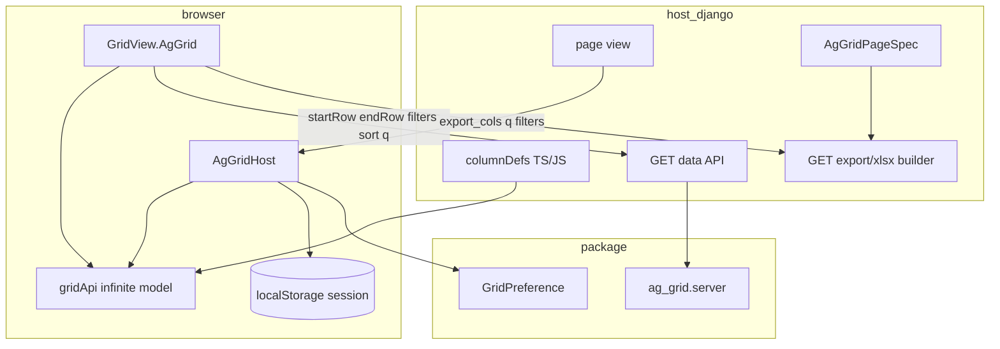
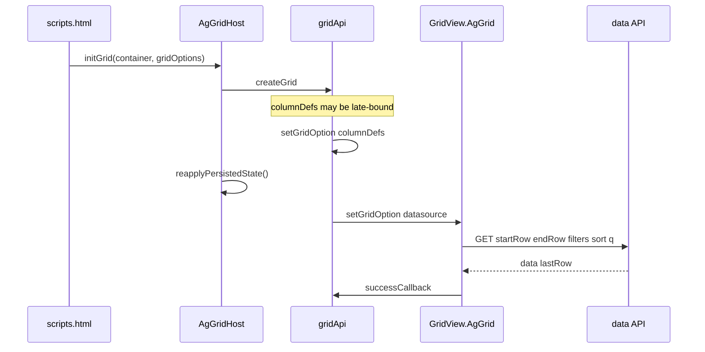
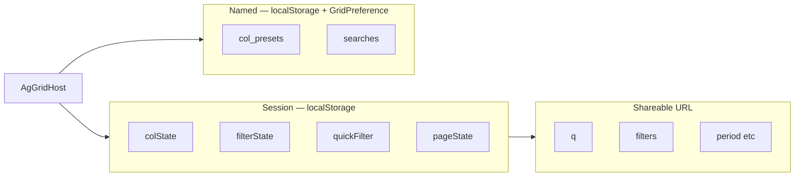
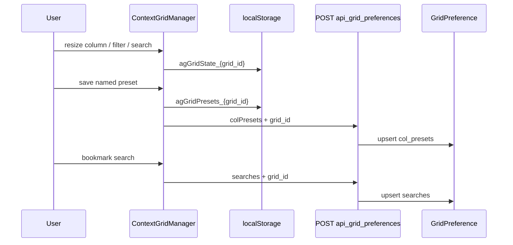
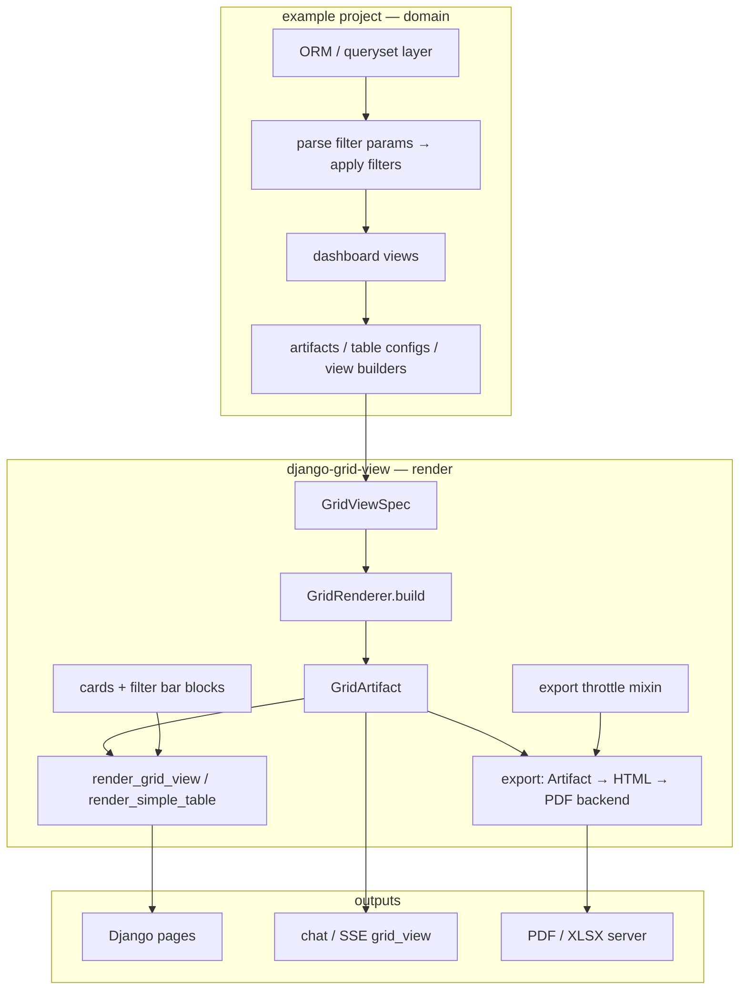
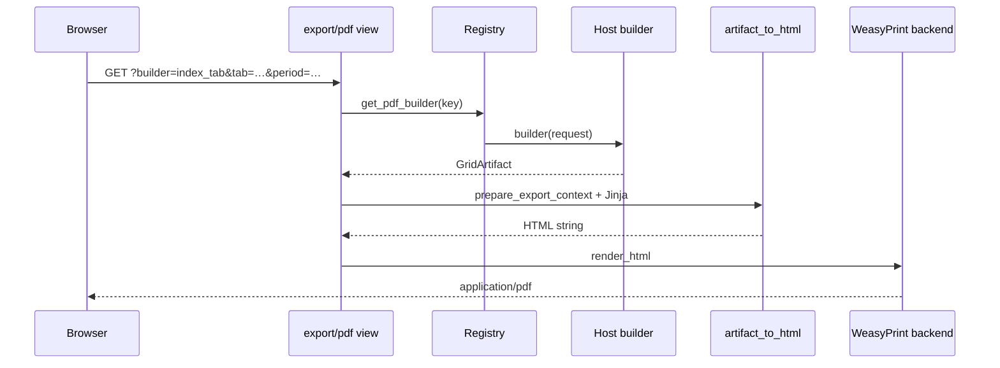
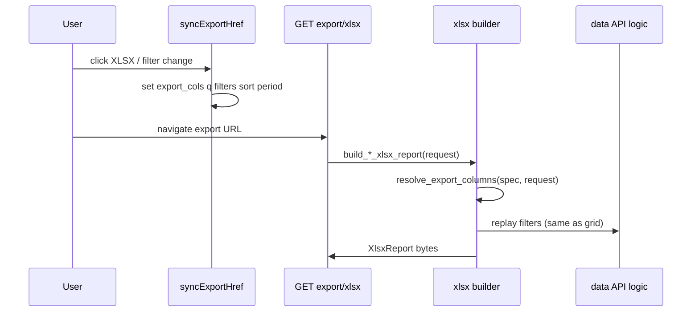

# django-grid-view — LLM context bundle

> Auto-generated by `scripts/build_llm_context.py`. Do not edit by hand.
> Regenerate: `uv run python scripts/build_llm_context.py`

Package: **django-grid-view** (PyPI) · Module: **django_grid_view** · Docs: https://alpiua.github.io/django-grid-view/

---


<!-- source: index.md -->

# Django Grid View

**django-grid-view** is a reusable Django app for declarative data views in dashboards and chat UIs.

Install from PyPI:

```bash
pip install django-grid-view
```

## Three ways to render data

### Simple Table

Server-rendered lists with sort, search, and export.

- **Python:** `SimpleTableConfig`
- **Template:** ``

### AG-Grid pages

Extension on [AG Grid Community](https://www.ag-grid.com/) 31.x — infinite model, toolbar, persistence.

- **Python:** `AgGridPageSpec`, `django_grid_view.ag_grid`, host JSON data API
- **Template:** ``, `GridView.AgGrid`

See AG-Grid integration (see section: ag-grid.md).

### Grid View

KPI strip, ECharts, table, optional filter bar and card grids — one spec.

- **Python:** `GridRenderer` / `build_artifact_from_view`
- **Template:** ``, ``, ``


**Core rule:** numeric KPI and chart values always come from Python `rows`. Specs and LLM output describe structure only.

See Architecture (see section: architecture.md) for how a host project wires domain queries, artifacts, chat, and PDF export.

## Quick links

- Getting started (see section: getting-started.md) — install, Django setup, first table
- Architecture (see section: architecture.md) — integration diagram and responsibility split
- Grid View artifacts (see section: grid-view-artifacts.md) — `GridViewSpec` → `GridArtifact`
- Server filtering contract (see section: guides/server-filtering-contract.md) — one queryset path for table/chart/export
- Changelog (see section: changelog.md) — release notes
- LLM context bundle (see section: llm/django-grid-view-llm-context.md) — single file for agents (about the bundle (see section: llm/context.md))
- GridViewSpec reference (see section: reference/grid-view-spec.md) — JSON Schema contract
- Python types (see section: reference/python-types.md) — imports for host apps (pyright/mypy)

## Publishing this documentation

The docs site is built with [MkDocs Material](https://squidfunk.github.io/mkdocs-material/) and deployed to GitHub Pages via the `Docs` workflow. Repository maintainers: enable **Settings → Pages → Build and deployment → GitHub Actions**, then set the repository **Website** to `https://alpiua.github.io/django-grid-view/`.

## Links

- [PyPI](https://pypi.org/project/django-grid-view/)
- [GitHub](https://github.com/alpiua/django-grid-view)
- [Issue tracker](https://github.com/alpiua/django-grid-view/issues)


---


<!-- source: getting-started.md -->

# Getting started

## Install

```bash
pip install django-grid-view
```

Editable install for local development:

```bash
pip install -e /path/to/django-grid-view
```

With **uv**, override PyPI in your project:

```toml
[project]
dependencies = ["django-grid-view>=1.0.0"]

[tool.uv.sources]
django-grid-view = { path = "../django-grid-view", editable = true }
```

## Django setup

```python
# settings.py
INSTALLED_APPS = [
    # ...
    "django_grid_view",
]
```

```python
# settings.py (export + grid prefs URL names used by templatetags and scripts.html)
DJANGO_GRID_VIEW_EXPORT_PDF_URL = "api_export_pdf"
DJANGO_GRID_VIEW_EXPORT_XLSX_URL = "api_export_xlsx"
```

Mount HTTP routes in **your** API `urls.py` (the package ships an empty `django_grid_view.urls` — do not `include()` it):

```python
# myapp/api/urls.py — example; mount as path("api/", include("myapp.api.urls"))
from django.urls import path
from django_grid_view.export.pdf_view import export_pdf
from django_grid_view.export.xlsx_view import export_xlsx
from django_grid_view.views import save_grid_settings

urlpatterns = [
    path("grid/preferences/", save_grid_settings, name="api_grid_preferences"),
    path("export/pdf/", export_pdf, name="api_export_pdf"),
    path("export/xlsx/", export_xlsx, name="api_export_xlsx"),
]
```

| Endpoint | URL name | Purpose |
|----------|----------|---------|
| `POST …/grid/preferences/` | `api_grid_preferences` | Save `GridPreference` (required for `scripts.html`) |
| `GET …/export/pdf/?builder=…` | `api_export_pdf` | Server PDF (``) |
| `GET …/export/xlsx/?builder=…` | `api_export_xlsx` | Server XLSX (``) |

Register PDF/XLSX **builders** in `AppConfig.ready()` — see Host app page export (see section: guides/host-app-page-export.md), PDF export (see section: guides/pdf-export.md), and XLSX export (see section: guides/xlsx-export.md).

```bash
python manage.py migrate django_grid_view
```

This creates the `GridPreference` model used for per-user column presets and saved searches.

## Load assets once per page

Grid View inclusion tags auto-load CSS/JS on first use. For explicit control:

```django


```

Place `` in your base template, or rely on auto-load from `render_simple_table`, `render_grid_view`, etc.

## First Simple Table

**View** — build rows in Python:

```python
from django.shortcuts import render
from django_grid_view.tables import Column, SimpleTableConfig

def orders_list(request):
    rows = [
        {"name": "Ada", "visits": 12},
        {"name": "Bob", "visits": 8},
    ]
    config = SimpleTableConfig(
        grid_id="orders",
        columns=[
            Column(key="name", label="Customer"),
            Column(key="visits", label="Visits", align="right"),
        ],
        data=rows,
    )
    return render(request, "orders.html", {"table": config})
```

**Template:**

```django


```

Open the page — client-side sort and search work without extra JavaScript.

## Typing in host projects

The package includes **`py.typed`**. Import contracts instead of copying TypedDicts:

```python
from django_grid_view.types import GridViewSpec, GridViewSpecWire, JsonObject, RowDict
from django_grid_view.tables import Column, SimpleTableConfig
from django_grid_view.render import build_artifact_from_view, parse_grid_view_spec
```

See Python types (see section: reference/python-types.md) for wire types, `GridArtifactJson`, enums, and pyright setup.

## Next steps

- Simple Table (see section: simple-table.md) — columns, export, footers
- AG-Grid integration (see section: ag-grid.md) — infinite API contract, persistence, wiring
- Charts and KPIs (see section: charts-and-kpis.md) — ECharts and KPI strips
- Grid View artifacts (see section: grid-view-artifacts.md) — unified `GridViewSpec` rendering


---


<!-- source: simple-table.md -->

# Simple Table

Server-rendered HTML tables with client-side sort, search, column settings, and server XLSX/PDF export links.

## Configuration

```python
from django_grid_view.tables import Column, ColumnGroup, SimpleTableConfig
from django_grid_view.types import RowDict

rows: list[RowDict] = [{"sku": "A1", "name": "Widget", "price": 9.99}]

config = SimpleTableConfig(
    grid_id="products",
    columns=[
        Column(key="sku", label="SKU", width="120px"),
        Column(key="name", label="Name"),
        Column(key="price", label="Price", align="right", hide=True),
    ],
    data=rows,
    search_mode="global",  # global | per_column | disabled
    striped=True,
    column_settings=True,
    column_groups_order=("Main", "Finance"),
)
```

### Column options

| Field | Purpose |
|-------|---------|
| `key` | Row dict key |
| `label` | Header text |
| `sortable` | Enable column sort (default `True`) |
| `searchable` | Include in client search (default `True`) |
| `align` | `left`, `center`, `right` |
| `hide` | Hidden by default (Standard preset restores this) |
| `menu_group` | Group label in column settings modal |
| `exportable` | Include in XLSX when visible (default `True`) |
| `sort_value` | Callable for custom sort key |
| `export_raw` | Callable for XLSX raw value |
| `render` | Override cell HTML (subclass `Column`) |

### Column settings

Enable with `column_settings=True` on `SimpleTableConfig` or `GridViewSpec`.

| Feature | Behaviour |
|---------|-----------|
| Gear button | Included in table toolbar; use `` for external toolbars |
| Modal | Drag order, show/hide, L/R pin, named presets |
| Persistence | `localStorage` session state + `GridPreference.col_presets` via `api_grid_preferences` |
| Export sync | Export links with `data-cm-export-sync data-cm-grid-id="…"` receive `export_cols` query param |

```django



```

Server XLSX export respects visible columns:

```python
from django_grid_view.export.table_columns import resolve_simple_table_for_export

def build_products_xlsx(request):
    page = load_products_page(request)
    table = resolve_simple_table_for_export(page.table, request)
    return report_from_simple_table(table, sheet_name="Products")
```

### Column groups

Multi-level headers:

```python
ColumnGroup(label="Q1", column_keys=["jan", "feb", "mar"])
```

With `column_groups`, the settings modal operates on **units**: each `ColumnGroup` is one chip (show/hide/reorder moves the whole group + its leaf columns together). Standalone columns outside groups remain individual units. Pin (L/R) is available for standalone columns only. Export expands visible groups to their leaf column keys.

### Row actions

```python
SimpleTableConfig(
    grid_id="orders",
    columns=[...],
    data=rows,
    row_url="/orders/{id}/",  # placeholders from row keys
    # or row_onclick="openOrder({id})"
)
```

### Footer row

```python
footer_row={"name": "Total", "amount": 1000},
footer_label="Summary",
footer_label_span=2,
```

## Template tag

```django


```

The tag builds header/footer rows and injects `data-cm-*` attributes consumed by `grid-view.js` (`GridView.SimpleTable` + `GridView.ColumnSettingsManager`).

## Export

Server export via registered builders:

- XLSX: `` — XLSX export (see section: guides/xlsx-export.md)
- PDF: `` — PDF export (see section: guides/pdf-export.md)

Host mounts `/api/export/xlsx/` and `/api/export/pdf/`; set `DJANGO_GRID_VIEW_EXPORT_*_URL` in settings.
Optional: `export_xlsx_url` / `export_pdf_url` on `SimpleTableConfig` for toolbar links.

Sync export columns from the browser:

```html
<a href=""
   data-cm-export-sync="1"
   data-cm-grid-id="products">XLSX</a>
```

`GridView.AgGrid.syncExportHref` is intentionally shared with Simple Table column settings:
when the grid id resolves to a column-settings adapter instead of an AG-Grid host, it writes
`export_cols` from the displayed Simple Table columns.

## When to use Simple Table vs Grid View 1.0

| Use Simple Table | Use Grid View artifact |
|------------------|------------------------|
| Custom `Column.render()` HTML | Declarative `GridViewSpec` + KPI + charts |
| Legacy dashboard tables | Chat / LLM-driven views |
| No KPI/chart on same block | One `` block |

See Grid View artifacts (see section: grid-view-artifacts.md) for the unified spec path.

## Shared column settings with AG-Grid

`GridView.ColumnSettingsManager` lives in `column-settings.js`, loaded only when `column_settings=True` via `` (included from `simple/table.html` and AG-Grid `scripts.html`). `grid-view.js` stays on every page (sort, search, charts). AG-Grid `ContextGridManager` delegates after `gridApi` init. Same modal: `django_grid_view/modal.html`.


---


<!-- source: ag-grid.md -->

# AG-Grid integration

Extension layer for [AG Grid Community](https://www.ag-grid.com/) 31.x in Django: toolbar,
`AgGridHost`, session persistence, infinite-model HTTP contract, server XLSX sync.

| Component | Owner |
|-----------|-------|
| `gridApi`, `columnDefs`, cell renderers, filter components | Host |
| JSON data API, ORM field maps, row serialization | Host |
| `AgGridPageSpec`, XLSX column resolution | Host (spec) + package (helpers) |
| `AgGridHost`, toolbar, modal, search bar | Package |
| `GridView.AgGrid`, `django_grid_view.ag_grid` | Package |
| `GridPreference` (named presets, saved searches) | Package model; host mounts save URL |

## Architecture



## Infinite data API contract

### Response

```json
{
  "data": [
    { "id": 1, "sku": "ABC-001", "customer": "Ada" }
  ],
  "lastRow": 45000
}
```

| Field | Type | Rule |
|-------|------|------|
| `data` | `object[]` | One object per row; keys = `columnDefs[].field` / `colId` |
| `lastRow` | `int` | Total row count after server filters (not page size) |

Empty keys may be omitted in sparse rows; export uses `AgGridPageSpec` column order, not `Object.keys(row)`.

### Request query parameters

| Param | Source | Type | Purpose |
|-------|--------|------|---------|
| `startRow` | `createInfiniteDatasource` | int | Block start (0-based) |
| `endRow` | `createInfiniteDatasource` | int | Block end (exclusive) |
| `filters` | AG Grid `filterModel` | JSON object | Server-side column filters |
| `sort` | AG Grid sort model | JSON array | Server-side sort |
| `q` | Search bar (`manager._searchText`) | string | Quick search |
| `cols` | Visible columns | comma-separated | Multi-column search scope |
| `export_cols` | `syncExportHref` only | comma-separated | XLSX column ids (not sent on infinite fetch) |
| `action` | Host | string | e.g. `dictionary` for set-filter values |
| `field` | Host | string | Column id when `action=dictionary` |

Host-specific params (period, tab, …) pass via `getExtraParams` in JS and replay in export builders.

### Filter JSON (`filters` param)

Set filter (custom or AG set):

```json
{ "status": { "values": ["Active", "Pending"] } }
```

Text filter:

```json
{ "sku": { "filterType": "text", "type": "contains", "filter": "abc" } }
```

Supported text `type` values in `apply_grid_filters`: `contains`, `notContains`, `equals`, `notEqual`, `startsWith`, `endsWith`.

Pass `format_filter_value(col_id, display_value)` when DB values differ from filter labels.

### Sort JSON (`sort` param)

```json
[{ "colId": "registered_esoz", "sort": "desc" }]
```

Only the first entry is applied; host supplies `field_map: colId → ORM path`.

### Dictionary action

```
GET /api/products/?action=dictionary&field=record_match_status
→ { "values": ["…", "…"] }
```

Wire `dictionaryUrl` in `gridOptions.context`.

### Python: `InfiniteGridParams`

```python
from django_grid_view.ag_grid import (
    apply_grid_filters,
    apply_grid_sort,
    parse_infinite_params,
)

params = parse_infinite_params(request)  # default_page_size=100
# params.start_row, params.end_row, params.search_query
# params.visible_cols, params.filters, params.sort_model
# params.action, params.action_field
```

## AgGridPageSpec contract

```python
from django_grid_view.types import AgGridColumnSpec, AgGridPageSpec

PRODUCTS_PAGE_SPEC = AgGridPageSpec(
    grid_id="products",
    columns=(
        AgGridColumnSpec("sku", "SKU"),
        AgGridColumnSpec("name", "Name"),
        AgGridColumnSpec("cost", "Cost", hide=True),
    ),
)
```

| `AgGridColumnSpec` field | Default | Meaning |
|--------------------------|---------|---------|
| `col_id` | — | AG Grid `colId` / row key |
| `label` | — | XLSX header, UI labels |
| `hide` | `False` | Default visibility when no live grid snapshot |
| `exportable` | `True` | Included in export resolution |

| `resolve_export_columns(spec, request)` input | Result |
|-----------------------------------------------|--------|
| `export_cols=a,b,c` (subset of exportable ids) | Those ids in request order |
| `export_cols` absent or empty | All columns with `exportable=True` and `hide=False` |

Constant: `EXPORT_COLS_PARAM = "export_cols"`.

## JavaScript contract

Load assets once per page (base template, outside HTMX swaps):

```django


```

AG Grid Community + SortableJS from CDN in the same base template.

### Boot sequence



```javascript
manager.gridApi.setGridOption("columnDefs", ProductColumns);
manager.reapplyPersistedState();
manager.gridApi.setGridOption(
  "datasource",
  GridView.AgGrid.createInfiniteDatasource({
    url: "/api/products-data/",
    manager: manager,
    getExtraParams: () => ({ period: "2025-01" }),
    onLastRow: (count) => { /* toolbar counter */ },
  })
);
```

### `gridOptions.context`

| Key | Default | Contract |
|-----|---------|----------|
| `gridId` | — | Equals `grid_id` in `scripts.html` and `GridPreference.grid_id` |
| `storageScope` | — | Suffix: `agGridState_{gridId}__{storageScope}` |
| `syncUrlState` | `true` | `history.replaceState` for `q`, `filters`, `urlPageStateKeys` |
| `urlPageStateKeys` | keys from `getPageState()` | Domain params mirrored to URL |
| `getPageState()` | — | Returns `{ period: ["2024-01"], … }` for filter bar |
| `applyPageState(state, opts)` | — | Restores domain filter bar |
| `onFilterChanged(manager)` | — | Hook after AG filter change (export sync) |
| `onDataReload(manager)` | — | Hook after manual search reload; otherwise export links are synced automatically |
| `restoreQuickFilter` | `true` | Restore search from localStorage when URL has no `q` |
| `dictionaryUrl` | — | Base URL for set-filter dictionary fetch |

### Export href sync

```javascript
GridView.AgGrid.syncExportHref(linkEl, manager, {
  getExtraParams: () => ({ period: "2025-01" }),
  exportColumns: true,  // writes export_cols (default true)
});
```

`syncExportHref` accepts either a runtime handle or a grid id string. `syncExportLinks`
updates every `[data-cm-export-sync][data-cm-grid-id="…"]` link for the grid.

```javascript
GridView.AgGrid.syncExportHref(linkEl, "products", {
  getExtraParams: () => ({ period: "2025-01" }),
});
GridView.AgGrid.syncExportLinks("products");
```

Call on first load and on filter/column/search changes; invoke again in link `onclick` before navigation.

| `syncExportHref` option | Default | Effect |
|-------------------------|---------|--------|
| `exportColumns` | `true` | Visible column ids → `export_cols` |
| `includeVisibleCols` | `false` | Also set `cols` on export URL |

## Page wiring

### Template

```django


<div id="products-grid" class="ag-theme-quartz-dark"></div>


```

### Host view

```python
import json
from django_grid_view.models import GridPreference

def products_view(request):
    presets, searches = {}, []
    if request.user.is_authenticated:
        pref = GridPreference.objects.filter(user=request.user, grid_id="products").first()
        if pref:
            presets, searches = pref.col_presets, pref.searches
    return render(request, "products.html", {
        "ag_grid_presets": json.dumps(presets),
        "ag_grid_searches": json.dumps(searches),
    })
```

### Save preferences URL (host-mounted)

Package ships `save_grid_settings` view; host registers it with name **`api_grid_preferences`**:

```python
from django_grid_view.views import save_grid_settings

urlpatterns = [
    path("api/grid/preferences/", save_grid_settings, name="api_grid_preferences"),
]
```

### XLSX link

```django
<a href=""
   id="products-xlsx"
   onclick="syncProductsExport();">XLSX</a>
```

```python
register_xlsx_builder("products", build_products_xlsx_report, filename_fn=…)
```

## Persistence

Column settings UI (`modal.html`, presets, drag/pin) is implemented once in `grid-view.js` as `GridView.ColumnSettings`. `AgGridHost` delegates to it after `gridApi` init; Simple Table uses the DOM table adapter. See [Simple Table — column settings](simple-table.md#column-settings).

Three storage layers:



| Layer | Key / model | Contents |
|-------|-------------|----------|
| Session | `agGridState_{grid_id}` or `…__{storageScope}` | `colState`, `filterState`, `quickFilter`, `pageState` |
| Named presets | `GridPreference.col_presets` | User-named `getColumnState()` snapshots |
| Saved searches | `GridPreference.searches` | Quick-search bookmark strings |

Session layout auto-saves on column/filter/search/domain-filter changes. Named presets and searches save via `POST api_grid_preferences`. Last column layout is not auto-persisted to Django.

### Session JSON

```json
{
  "colState": [{ "colId": "name", "width": 220, "hide": false }],
  "filterState": { "customer": { "values": ["Ada"] } },
  "quickFilter": "uuid-fragment",
  "pageState": { "period": ["2024-01", "2024-02"] }
}
```

### Restore priority

| Field | Source order |
|-------|--------------|
| Quick search | URL `?q=` → localStorage |
| AG filters | URL `?filters=` (JSON) → localStorage |
| Domain filters | URL keys in `urlPageStateKeys` → `pageState` in localStorage |

Cross-tab: `storage` event on session key reapplies state and purges infinite cache.

See Saved preferences (see section: preferences.md) for `POST` body schema.

## Integration checklist

| # | Requirement |
|---|-------------|
| 1 | AG Grid + Sortable CDN in base template |
| 2 | `` once per page |
| 3 | `grid_id` = `context.gridId` = `GridPreference.grid_id` |
| 4 | `ag_grid_presets`, `ag_grid_searches` in view context |
| 5 | `api_grid_preferences` → `save_grid_settings`; `migrate django_grid_view` |
| 6 | Data API: `{ data, lastRow }` + `parse_infinite_params` |
| 7 | XLSX: `AgGridPageSpec` + `resolve_export_columns` + `syncExportHref` |
| 8 | Late `columnDefs`: `reapplyPersistedState()` before datasource |

## Runtime constraints

| Rule | Detail |
|------|--------|
| HTMX | AG Grid CDN and bundle load outside swapped fragments |
| Search | Infinite model uses server `q`; not `quickFilterText` |
| Export | Server XLSX via registered builder — guides/xlsx-export.md (see section: guides/xlsx-export.md) |
| License | AG Grid Community 31.x APIs only |

## Filtered KPI strip

```django

```

```javascript
GridView.bindGridKpis({ gridAdapter: GridView.createAgGridAdapter(gridApi) });
```

See Charts and KPIs (see section: charts-and-kpis.md).

## Reference: host integration

| Layer | Module |
|-------|--------|
| Spec | `dashboard/items/ag_grid/spec.py` |
| API | `ag_grid/api.py`, `queryset.py`, `fields.py`, `serializers.py` |
| XLSX | `export.py` — builder key `items_grid` |
| Columns | your frontend `columnDefs` |
| Templates | `_grid_options.html`, `_grid_scripts.html`, `_toolbar.html` |

Typical config: `grid_id="items"`, `storageScope="items-grid"`, data endpoint `GET /api/items/data/`.

## API reference

- [Python types — AG-Grid](reference/python-types.md#ag-grid)
- JavaScript API (see section: reference/javascript.md)
- [Template tags](reference/template-tags.md#ag-grid-helpers)
- Saved preferences (see section: preferences.md)


---


<!-- source: charts-and-kpis.md -->

# Charts and KPIs

Grid View 1.0 resolves KPI values and chart bindings in Python from `rows`, then renders ECharts in the browser.

## KPI strip (Python-resolved)

```python
from django_grid_view.types import ColumnFormat, KpiAggregate, KpiSpec, RowDict
from django_grid_view.render.kpi import resolve_kpis

specs = [
    KpiSpec(
        label="Total",
        column_key="amount",
        aggregate=KpiAggregate.SUM,
        format=ColumnFormat.NUMBER,
    ),
]
kpis = resolve_kpis(specs, rows)
```

```django

```

## Charts (static rows)

Requires `window.echarts` on the page (load ECharts CDN in your base template).

```python
from django_grid_view.types import ChartSpec, ChartType, RowDict, SeriesSpec
from django_grid_view.render.charts import build_chart_runtime

chart = ChartSpec(
    id="main",
    chart_type=ChartType.BAR,
    x_key="name",
    series=(SeriesSpec(key="amount", label="Amount"),),
)
runtime = build_chart_runtime(chart, rows)
```

```django

```

## AG-Grid–filtered KPIs and charts

When KPIs or charts must reflect **visible** AG-Grid rows after filter/sort:

- Python: `` (unresolved specs)
- JS: `GridView.createAgGridAdapter(gridApi)` + `bindGridKpis` / `bindGridFilteredCharts`

`ChartSpec.data_source` can be `static` (artifact rows) or `grid_filtered` (adapter rows).

## Unified layout

Prefer one artifact when KPI, chart, and table share the same `rows`:

```python
from django_grid_view.types import GridViewSpec, RowDict
from django_grid_view.render import GridRenderer

artifact = GridRenderer.build(spec, rows)
```

Types: Python types (see section: reference/python-types.md).

```django

```

See Grid View artifacts (see section: grid-view-artifacts.md).


---


<!-- source: grid-view-artifacts.md -->

# Grid View artifacts

`GridViewSpec + rows → GridArtifact` is the core render contract for unified KPI, chart, and table blocks.

## Quick start

```python
from django_grid_view.types import JsonObject, RowDict
from django_grid_view.render import build_artifact_from_view

rows: list[RowDict] = [{"name": "A", "amount": 10}, {"name": "B", "amount": 20}]
view: JsonObject = {
    "grid_id": "demo",
    "title": "Demo",
    "columns": [
        {"key": "name", "label": "Name", "format": "text"},
        {"key": "amount", "label": "Amount", "format": "number"},
    ],
    "kpis": [
        {"label": "Total", "column_key": "amount", "aggregate": "sum", "format": "number"}
    ],
    "charts": [{
        "id": "main",
        "chart_type": "bar",
        "x_key": "name",
        "series": [{"key": "amount", "label": "Amount"}],
    }],
    "layout": {"blocks": ["title", "kpis", "chart", "table"]},
}

artifact = build_artifact_from_view(view, rows)
payload = artifact.to_json()  # wire shape for GridView.init
```

Typed builders (recommended for dashboards):

```python
from django_grid_view.types import (
    ChartSpec,
    ChartType,
    ColumnSpec,
    GridViewSpec,
    KpiSpec,
    RowDict,
    SeriesSpec,
)
from django_grid_view.render import GridRenderer

spec = GridViewSpec(
    grid_id="demo",
    columns=(ColumnSpec(key="name", label="Name"),),
    kpis=(),
    charts=(
        ChartSpec(
            id="main",
            chart_type=ChartType.BAR,
            x_key="name",
            series=(SeriesSpec(key="amount", label="Amount"),),
        ),
    ),
)
artifact = GridRenderer.build(spec, rows)
```

Import map: Python types (see section: reference/python-types.md).

## API

| Function | Input | Output |
|----------|-------|--------|
| `parse_grid_view_spec_json(raw)` | dict | `GridViewSpec` |
| `GridRenderer.build(spec, rows)` | validated spec + rows | `GridArtifact` |
| `build_artifact_from_view(view, rows)` | raw dict or spec + rows | `GridArtifact` |
| `build_artifact_json_from_view(view, rows)` | raw dict or spec + rows | `GridArtifactJson` |

Use `build_artifact_from_view` when the spec comes from JSON (LLM or Python dict).
Use `GridRenderer.build` when you already have a validated `GridViewSpec`.

## Invariants

- KPI and chart **numbers** are computed from `rows` inside `GridRenderer.build`.
- The spec must not contain row data or numeric KPI values.
- Schema: GridViewSpec reference (see section: reference/grid-view-spec.md) and `schema/grid-view-spec.v1.json` in the repository.

## Template rendering

```django


```

## Client-side init (SPA / chat)

```javascript
GridView.init({ root: document.getElementById("chat-panel"), artifact: payload });
```

## Consumer integration

Router state lookup, chat SSE wrapping, and visualizer prompts are **not** part of this package. See Chat visualizer (see section: guides/chat-visualizer.md) for a generic wire contract.


---


<!-- source: preferences.md -->

# Saved preferences

Named column presets and saved quick-search bookmarks for AG-Grid pages. Session state
(columns, filters, search, domain `pageState`) lives in `localStorage` — see
[AG-Grid integration — Persistence](ag-grid.md#persistence).



## GridPreference model

| Field | Type | Constraint |
|-------|------|------------|
| `user` | FK → `AUTH_USER_MODEL` | Owner |
| `grid_id` | `CharField(100)` | Matches `scripts.html` `grid_id` and `context.gridId` |
| `col_presets` | JSON object | `{ "Preset name": [ colState, … ] }` |
| `searches` | JSON list of strings | Quick-search bookmarks |

Unique: `(user, grid_id)`.

## Host setup

```bash
python manage.py migrate django_grid_view
```

```python
from django_grid_view.views import save_grid_settings

urlpatterns = [
    path("api/grid/preferences/", save_grid_settings, name="api_grid_preferences"),
]
```

URL name **`api_grid_preferences`** is required — `scripts.html` resolves it with ``.

View context for initial load:

```python
return render(request, "page.html", {
    "ag_grid_presets": json.dumps(presets),   # "{}" or preset dict
    "ag_grid_searches": json.dumps(searches), # "[]" or string list
})
```

## Save API contract

| | |
|---|---|
| Method | `POST` |
| URL | Host-defined; name must be `api_grid_preferences` |
| Auth | `login_required` |
| Content-Type | `application/json` |

### Request body

```json
{
  "grid_id": "products",
  "colPresets": {
    "Finance view": [{ "colId": "name", "hide": false, "width": 220 }]
  },
  "searches": ["north region", "priority"]
}
```

| Field | Required | Semantics |
|-------|----------|-----------|
| `grid_id` | yes | Target grid |
| `colPresets` | no | Full replacement of named presets when present |
| `searches` | no | Full replacement of search list when present |

`colPresets` values are AG Grid `getColumnState()` arrays.

### Responses

| Status | Body |
|--------|------|
| `200` | `{"status": "ok"}` |
| `400` | `{"status": "error", "message": "Invalid JSON"}` |
| `400` | `{"status": "error", "message": "Missing grid_id parameter"}` |

Anonymous users: session state in `localStorage` only; save API returns login redirect.

## Security

| Concern | Behavior |
|---------|----------|
| Write scope | Authenticated user; row keyed by `(user, grid_id)` |
| Read scope | View loads prefs for `request.user` only |
| Row-level data | Package stores layout JSON only; host validates sensitive grids |


---


<!-- source: architecture.md -->

# Architecture

This document summarizes how **django-grid-view** is structured and how a host Django
project integrates with it.

## Purpose

`django-grid-view` provides reusable **grid view** rendering for Django applications:

1. **Simple Table** — server-rendered HTML tables (sort, search, export)
2. **AG-Grid** — HTMX-safe lifecycle, preferences, infinite row model helpers
3. **Grid View** — unified KPI cards, ECharts charts, tabular data, optional filter bar and card grids
4. **Export** (optional extras) — artifact → HTML (Jinja2) → PDF (WeasyPrint), static chart PNG, throttle helpers


## Target integration (example project)

A typical dashboard keeps **domain data and queries** in the host app and passes
**structure + rows** into the package renderer. Chat, HTML pages, and PDF export are
three consumers of the same `GridArtifact`, not three parallel render paths.



**Single contract:** `GridViewSpec + rows[] → build_artifact_from_view()` (or
`GridRenderer.build`). The host owns labels, URLs, filter options, and ORM filters; the
package owns widgets, templates, `grid-view.js`, and export adapters.

### Responsibility split

| Layer | django-grid-view | example project (host) |
|-------|------------------|----------------------|
| CSS, toolbar, KPI, chips, cards | `table.css`, partials, `CardGridSpec`, `FilterBarSpec` | domain labels, tones, layout blocks |
| Tables | `Column`, `SimpleTableConfig`, `ColumnSpec` | domain columns, row serializers |
| Charts / KPI | `ChartSpec`, `KpiSpec`, ECharts bind | builders from aggregated querysets |
| Server XLSX | declarative `XlsxReport` + xlsxwriter (openpyxl optional) | register host `…/export/xlsx/?builder=` builders |
| Server PDF | artifact → HTML + PDF backend plugins | rows + thin view wrappers |
| Inline edit (hook) | `EditActionSpec` + JS callback | PATCH endpoints, validation, policy |
| Rate limit | `ExportThrottleMixin` / decorator | URL wiring, limits per endpoint |
| Filter / search UI | `FilterBarSpec`, widgets, URL/DOM sync, `AgGridHost` session state | options + `FilterState` → ORM |
| Filter / search data | — | models, care-type lists, period helpers |
| AG-Grid infinite API | `parse_infinite_params`, `apply_grid_filters`, `apply_grid_sort` | ORM queryset, field maps, row serializer |
| AG-Grid export columns | `AgGridPageSpec`, `resolve_export_columns` | XLSX builder replays data API |
| AG-Grid client wiring | `GridView.AgGrid`, `AgGridHost`, `scripts.html` | `columnDefs`, data API URL, page hooks |

## AG-Grid mode

Large interactive grids: host supplies `columnDefs` and JSON data API; package supplies
toolbar, `AgGridHost`, `GridView.AgGrid`, and `django_grid_view.ag_grid` server helpers.

Contract and diagrams: AG-Grid integration (see section: ag-grid.md).

## Layer model

```
Data (Python)          Spec (declarative)        Render (adapters)
─────────────────────────────────────────────────────────────────
rows: list[dict]   +   GridViewSpec          →   GridArtifact
                                               ├─ SimpleTableConfig
                                               ├─ AgGridColumnDefs
                                               ├─ ResolvedKpi[]
                                               ├─ ChartRuntimeConfig[]
                                               ├─ CardGridSpec / FilterBarSpec (optional)
                                               └─ export HTML / PDF (optional)
```

**Rule:** Numbers always come from Python `rows`. The LLM (chat visualizer) supplies structure only.

### Ownership boundaries

| Layer | Responsibility |
|-------|----------------|
| **Package** | Types, parser, `GridRenderer`, adapters, `grid-view.js`, CSS, i18n, export/throttle |
| **Consumer app** | `rows` (SQL/ORM), domain labels/URLs, AG-Grid instance, filter → queryset |
| **Chat / LLM** | `GridViewSpec` JSON only; no row data or KPI numbers |

The package **does not** instantiate AG-Grid. KPI numbers come from Python `rows` only.

## ChartSpec and AG-Grid

| `data_source` | Behavior |
|---------------|----------|
| `static` | Use `rows` from `GridArtifact` |
| `grid_filtered` | Visible rows from AG-Grid via `GridView.createAgGridAdapter` |

See JavaScript API (see section: reference/javascript.md).

## Front-end bundle

All browser code lives in **`static/django_grid_view/grid-view.js`** — one IIFE, no Vite build. Python types in `types/chart_bind.py` define the chart runtime contract.

Host apps import public types from `django_grid_view.types` (Python types (see section: reference/python-types.md)); `py.typed` is shipped in the wheel.

## Internationalization

Package chrome uses Django `locale/` (en + uk) and `window.GridViewI18n` injected before the bundle.

## Package modules

| Module | Responsibility |
|--------|----------------|
| `types/` | Enums, specs, JSON parsing (`filters`, `cards`, wire types, `AgGridPageSpec`) |
| `ag_grid/` | Infinite API param parsing, filter/sort helpers, export column resolution |
| `render/` | `GridRenderer`, KPI/chart resolution |
| `tables.py` | `Column`, `SimpleTableConfig` |
| `export/` | HTML report, PDF/XLSX backends, static charts, throttle |
| `templatetags/` | Inclusion tags (`render_grid_view`, `render_filter_bar`, cards) |
| `models.py` | `GridPreference` |
| `templates/django_grid_view/` | `scripts.html` (`AgGridHost`), plugins, partials |
| `static/django_grid_view/` | `grid-view.js`, `table.css` |

## Server PDF export

One HTTP entry for all host apps — **no per-page PDF views in the consumer**:

```
GET /api/export/pdf/?builder=<key>&<same query as the HTML page>
  → register_pdf_builder(key)(request) → GridArtifact
  → artifact_to_html(artifact)  # layout.blocks + artifact.table + chart PNGs
  → PdfBackend (WeasyPrint) → bytes
```

Host projects mount `export_pdf` / `export_xlsx` and set `DJANGO_GRID_VIEW_EXPORT_*_URL` — see Getting started (see section: getting-started.md).

| Layer | Owner |
|-------|--------|
| ORM → rows, `SimpleTableConfig`, `GridArtifact` | Host (`register_pdf_builder`) |
| HTML assembly, throttle, WeasyPrint | Package |

**Customize layout:** optional Jinja `template` on `register_pdf_builder` — not `GridViewSpec` in the URL (numbers must be rebuilt server-side).

See PDF export guide (see section: guides/pdf-export.md) for registration, `export_pdf_href`, block types, and troubleshooting.

## Optional dependencies

| Extra | Install | Use |
|-------|---------|-----|
| `[pdf]` | `pip install django-grid-view[pdf]` | WeasyPrint PDF export |
| `[static-charts]` | `pip install django-grid-view[static-charts]` | Matplotlib PNG for PDF/embed |

Dev environments often pin the same packages so type checkers resolve imports; production hosts install only the extras they need.

## Related documents

- Grid View artifacts (see section: grid-view-artifacts.md)
- AG-Grid integration (see section: ag-grid.md)
- GridViewSpec reference (see section: reference/grid-view-spec.md)
- Charts and KPIs (see section: charts-and-kpis.md)
- Chat visualizer (see section: guides/chat-visualizer.md)


---


<!-- source: reference/template-tags.md -->

# Template tags

Load tags with ``.

## Asset bundle

| Tag | Template | Purpose |
|-----|----------|---------|
| `` | `bundle.html` | CSS + `grid-view.js` (once per page) |

Inclusion tags below auto-load assets on first use unless `grid_view_bundle` was already rendered.

## Simple Table

| Tag | Arguments | Purpose |
|-----|-----------|---------|
| `` | `SimpleTableConfig` | Full server-rendered table |

## Grid View 1.0

| Tag | Arguments | Purpose |
|-----|-----------|---------|
| `` | `GridArtifact`, optional `interactive=True` | Unified KPI + charts + table |
| `` | resolved KPIs, `columns=4` | Static KPI strip |
| `` | `ChartSpec` or runtime config, rows | ECharts block |
| `` | `KpiSpec` sequence, `columns=4` | AG-Grid KPI (client aggregates) |

## AG-Grid helpers

| Tag | Arguments | Purpose |
|-----|-----------|---------|
| `` | see below | Mount grid + `ContextGridManager` |
| `` | `grid_id` (context) | Toolbar + gear |
| `` | `grid_id` | Search bar |
| `` | `grid_id` | Gear button only |
| `` | `grid_id` | Column/search modal |
| `` | `filter_specs`, selected values | Declarative filter bar (`FilterSpec`) |
| `` | `SearchSpec`, value | Unified search input |
| `` | `scope_id`, backend/mode/value, `apply_on_enter` | Toolbar search for Simple Table or AG-Grid |
| `` | — | Lazy-load column settings JS/CSS once |

### `django_grid_view_scripts`

Include (do not use as inclusion tag — needs `options_var` global):

```django

```

| Parameter | Required | Description |
|-----------|----------|-------------|
| `grid_id` | yes | Preference key / DOM id prefix; must match `context.gridId` |
| `options_var` | yes | Global JS variable name (e.g. `"gridOptions"`) |
| `container_id` | yes | Element id for the grid div |
| `toolbar` | no | Include toolbar partial (default true) |
| `modal` | no | Include modal partial (default true) |

**Template context (from host view):**

| Variable | Type | Purpose |
|----------|------|---------|
| `ag_grid_presets` | JSON string or `"null"` | Server `GridPreference.col_presets` |
| `ag_grid_searches` | JSON string or `"null"` | Server `GridPreference.searches` |

**Typical partials:**

```django




```

`apply_on_enter=True` sets `data-cm-grid-search-apply="enter"`; AG-Grid reloads only on
Enter/clear instead of on every keypress.

See AG-Grid integration (see section: ag-grid.md) for `gridOptions.context` hooks and boot order.

## Server export hrefs

| Tag | Arguments | Purpose |
|-----|-----------|---------|
| `` | `builder` + optional query kwargs | PDF URL (`DJANGO_GRID_VIEW_EXPORT_PDF_URL`) |
| `` | same | XLSX URL (`DJANGO_GRID_VIEW_EXPORT_XLSX_URL`) |

`build_export_href(route_name, builder, **query)` skips empty values. Host must mount export views and register builders — Getting started (see section: getting-started.md), PDF (see section: guides/pdf-export.md), XLSX (see section: guides/xlsx-export.md).

For filterable dashboards, keep query params synchronized between page and export links; see Server filtering contract (see section: guides/server-filtering-contract.md).

## Context helper

`get_grid_state(context, grid_id)` — returns `(col_presets_json, searches_json)` for embedding in templates (used internally by toolbar).


---


<!-- source: reference/javascript.md -->

# JavaScript API

The package ships a single hand-maintained bundle: `static/django_grid_view/grid-view.js` (global `GridView` / `CmGridView`). No Node build step.

Load via `` or any inclusion tag that sets `load_assets`.

## GridView.AgGrid (infinite row model)

Host apps own the AG-Grid instance and domain API. The package provides datasource wiring and export href sync:

```javascript
GridView.AgGrid.createInfiniteDatasource({
  url: "/api/my-grid-data/",
  gridId: "my-grid",
  getExtraParams: function () { return { period: "2024-01" }; },
  onLastRow: function (count) { /* update toolbar counter */ },
});

GridView.AgGrid.syncExportHref(document.getElementById("my-xlsx-export"), "my-grid", {
  getExtraParams: function () { return { period: "2024-01" }; },
  exportColumns: true,
});
GridView.AgGrid.syncExportLinks("my-grid");
```

| API | Purpose |
|-----|---------|
| `createInfiniteDatasource(options)` | AG-Grid infinite `getRows` → fetch JSON `{ data, lastRow }` |
| `buildInfiniteQueryParams(blockParams, gridId, options)` | Serialize block params + filters/sort; optional `cols` for search scope |
| `syncExportHref(linkEl, gridIdOrHandle, options)` | Copy period, `q`, `col_q`, AG filters/sort, and `export_cols` into export href |
| `syncExportLinks(gridId, options)` | Update all `[data-cm-export-sync]` links for a grid |
| `getQuickSearchText(gridId)` | Read quick-search text for a grid |
| `GridView.byId.get(gridId)` | Runtime handle (`AgGridHost` or column settings) |
| `GridView.byId.registerBoot(gridId, fn)` | Register HTMX/re-mount bootstrap (used by `scripts.html`) |
| `GridView.byId.boot(gridId)` | Re-run bootstrap for a grid |
| `GridView.AgGrid.Host` | AG-Grid toolbar/search/persistence controller class |
| `GridView.AgGrid.SmartFilter` / `.Tooltip` | Optional AG-Grid component plugins |
| `GridView.AgGrid.createAdvancedSearch(inputSelector)` | Smart quick-filter parser factory |
| `GridView.createColumnSettings(...)` | Column settings controller for AG-Grid or Simple Table |

| `createInfiniteDatasource` option | Purpose |
|-----------------------------------|---------|
| `gridId` | Must match `grid_id` from `` / `data-cm-grid-id` |
| `manager` | Removed — pass `gridId`; `syncExportHref` can still receive a runtime handle |

UI controls (gear, search, presets) use **declarative markup**, not inline JS:

| Attribute | Example action |
|-----------|----------------|
| `data-cm-grid-id` | `"order-26488"` |
| `data-cm-col-action` | `toggle`, `reset`, `savePreset` |
| `data-cm-grid-action` | `clearSearch`, `saveSearch`, `toggleSavedSearches` |
| `data-cm-grid-search` | quick-filter input |

| `syncExportHref` option | Default | Purpose |
|-------------------------|---------|---------|
| `exportColumns` | `true` | Write visible column ids to `export_cols` (server resolves via `AgGridPageSpec`) |
| `includeVisibleCols` | `false` | Also set `cols` on the export URL (rarely needed) |

### AgGridHost persistence

| Method | Purpose |
|--------|---------|
| `host._storageKey()` | `localStorage` key for session state |
| `host.reapplyPersistedState()` | Re-apply filters/columns/search after late-bound `columnDefs`; purges infinite cache |
| `host.syncBrowserUrl()` | Write `q`, `filters`, `pageState` keys to URL (`replaceState`) |
| `host.reloadData()` | Sync search text, purge infinite cache, then `context.onDataReload` or `syncExportLinks` |

Grid options `context`:

| Key | Purpose |
|-----|---------|
| `gridId` | Must match `grid_id` in `scripts.html` |
| `storageScope` | Optional suffix for session key (e.g. `'archived-orders'`) |
| `syncUrlState` | Default `true`; set `false` to disable URL mirroring |
| `urlPageStateKeys` | Domain params in URL, e.g. `['period']` |
| `getPageState` / `applyPageState` | Host hooks for filter-bar ↔ `pageState` |
| `onFilterChanged` | Optional callback after AG filter changes |
| `onDataReload` | Called after `reloadData()` (search clear/apply, infinite purge) — sync export hrefs, counters |
| `restoreQuickFilter` | Default `true`; set `false` to skip restoring quick search from `localStorage` |

For infinite grids with manual search apply, set `data-cm-grid-search-apply="enter"` on the toolbar input (`render_toolbar_search` → `apply_on_enter=True`). Enter triggers `reloadData()`; clear uses `clearSearch()` → `reloadData()`.

`GridView.FilterBar.applyFilterValues(bar, state)` restores multiselect/select widgets.

See [AG-Grid — Persistence](../ag-grid.md#persistence).

Python: `AgGridPageSpec`, `resolve_export_columns(spec, request)` — see AG-Grid integration (see section: ag-grid.md).

## GridView.init

```javascript
var disconnect = GridView.init({
  root: document,           // scope for queries
  artifact: artifactJson, // optional GridArtifact payload
  gridAdapter: adapter,     // optional AG-Grid adapter
});
// disconnect() — unsubscribe grid_filtered KPI/chart listeners
```

Initializes Simple Tables, static KPI strips, charts, and optionally binds AG-Grid KPI/chart refresh.

## AG-Grid adapter

```javascript
var adapter = GridView.createAgGridAdapter(gridApi);
GridView.bindGridKpis({ root: document, gridAdapter: adapter });
GridView.bindGridFilteredCharts(document, adapter);
```

| Method | Purpose |
|--------|---------|
| `getRows()` | Visible row data after filter/sort |
| `onChange(cb)` | Subscribe to model updates; returns unsubscribe |

Static rows (tests or non-grid pages):

```javascript
var adapter = GridView.staticRowsAdapter(rowsArray);
```

## KPI helpers

| API | Purpose |
|-----|---------|
| `GridView.resolveKpis(specs, rows)` | Client-side aggregate (mirrors Python) |
| `GridView.Kpi.initKpiStrip(root, kpis, columns)` | Render resolved KPI cards |
| `GridView.bindGridKpis({ gridAdapter })` | Wire `[data-cm-grid-kpi]` strips |

## Charts

| API | Purpose |
|-----|---------|
| `GridView.initChart(el, config, rows)` | Mount one ECharts instance |
| `GridView.initAllCharts(scope)` | Scan `[data-cm-chart-config]` |
| `GridView.buildEchartsOption(config, rows)` | Build option object |
| `GridView.refreshChartWrap(node, config, rows)` | Update chart data |
| `GridView.bindGridFilteredCharts(scope, adapter)` | `data_source: grid_filtered` |

Requires global `echarts`.

## Simple Table

```javascript
GridView.SimpleTable.initAll(scope);
// legacy alias: CmSimpleTable.initAll(scope)
```

## i18n

Django injects `window.GridViewI18n` before the bundle:

```javascript
GridView.i18n.t("search.placeholder", "Search…");
```

Add translations under `django_grid_view/locale/`.

## Aliases

`CmGridView` is identical to `GridView` for backward compatibility.


---


<!-- source: reference/grid-view-spec.md -->

# GridViewSpec

Declarative JSON contract for Grid View 1.0. **Rows are never embedded in the spec** — pass them separately to `GridRenderer.build` or `build_artifact_from_view`.

Canonical schema file in the repository:

```
schema/grid-view-spec.v1.json
```

## Required fields

| Field | Type | Description |
|-------|------|-------------|
| `grid_id` | string | DOM id prefix (`^[a-z][a-z0-9_-]*$`) |
| `columns` | array | At least one column spec |

## Top-level optional fields

| Field | Description |
|-------|-------------|
| `title` | Heading above the view |
| `kpis` | Up to 8 KPI specs (structure only) |
| `charts` | Up to 3 chart specs |
| `layout` | Block order: `title`, `kpis`, `chart`, `table`, … |
| `wrapper` | `full`, `inner`, or `shell` |
| `search_mode` | `global`, `per_column`, `disabled` |
| `striped` | Table zebra striping |
| `export_xlsx` | Enable client XLSX export |
| `export_pdf_url` | Server PDF download URL |

## Column spec

| Field | Default | Notes |
|-------|---------|-------|
| `key`, `label` | required | Row dict key and header |
| `format` | `text` | `text`, `number`, `currency`, `percent` |
| `align` | `left` | `left`, `center`, `right` |
| `sortable`, `searchable` | `true` | |
| `link_template` | — | URL with `{placeholders}` |
| `width` | — | CSS width |

## KPI spec

| Field | Notes |
|-------|-------|
| `label` | required |
| `column_key` | Column to aggregate (optional for `count`) |
| `aggregate` | `count`, `sum`, `avg`, `min`, `max`, … |
| `format` | Display format enum |
| `icon`, `tone` | Optional card styling |

## Chart spec

| Field | Notes |
|-------|-------|
| `id` | Unique within view |
| `chart_type` | `bar`, `line`, `pie`, … |
| `x_key` | Category axis field |
| `series` | `[{ "key", "label" }]` |
| `data_source` | `static` or `grid_filtered` |
| `height` | Pixel height |

## Python usage

```python
from django_grid_view.types import GridViewSpecWire, JsonObject, RowDict
from django_grid_view.render import GridRenderer, parse_grid_view_spec, parse_grid_view_spec_json

rows: list[RowDict] = [...]

# JSON from LLM / API
raw: JsonObject = {"grid_id": "demo", "columns": [{"key": "name", "label": "Name"}]}
spec = parse_grid_view_spec_json(raw)

# Typed wire literal
wire: GridViewSpecWire = {"grid_id": "demo", "columns": [{"key": "name", "label": "Name"}]}
spec = parse_grid_view_spec(wire)

artifact = GridRenderer.build(spec, rows)
```

See Python types (see section: reference/python-types.md) for all public imports.

## LLM / chat output

Allowed: `view` object matching this schema.  
Forbidden: `rows`, numeric KPI values, raw `echarts_option`, SQL text.

See Chat visualizer (see section: guides/chat-visualizer.md).


---


<!-- source: reference/python-types.md -->

# Python types (for host projects)

django-grid-view ships with **`py.typed`** (PEP 561). In a consuming Django app, enable strict pyright or mypy and **import contracts from this package** — do not copy TypedDict shapes or use `dict[str, Any]` at domain boundaries.

Full API surface: `django_grid_view.types` (see `types.__all__` in source).

## Quick reference

| Use case | Import from |
|----------|-------------|
| Table rows | `django_grid_view.types` → `RowDict` |
| Python-built grid | `GridViewSpec`, `ColumnSpec`, `KpiSpec`, `ChartSpec`, `SeriesSpec` |
| LLM / JSON spec | `GridViewSpecWire`, `ColumnSpecWire`, `JsonObject`, `ViewSpecInput` |
| Chat / frontend payload | `GridArtifactJson`, `GridLayoutDict` |
| Simple Table | `django_grid_view.tables` → `Column`, `SimpleTableConfig` |
| AG-Grid page | `AgGridPageSpec`, `AgGridColumnSpec`, `django_grid_view.ag_grid` |
| Filter/search toolbar | `FilterSpec`, `FilterOption`, `SearchSpec`, `ToolbarSpec` |
| XLSX export | `django_grid_view.export.xlsx` → `XlsxReport`, `XlsxSheet`, `XlsxCell` |
| PDF/XLSX builders | `django_grid_view.export.registry` / `export.xlsx.registry` → `*BuilderFn`, `FilenameFn` |
| Template render cells | `django_grid_view.types.template_cells` (internal render contract) |
| Print/PDF table context | `django_grid_view.export.table_html` → `SimpleTablePrintContext` |
| Column settings id | `SimpleTableConfig.group_settings_id()` |
| Render | `django_grid_view.render` → `build_artifact_from_view`, `parse_grid_view_spec` |

## Short imports (root package)

Common symbols are re-exported from `django_grid_view`:

```python
from django_grid_view import (
    GridViewSpec,
    GridViewSpecWire,
    GridArtifactJson,
    JsonObject,
    RowDict,
    ViewSpecInput,
    build_artifact_from_view,
    parse_grid_view_spec,
)
```

Prefer `django_grid_view.types` when you need enums, wire helpers, or the full list below.

## Domain models (Python builders)

```python
from django_grid_view.types import (
    BlockType,
    ChartSpec,
    ChartType,
    ColumnFormat,
    ColumnSpec,
    GridViewSpec,
    KpiAggregate,
    KpiSpec,
    KpiTone,
    RowDict,
    SeriesSpec,
    ViewLayout,
)
from django_grid_view.render import GridRenderer, build_artifact_from_view

rows: list[RowDict] = [{"name": "Ada", "amount": 10}]

spec = GridViewSpec(
    grid_id="demo",
    columns=(ColumnSpec(key="name", label="Name"), ColumnSpec(key="amount", label="Amount")),
    kpis=(KpiSpec(label="Total", column_key="amount", aggregate=KpiAggregate.SUM),),
    charts=(
        ChartSpec(
            id="main",
            chart_type=ChartType.BAR,
            x_key="name",
            series=(SeriesSpec(key="amount", label="Amount"),),
        ),
    ),
)

artifact = GridRenderer.build(spec, rows)
```

## LLM / API JSON (snake_case wire)

```python
from django_grid_view.types import (
    ChartSpecWire,
    ColumnSpecWire,
    GridViewSpecWire,
    JsonObject,
    ViewSpecInput,
)
from django_grid_view.render import (
    build_artifact_json_from_view,
    parse_grid_view_spec,
    parse_grid_view_spec_json,
)

# Untyped JSON from json.loads or Router
def handle_llm_payload(raw: JsonObject, rows: list[RowDict]) -> ...:
    return build_artifact_json_from_view(raw, rows)

# Typed wire literal (tests, planners, presenters)
wire: GridViewSpecWire = {
    "grid_id": "orders",
    "columns": [{"key": "name", "label": "Name"}],
    "kpis": [{"label": "Count", "aggregate": "count"}],
}
spec = parse_grid_view_spec(wire)
artifact_json = build_artifact_json_from_view(spec, rows)  # GridViewSpec also works
```

`parse_grid_view_spec_json(raw)` accepts `JsonObject` only. For `GridViewSpecWire`, use `parse_grid_view_spec`.

## Outbound JSON (frontend / chat UI)

CamelCase keys match `GridView.init` and SSE payloads:

```python
from django_grid_view.types import GridArtifact, GridArtifactJson, RowDict

artifact: GridArtifact = ...
payload: GridArtifactJson = artifact.to_json()
```

## Simple Table (server-rendered)

```python
from django_grid_view.tables import Align, Column, ColumnGroup, SimpleTableConfig
from django_grid_view.types import RowDict

rows: list[RowDict] = [{"sku": "A1", "name": "Widget"}]
config = SimpleTableConfig(
    grid_id="products",
    columns=[Column(key="sku", label="SKU"), Column(key="name", label="Name")],
    data=rows,
)
```

## `ViewSpecInput`

Type alias for `build_artifact_from_view` / `build_artifact_json_from_view`:

```text
GridViewSpec | JsonObject
```

Import: `from django_grid_view.types import ViewSpecInput`

For `GridViewSpecWire`, call `parse_grid_view_spec(wire)` first, then `GridRenderer.build(spec, rows)`.

## AG-Grid

Large interactive grids use **AG Grid Community** under the hood; django-grid-view adds Django
toolbar, infinite-model helpers, and export wiring. See AG-Grid integration (see section: ag-grid.md).

```python
from django_grid_view.types import AgGridColumnSpec, AgGridPageSpec
from django_grid_view.ag_grid import (
    apply_grid_filters,
    apply_grid_sort,
    parse_infinite_params,
    resolve_export_columns,
)

PRODUCTS_SPEC = AgGridPageSpec(
    grid_id="products",
    columns=(
        AgGridColumnSpec("sku", "SKU"),
        AgGridColumnSpec("name", "Name"),
        AgGridColumnSpec("cost", "Cost", hide=True),
    ),
)

def build_products_xlsx(request):
    col_ids = resolve_export_columns(PRODUCTS_SPEC, request)
    labels = [PRODUCTS_SPEC.label_for(c) for c in col_ids]
    ...
```

| Symbol | Role |
|--------|------|
| `AgGridColumnSpec` | `col_id`, `label`, `hide`, `exportable` |
| `AgGridPageSpec` | Column order + `resolve_export_columns(active_ids)` |
| `parse_infinite_params(request)` | `startRow`, `endRow`, `filters`, `sort`, `q`, `cols` |
| `resolve_export_columns(spec, request)` | Uses `export_cols` param or spec defaults |

## Filter/search toolbar

```python
from django_grid_view.types import FilterOption, FilterSpec, SearchSpec, ToolbarSpec

toolbar = ToolbarSpec(
    filters=(
        FilterSpec(
            id="period",
            label="Period",
            type="multiselect",
            select_all_option=True,
            options=(
                FilterOption("all_future", "All future periods", exclusive_solo=True),
                FilterOption("2026-01", "2026-01"),
            ),
        ),
    ),
    search=SearchSpec(param="q", mode="smart", backend="server"),
)
```

`FilterSpec.param` defaults to `id`. `FilterOption.exclusive_solo=True` marks an
option that clears other choices when selected. `SearchSpec.backend="grid"` is for
AG-Grid quick search; `backend="server"` serializes `q` for server loaders and
export builders.

## XLSX export (declarative layout)

Host apps build an engine-agnostic workbook description; django-grid-view renders bytes
(xlsxwriter by default, openpyxl optional).

```python
from django_grid_view.export.xlsx import (
    XlsxCell,
    XlsxReport,
    XlsxRow,
    XlsxSheet,
    report_from_simple_table,
)
from django_grid_view.export.xlsx.registry import (
    FilenameFn as XlsxFilenameFn,
    XlsxBuilderFn,
    register_xlsx_builder,
)
from django_grid_view.types import RowDict

# Scalar cell values only — no formulas or rich text at the layout layer.
cell: XlsxCell = "Total"
row: XlsxRow = ("№", "Name", 42)

report = XlsxReport(
    sheets=[
        XlsxSheet(
            name="Report",
            title_rows=[("Clinic — Packages",), ("Period: 2025-01",)],
            header_rows=[("No.", "Name", "Records")],
            data_rows=[(1, "Package A", 120)],
            footer_rows=[("Total", "", 120)],
        )
    ]
)

def build_packages_xlsx(request) -> XlsxReport:
    ...

register_xlsx_builder("packages", build_packages_xlsx, filename_fn=...)
```

| Symbol | Role |
|--------|------|
| `XlsxCell` | `str \| int \| float \| bool \| None` |
| `XlsxRow` | `Sequence[XlsxCell]` — use tuples for covariant-safe rows |
| `XlsxSheet` | One worksheet: title/header/data/footer rows, merges, widths |
| `XlsxReport` | Workbook with one or more `XlsxSheet` |
| `XlsxBuilderFn` | `(HttpRequest) -> XlsxReport` for registry builders |
| `FilenameFn` (XLSX) | `(HttpRequest, XlsxReport) -> str` download name |
| `report_from_simple_table` | `SimpleTableConfig` → `XlsxReport`; pass a pre-resolved table or `request=` for title/meta lines |

Prefer **`title_rows`** as `Sequence[Sequence[XlsxCell]]` (each title line is one row tuple).
Do not confuse with host helpers named `title_lines` that return plain `tuple[str, ...]` —
convert those to `title_rows=[(line,) for line in title_lines]` when filling `XlsxSheet`.

Install extras: `django-grid-view[xlsx]` (xlsxwriter) or `[xlsx-all]` (+ openpyxl).

## PDF export registry

```python
from django_grid_view.export.registry import (
    FilenameFn as PdfFilenameFn,
    PdfBuilderFn,
    register_pdf_builder,
)
from django_grid_view.types import GridArtifact

def build_report_pdf(request) -> GridArtifact:
    ...

register_pdf_builder("report", build_report_pdf, filename_fn=...)
```

| Symbol | Role |
|--------|------|
| `PdfBuilderFn` | `(HttpRequest) -> GridArtifact` |
| `FilenameFn` (PDF) | `(HttpRequest, GridArtifact) -> str` |

## Simple Table print context (PDF/email)

```python
from django_grid_view.export.table_html import (
    PrintTableRow,
    SimpleTablePrintContext,
    simple_table_print_context,
)
from django_grid_view.tables import SimpleTableConfig

ctx: SimpleTablePrintContext = simple_table_print_context(config)
# header_rows reuse TableHeaderCell from types.template_cells
```

## Template render cells (`types.template_cells`)

Used by `` and export paths — import when extending render
or writing tests against prepared table rows:

```python
from django_grid_view.types.template_cells import (
    PreparedTableRow,
    SimpleTableRenderContext,
    TableBodyCell,
    TableFooterCell,
    TableHeaderCell,
)
```

`SimpleTableRenderContext` is the dict passed to `simple/table.html`. Column settings
init is page-scoped: call `GridView.bootGridViewScope(document)` once (via
``), not per-table inline scripts. Tables with column settings
expose `[data-cm-column-settings="1"]` on `.cm-page-table-layout` / `.cm-simple-wrapper`.

## Column settings helpers

```python
from django_grid_view.tables import ColumnSettingsMeta, SimpleTableConfig

meta: list[ColumnSettingsMeta] = config.column_settings_meta()
group_id = config.group_settings_id(column_group)
```

## Stability

| Module | Status |
|--------|--------|
| `django_grid_view.types` | Public — semver applies to names in `types.__all__` |
| `django_grid_view.types.spec_wire` | Public wire contract (`schema/grid-view-spec.v1.json`) |
| `django_grid_view.types.artifact_bind` | Public camelCase artifact JSON |
| `django_grid_view.tables` | Public Simple Table API |
| `django_grid_view.ag_grid` | Public AG-Grid server helpers (`parse_infinite_params`, export resolution) |
| `django_grid_view.render` | Public render/build helpers |
| `django_grid_view` (root re-exports) | Public convenience imports |
| `django_grid_view.templatetags` | Public template tags (untyped Django surface) |
| `django_grid_view.export` | Optional extras `[xlsx]`, `[static-charts]`; registries + layout types |
| `django_grid_view.export.xlsx` | Public XLSX layout + builder registry |
| `django_grid_view.types.template_cells` | Render TypedDicts (stable for tests/extensions) |

Internal modules (`render.spec_parser`, `export._matplotlib_*`) may change without notice.

## Host project setup

```toml
# pyproject.toml
dependencies = ["django-grid-view>=1.0.0"]
```

```toml
# pyproject.toml — strict checking (recommended)
[tool.basedpyright]
typeCheckingMode = "strict"
```

```python
# settings.py
INSTALLED_APPS = ["django_grid_view"]
```

No separate types-stubs package is required.

**Optional engines:** For strict checking of openpyxl-backed code in this repo, dev deps
include `openpyxl>=3.1` so pyright resolves from source. Do **not** use the published
`openpyxl-stubs` package — it conflicts with openpyxl 3.x types. Host apps only need
`django-grid-view[xlsx]` at runtime; typing comes from `django_grid_view` + layout types above.

## See also

- GridViewSpec JSON reference (see section: reference/grid-view-spec.md) — field tables and schema file
- Grid View artifacts (see section: grid-view-artifacts.md) — render flow
- Chat visualizer (see section: guides/chat-visualizer.md) — planner-driven presenter


---


<!-- source: guides/chat-visualizer.md -->

# Chat visualizer wire contract

How a Django chat app turns analytics SQL results into a **`grid_view`** UI component using django-grid-view.

Router prompts, graph wiring, and component extraction live in **your application**. This package provides `build_artifact_from_view` and `GridView.init`.

---

## End-to-end flow

```
User question
  → Router graph: planner → SQL tool → verifier → end
  → Django: extract_components(graph_state)
       SQL rows + planner hints → GridViewSpec (Python)
       → build_artifact_from_view(spec, rows) → GridArtifact
  → SSE/JSON: { "type": "grid_view", "artifact": …, "rows": … }
  → Frontend: renderGridView → GridView.init({ root, artifact })
```

**Invariant:** row data and KPI numbers never come from a dedicated “visualizer” LLM. SQL returns rows; your Django code builds the view spec and resolves aggregates.

---

## Recommended: planner-driven presenter (no visualizer LLM)

Use a Router graph with **planning, SQL execution, and verification only** — no extra node whose job is to emit a full grid layout.

Typical graph shape:

1. **Planner** (`llm`, JSON output) — produces the query and how to present results.
2. **SQL tool** — runs the query; state gets `columns` and `rows`.
3. **Verifier** (`llm`, optional loop) — checks the result; on success the graph ends.

### Planner output (not `GridViewSpec`)

The planner model returns JSON with SQL and presentation hints only:

```json
{
  "sql": "SELECT name AS customer_name, COUNT(*) AS total_orders FROM …",
  "purpose": "Customers with the most orders",
  "format": "table"
}
```

| `format` | Typical layout (built in your app) |
|----------|-------------------------------------|
| `table` | title, kpis, table |
| `report` | title, kpis, chart, table |
| `chart` | title, kpis, chart, table |
| `answer` | title, kpis |

Define a strict JSON schema (`sql`, `purpose`, `format`) in the planner prompt.  
**Forbidden in planner output:** `rows`, KPI values, a `view` object, `echarts_option`.

After the SQL step, graph state should expose result rows (e.g. under `final_output` or `intermediate_results` for the tool node) plus planner fields for `purpose` and `format`.

### Python presenter

In your app (e.g. `extract_components`):

1. Read SQL result (`columns`, `rows`) from the Router payload.
2. Read `purpose` and `format` from the planner step.
3. Build a `GridViewSpec` wire dict in Python — column labels, KPI candidates, chart choice, `layout.blocks` from `format` and column types.
4. Build a typed wire dict (`GridViewSpecWire`) or `GridViewSpec`, then `build_artifact_from_view(spec, rows)` → resolved `GridArtifact`.
5. Emit one chat component:

```python
{
    "type": "grid_view",
    "title": "…",
    "artifact": artifact.to_json(),
    "columns": [...],
    "rows": [...],
}
```

On the Router `result` event, map graph state → `components` and stream or return JSON to the browser.

### Frontend

Register a `grid_view` widget that mounts KPI/chart/table DOM from `artifact` and calls:

```javascript
GridView.init({ root: wrap, artifact: c.artifact });
```

Load `grid-view.js` and ECharts on the chat page (same bundle as dashboards).

### Package API

```python
from django_grid_view.types import GridArtifactJson, GridViewSpecWire, JsonObject, RowDict
from django_grid_view.render import GridRenderer, build_artifact_from_view, parse_grid_view_spec

sql_rows: list[RowDict] = [...]

# Presenter builds wire spec in Python
view: GridViewSpecWire = {"grid_id": "analytics", "columns": [...], "kpis": [...]}
artifact = GridRenderer.build(parse_grid_view_spec(view), sql_rows)

# Or loose JSON / visualizer LLM output
raw: JsonObject = {"grid_id": "analytics", "columns": [...]}
artifact = build_artifact_from_view(raw, sql_rows)

payload: GridArtifactJson = artifact.to_json()
```

Imports: Python types (see section: reference/python-types.md).

---

## Alternative: dedicated visualizer LLM node

Some integrations add a **second LLM node** after SQL that emits layout JSON. The model returns structure only:

```json
{
  "view": {
    "grid_id": "analytics-result",
    "columns": [{ "key": "customer_name", "label": "Customer" }],
    "kpis": [{ "label": "Orders", "aggregate": "count" }],
    "charts": [],
    "layout": { "blocks": ["title", "kpis", "table"] }
  }
}
```

Use a generic LLM node with `output_format: json`. Avoid legacy platform-specific `sql_visualizer` executors unless you still depend on them.

**Forbidden** in visualizer output: `rows`, row data, numeric KPI values, `echarts_option`, SQL text.

You must still call `build_artifact_from_view(view, sql_rows)` in Django so numbers come from SQL rows, not the model.

---

## Choosing an approach

| Approach | Graph | LLM emits | Who builds `GridViewSpec` |
|----------|-------|-----------|---------------------------|
| **Planner-driven presenter** | planner → SQL tool → verifier | `sql`, `purpose`, `format` | Your Python presenter |
| **Visualizer LLM** | planner → SQL tool → visualizer → … | `{ "view": … }` | Visualizer LLM, then `build_artifact_from_view` |

Checklist:

1. **Graph** — no visualizer node unless you need model-chosen layouts.
2. **Planner prompt** — SQL + `format`, not a full grid spec (GridViewSpec reference (see section: reference/grid-view-spec.md) documents the presenter output).
3. **Adapter** — graph state → `grid_view` component; see Grid View artifacts (see section: grid-view-artifacts.md).
4. **Frontend** — `GridView.init({ artifact })` in the chat panel.


---


<!-- source: guides/dashboard-builders.md -->

# Dashboard builders

Replace ad hoc `ChartSpec + rows + KpiSpec` tuples with one `GridViewSpec` and `build_artifact_from_view`.

## Before

```python
chart_spec, chart_rows = build_revenue_chart(tab_id, categories)
kpi_specs, kpi_rows = build_revenue_kpis(categories)
# template: render_kpi_strip + render_chart
```

## After

```python
from django_grid_view.types import GridViewSpecWire, RowDict
from django_grid_view.render import GridRenderer, parse_grid_view_spec

def build_revenue_artifact(tab_id: str, categories: list[CategoryStats]):
    rows: list[RowDict] = revenue_rows(categories)
    view: GridViewSpecWire = {
        "grid_id": f"revenue-{tab_id}",
        "title": "Revenue by category",
        "columns": [...],
        "kpis": [...],
        "charts": [...],
        "layout": {"blocks": ["title", "kpis", "chart"]},
    }
    return GridRenderer.build(parse_grid_view_spec(view), rows)
```

Template:

```django

```

## When to migrate

| Pattern | Migrate? |
|---------|----------|
| KPI + chart + table on one page | Yes |
| Single chart, no KPI | Optional |
| Custom `Column.render()` HTML | Keep `SimpleTableConfig` |

Use `GridViewSpecWire`, `RowDict`, and `parse_grid_view_spec` / `GridRenderer.build` — see Python types (see section: reference/python-types.md). Avoid `dict[str, Any]` at the domain boundary.


---


<!-- source: guides/host-app-page-export.md -->

# Host app: page loader → HTML / PDF / XLSX

django-grid-view owns **rendering and export HTTP views**. Your Django app owns **domain data** and should expose **one loader per screen** so HTML, PDF, and XLSX never diverge.

This guide is the recommended template for dashboard-style host apps.

## Responsibility split

| Layer | Host app | django-grid-view |
|-------|----------|------------------|
| ORM / filters / rows | `load_*_page(request)` | — |
| `SimpleTableConfig` / `GridArtifact` | build in loader or `*_tables.py` | types, render tags |
| HTTP export routes | mount `export_pdf`, `export_xlsx` under `/api/` | views + registry |
| Builder registration | `AppConfig.ready()` | `register_pdf_builder`, `register_xlsx_builder` |
| Template export links | ``, shared partials | templatetags + `build_export_href` |
| AG-Grid XLSX columns | replay data API + `resolve_export_columns` | `AgGridPageSpec`, `syncExportHref` |

## Recommended module layout

```
myapp/dashboard/entities/
  page_data.py      # load_entity_page(request, pk) -> EntityPageData
  list_data.py      # optional second screen in same area
  entity_tables.py  # SimpleTableConfig factories (plain str labels)
  export.py         # register_*_exports(); thin build_* wrappers
  views.py          # render HTML only
```

Register once in `apps.py`:

```python
def ready(self):
    from myapp.dashboard.entities.export import register_entity_exports
    register_entity_exports()
```

## Step 1 — Frozen page dataclass

```python
from dataclasses import dataclass
from django.http import HttpRequest
from django_grid_view.tables import SimpleTableConfig

@dataclass(frozen=True, slots=True)
class EntityListPage:
    category: str
    table: SimpleTableConfig
    export_title: str

def load_entity_list_page(request: HttpRequest) -> EntityListPage:
    rows, category = query_entities(request)
    return EntityListPage(
        category=category,
        table=build_entity_list_table(rows),
        export_title=f"Entities — {category}",
    )
```

Parse **`request.GET` only here**. Accept alias params (`entity_id` and legacy `pk`) in one helper.

## Step 2 — HTML view

```python
def entities_list(request):
    page = load_entity_list_page(request)
    return render(request, "entities/list.html", {
        "config": page.table,
        "category": page.category,
    })
```

## Step 3 — Export builders (thin)

```python
from django_grid_view.export.registry import register_pdf_builder
from django_grid_view.export.xlsx.registry import register_xlsx_builder
from django_grid_view.export.xlsx.table import report_from_simple_table

def build_entity_list_xlsx_report(request):
    page = load_entity_list_page(request)
    return report_from_simple_table(
        page.table,
        sheet_name="Entities",
        title_rows=[[page.export_title]],
    )

def register_entity_exports():
    register_xlsx_builder("entities_list", build_entity_list_xlsx_report, filename_fn=…)
```

For **PDF + chart + table** pages:

```python
def build_entity_summary_page_artifact(page: EntitySummaryPage, *, for_export: bool = False) -> GridArtifact:
    blocks = (BlockType.TITLE, BlockType.CHART, BlockType.TABLE) if for_export else (BlockType.TABLE, BlockType.CHART)
    spec = GridViewSpec(title=page.export_title if for_export else "", layout=ViewLayout(blocks=blocks), …)
    return build_artifact_from_view(spec, page.rows, table=page.table)

def load_entity_summary_page(request) -> EntitySummaryPage:
    …
    return EntitySummaryPage(..., artifact=build_entity_summary_page_artifact(partial, for_export=False), …)

def build_entity_summary_pdf(request):
    page = load_entity_summary_page(request)
    return build_entity_summary_page_artifact(page, for_export=True)
```

HTML uses `page.artifact`; export calls `build_*_page_artifact(page, for_export=True)` once for PDF and XLSX (`ArtifactXlsxBundle`).

## Step 4 — Template links

```django


```

Tags reverse `DJANGO_GRID_VIEW_EXPORT_XLSX_URL` (default `api_export_xlsx`). Pass the **same GET keys** the loader reads.

Dynamic JS (modals, chat):

```javascript
window.cmExportHref('xlsx', 'entity_detail', { entity_id: id });
```

## Three export shapes

### A. Simple table only (entity list, entity detail records)

One `SimpleTableConfig` in the page dataclass → `report_from_simple_table`.

### B. Grid artifact (category summary, detail modal with chart)

`GridArtifact` for PDF → XLSX from `artifact.table` (same columns as PDF table block).

### C. AG-Grid infinite model (large grids)

Export builder **replays the JSON data API** with the same filters/sort/`q`, plus optional `export_cols` from `GridView.AgGrid.syncExportHref`. Column labels from `AgGridPageSpec`.

## Invariants

1. **Never put numbers in URLs** — rebuild from ORM in the loader (security).
2. **Plain strings for export column labels** — not `gettext_lazy`.
3. **One builder key per screen** — matches `?builder=` in export URLs.
4. **One loader, one artifact builder** — `load_*_page` + `build_*_page_artifact(page, for_export=…)`; no parallel export aggregation path.
5. **Grouped section tables** — `__section__` rows + `footer_row`; PDF/XLSX use the same section totals as HTML (package handles this).
6. **Empty `django_grid_view.urls`** — mount export + grid preferences in the host API:

```python
path("grid/preferences/", save_grid_settings, name="api_grid_preferences"),
path("export/pdf/", export_pdf, name="api_export_pdf"),
path("export/xlsx/", export_xlsx, name="api_export_xlsx"),
```

## Related

- PDF export (see section: guides/pdf-export.md)
- XLSX export (see section: guides/xlsx-export.md)
- Getting started (see section: getting-started.md) — host HTTP setup
- AG-Grid integration (see section: ag-grid.md) — `export_cols` / `syncExportHref`


---


<!-- source: guides/server-filtering-contract.md -->

# Server Filtering Contract

Use one server pipeline for all filterable views: page table, KPIs/charts, and exports.

## Why this matters

If one part is filtered from queryset and another part is filtered from rendered rows, totals drift:

- table rows do not match counters,
- charts do not match export,
- URL state becomes hard to reason about.

The fix is to keep one source of truth.

## Correct flow

1. **Read URL/filter state** (`period`, `category`, `q`, etc.).
2. **Build one base queryset** for the page.
3. **Apply all server filters to that queryset** (including search).
4. **Aggregate table rows/charts/KPIs from that filtered queryset only**.
5. **Build export URLs with the same query params** so PDF/XLSX reuse the same filter state.

```text
URL params -> load_*_page -> PageData (table, page.artifact) -> HTML / PDF / XLSX
```

Do **not** use a state token as the primary contract. URL is fine when every consumer calls the same loader and `build_*_page_artifact(page, for_export=…)`.

## Search behavior for grouped tables

For grouped section tables (for example, entities grouped by category), keep grouping in the table builder,
but still derive rows from the already filtered queryset.

Recommended pattern:

- use an explicit row policy, e.g. `row_policy="catalog"` when search is empty,
- switch to `row_policy="strict"` when search is non-empty (hide zero-total rows).

Do **not** do an extra row-level post-filter after aggregation.

## Column filters (`col_q`)

Per-column smart filters live in table headers (magnifier icon). Active values serialize to one GET param:

```json
col_q={"amount": ">1000", "name": "%Alpha%"}
```

Apply on the server with ``filter_table_for_request(rows, table, request)`` — same helper used by
``resolve_simple_table_for_export``. Combine with toolbar ``q`` and FilterBar params in export URLs
(``syncExportHref`` / ``syncExportLinks`` on ``data-cm-export-sync`` links add ``col_q`` automatically).

Export PDF/XLSX subtitle lines (when set):

- ``Search: "…"`` from ``q``
- ``Filters: …`` from FilterBar specs + column filters

Use ``build_export_meta_lines(request, table=…, filter_specs=…)`` or pass ``request=`` to
``report_from_simple_table`` for XLSX title rows.

## FilterBar integration

`GridView.FilterBar` should only serialize state to URL. Filtering stays server-side.

- multiselect debounce can be client-side for UX,
- data filtering must still happen on backend from GET params.

## Export contract

Pass the same params into export links (`q`, `period`, type filters, etc.):

- ``
- ``

Export handlers should load and filter data with the same code path as the page.

When the page uses column settings (hide/reorder/pin), export links must carry the live
column snapshot as ``export_cols`` (comma-separated column keys in display order).
The browser syncs this via ``data-cm-export-sync`` + ``data-cm-grid-id`` on PDF/XLSX links;
PDF/XLSX handlers call ``resolve_simple_table_for_export`` or
``resolve_artifact_table_for_export`` so export matches the on-screen table.

## Render parity (grouped section tables)

When the table builder inserts `__section__` row markers and sets `footer_row` (to enable per-section totals), HTML, PDF, and XLSX must share one preparation path:

- `django_grid_view.render.section_totals.inject_group_section_totals`
- used by `` and `simple_table_print_context` (PDF/XLSX)

Do **not** post-process export rows separately in the host app.


---


<!-- source: guides/pdf-export.md -->

# Server-side PDF export

django-grid-view provides a **single HTTP endpoint** for PDF downloads. Host applications
register named **builders** that construct a `GridArtifact` from the current request; the
package renders printable HTML (Jinja2) and converts it to PDF (WeasyPrint by default).

HTML pages, chat visualizers, and PDF export therefore share one data contract:
`GridViewSpec` + `rows` → `GridArtifact`.

## Install

```bash
pip install django-grid-view[pdf]
# optional chart rasterization for PDF:
pip install django-grid-view[static-charts]
```

Configure the PDF backend (optional):

```python
# settings.py
GRID_VIEW_PDF_BACKEND = "weasyprint"  # default
```

Mount the export view in your host API (package `django_grid_view.urls` is empty):

```python
from django.urls import path
from django_grid_view.export.pdf_view import export_pdf

urlpatterns = [
    path("export/pdf/", export_pdf, name="api_export_pdf"),
]
```

```python
# settings.py
DJANGO_GRID_VIEW_EXPORT_PDF_URL = "api_export_pdf"
```

The export endpoint (with `/api/` prefix in typical hosts):

```
GET /api/export/pdf/?builder=<key>&<same query params as the HTML page>
```

## Register a builder (host app)

In `AppConfig.ready()` (or another startup hook):

```python
from django_grid_view.export.registry import register_pdf_builder

from myapp.pdf_builders import build_index_tab_pdf_artifact


def ready(self):
    register_pdf_builder(
        "index_tab",
        build_index_tab_pdf_artifact,
        filename_fn=lambda request, artifact: f"index_{request.GET.get('tab')}.pdf",
    )
```

Builder signature:

```python
def build_index_tab_pdf_artifact(request: HttpRequest) -> GridArtifact:
    # 1. Parse filters from request.GET (same as the HTML view)
    # 2. Query ORM / aggregate domain rows
    # 3. Build SimpleTableConfig (optional) and GridViewSpec
    # 4. return build_artifact_from_view(spec, rows, table=table_config)
```

| Parameter | Purpose |
|-----------|---------|
| `builder` | Callable `(HttpRequest) → GridArtifact` |
| `template` | Jinja template under `django_grid_view/export/templates/` (default `artifact_report.html`) |
| `filename_fn` | Optional `(request, artifact) → str` for `Content-Disposition` |
| `filter_specs_fn` | Optional `(request) → Sequence[FilterSpec]`; used for subtitle filter lines |

Unknown `builder` keys return HTTP 404.

## Link from templates

Load the tag library and point the PDF button at the unified endpoint:

```django

<a href=""
   target="_blank" class="cm-export-btn cm-export-btn--pdf">PDF</a>
```

`export_pdf_href` reverses `DJANGO_GRID_VIEW_EXPORT_PDF_URL` (default `api_export_pdf`) and
adds `builder` plus non-empty query parameters. Pass the **same** `period`, `tab`,
`category_id`, `entity_id`, `item_id`, etc. that the HTML page uses so the PDF matches
on-screen filters.

Prefer shared partials or `` in templates — avoid hardcoding `/export/pdf/`
in Python or JavaScript (`build_export_href` / `cmExportHref` use the same contract).

For pages with FilterBar/column filters, pass a `filter_specs_fn` when registering the
builder. `export_pdf` combines `q`, `col_q`, and active `FilterSpec` values into subtitle
lines via `build_export_meta_lines`.

## Rendering pipeline



### Block order

PDF layout follows `GridViewSpec.layout.blocks`. Supported block types:

| Block | Source |
|-------|--------|
| `title` | `spec.title`, optional `subtitle` query param |
| `kpis` | `artifact.kpis` (resolved from `spec.kpis` + rows) |
| `chart` | Matplotlib PNG per `spec.charts` (`chart_images_from_artifact`) |
| `table` | `artifact.table` via `SimpleTableConfig` → `simple_table_print_context` (includes grouped `__section__` totals) |
| `cards` | `spec.cards` + `artifact.rows` |
| `tabs` / `card_groups` | `spec.tabs` + `spec.card_groups` |

Blocks `toolbar`, `filters`, and `ag_grid` are skipped in PDF.

Customize the Jinja shell with `register_pdf_builder(..., template="my_report.html")`.
Templates live in `django_grid_view/export/templates/` or you can copy `artifact_report.html`
as a starting point. **Do not** pass `GridViewSpec` in the URL — numbers must be rebuilt
server-side in the builder (security).

## Rate limiting

`export_pdf` is wrapped with `export_throttle` (default: 5 requests per 60 seconds per user
and builder key). Reuse `export_throttle` on other export views:

```python
from django_grid_view.export import export_throttle

@export_throttle(max_requests=10, window_seconds=120)
def my_csv_export(request): ...
```

## Programmatic use

```python
from django_grid_view.export import artifact_to_html, pdf_response_from_html
from django_grid_view.export.charts_png import chart_images_from_artifact

artifact = build_my_artifact(request)
images = chart_images_from_artifact(artifact)
html = artifact_to_html(artifact, chart_images=images, subtitle="…")
return pdf_response_from_html(html, "report.pdf")
```

## Example host registry

`myapp/dashboard/pdf_builders.py` can register keys like:

| Builder key | Page |
|-------------|------|
| `category_tab` | Category tab (table + chart) |
| `entity_summary` | Summary page (KPIs + table + cards) |
| `entity_modal` | Detail modal (`entity_id`, `tab`, `period`) |
| `item_detail` | Single item modal (`item_id` or legacy `pk`) |
| `saved_report` | Saved query report (`saved_id`) |

Keep shared `SimpleTableConfig` factories in one module so HTML and PDF use identical columns and totals.

There is no `window.print()` export path in the dashboard or chat UI — all PDF buttons link
to the host export route (e.g. `/api/export/pdf/`).

## Troubleshooting

| Symptom | Check |
|---------|--------|
| Empty table in PDF | `artifact.table` set in builder; `layout.blocks` includes `table` |
| Wrong period / totals | Builder uses same `page_id` and `normalize_periods_*` as HTML view |
| 404 Unknown builder | `register_pdf_builder` runs in `AppConfig.ready()` |
| 429 Too many requests | Throttle window; adjust decorator or cache backend |
| Missing charts | Install `[static-charts]`; chart rows must match `ChartSpec` keys |
| WeasyPrint import error | Install `[pdf]` extra and system deps (Cairo, Pango) |

## Related

- [Architecture — PDF export](../architecture.md#server-pdf-export)
- Grid View artifacts (see section: grid-view-artifacts.md)
- Charts and KPIs (see section: charts-and-kpis.md)


---


<!-- source: guides/xlsx-export.md -->

# Server-side XLSX export

django-grid-view provides a **single HTTP endpoint** for Excel downloads, mirroring the PDF
contract. Host applications register named **builders** that return a declarative
`XlsxReport`; the package renders bytes with **xlsxwriter** by default.

## Install

```bash
pip install django-grid-view[xlsx]
# optional second engine (same declarative layout, future template fill):
pip install django-grid-view[xlsx-all]
```

Configure the engine (optional):

```python
# settings.py
GRID_VIEW_XLSX_ENGINE = "xlsxwriter"  # default
# GRID_VIEW_XLSX_ENGINE = "openpyxl"  # same XlsxReport layout; template fill planned
```

Mount in your host API:

```python
from django_grid_view.export.xlsx_view import export_xlsx

urlpatterns = [
    path("export/xlsx/", export_xlsx, name="api_export_xlsx"),
]
```

```python
DJANGO_GRID_VIEW_EXPORT_XLSX_URL = "api_export_xlsx"
```

Endpoint (example with `/api/` prefix):

```
GET /api/export/xlsx/?builder=<key>&<same query params as the HTML page>
```

## Declarative layout

```python
from django_grid_view.export.xlsx import XlsxReport, XlsxSheet, XlsxMergeRange

report = XlsxReport(
    sheets=[
        XlsxSheet(
            name="Report",
            title_rows=[["Operations report"], ["Period: 2025-01"]],
            header_rows=[["#", "Name", "Records"]],
            data_rows=[[1, "Item A", 120], [2, "Item B", 80]],
            footer_rows=[["Total", "", 200]],
            merges=[XlsxMergeRange(0, 0, 0, 2)],  # title row merge
            col_widths=[],  # optional
        )
    ]
)
```

| Piece | Purpose |
|-------|---------|
| `title_rows` | Banner lines above the table (org name, period, filters) |
| `header_rows` | One or more header lines (grouped headers = multiple rows) |
| `data_rows` | Body |
| `footer_rows` | Totals row(s) |
| `merges` | Excel merges (0-based) |
| `freeze_panes` | `(row, col)` freeze after headers |

## From SimpleTableConfig

```python
from django_grid_view.export.xlsx import report_from_simple_table

report = report_from_simple_table(
    table_config,
    sheet_name="Groups",
    title_rows=[["Operations dashboard"], [f"Period: {period}"]],
    request=request,
    filter_specs=filter_specs,
)
```

Uses the same column renderers as PDF (HTML stripped to plain text). When `request` is
passed, active `q`, `col_q`, and `FilterSpec` values are merged into title/meta rows.

For live Simple Table column settings, resolve the table first:

```python
from django_grid_view.export.table_columns import resolve_simple_table_for_export

table = resolve_simple_table_for_export(page.table, request)
report = report_from_simple_table(table, request=request, filter_specs=filter_specs)
```

## Register a builder

```python
from django_grid_view.export.xlsx import register_xlsx_builder

register_xlsx_builder(
    "index_tab",
    build_index_tab_xlsx_report,
    filename_fn=lambda request, report: f"index_{request.GET.get('tab')}.xlsx",
)
```

Builder signature: `(HttpRequest) -> XlsxReport`.

## Link from templates

```django

<a href="">XLSX</a>
```

Pass the **same GET parameters** as the HTML view (period, tab, filters).

### AG-Grid pages



| Step | Owner | Contract |
|------|-------|----------|
| Column labels | `AgGridPageSpec` | `label_for(col_id)` |
| Column selection | `resolve_export_columns(spec, request)` | `export_cols` param or spec defaults |
| Row data | Host builder | Same queryset/filters as data API |

```python
from django_grid_view.ag_grid import resolve_export_columns

def build_items_grid_xlsx(request):
    col_ids = resolve_export_columns(ITEMS_PAGE_SPEC, request)
    labels = [ITEMS_PAGE_SPEC.label_for(c) for c in col_ids]
    rows = fetch_all_rows_like_grid(request)
    return XlsxReport(
        sheets=[XlsxSheet(
            name="Items",
            header_rows=[labels],
            data_rows=[[row.get(c, "") for c in col_ids] for row in rows],
        )]
    )
```

| `export_cols` | Exported columns |
|---------------|------------------|
| Present | Active visible columns, request order after dropping non-exportable ids |
| Absent | `exportable=True` and `hide=False` in spec |

Full contract: AG-Grid integration (see section: ag-grid.md).

## Engines

| Engine | Install | Output |
|--------|---------|--------|
| **xlsxwriter** | default `[xlsx]` | Programmatic workbooks |
| **openpyxl** | `[xlsx-all]` | Same `XlsxReport` layout |

Excel export is server-side only: register a builder per screen; `syncExportHref` passes grid state on AG-Grid pages.

## Throttling

`export/xlsx/` uses the same `@export_throttle` decorator as PDF (per user + builder key).

## Example host registry

See `myapp/dashboard/xlsx_builders.py` — keys can mirror PDF keys:
`category_tab`, `entity_summary`, `entity_modal`, `record_detail`, `saved_report`.


---


<!-- source: guides/i18n.md -->

# Internationalization (i18n)

django-grid-view is **host-agnostic**: UI chrome uses dotted msgids (`column_settings.title`, `export.pdf`, …) in both Django templates and the JS catalog.

## Requirements

1. Add `django_grid_view` to `INSTALLED_APPS` (loads `locale/` automatically).
2. Set `LANGUAGE_CODE` and enable `LocaleMiddleware` in the host project.
3. Include `` once per page (or rely on `column_settings_assets`, which merges `GridViewI18n`).

Optional host overrides: add the same msgids under the host `LOCALE_PATHS`.

## Two surfaces, one catalog

| Surface | Pattern | Example |
|---------|---------|---------|
| Django templates | `` | Modal shell, export buttons, filter bar |
| JavaScript | `window.GridViewI18n` via `GridView.i18n.t(key, fallback)` or `colT()` in column-settings | Dynamic modal groups, multiselect labels |

All JS keys are listed in `django_grid_view.i18n.JS_I18N_KEYS` and compiled into `locale/*/LC_MESSAGES/django.po`.

After editing `.po` files:

```bash
django-admin compilemessages -l en -l uk
```

## Host-owned labels

**Table/chart/KPI column labels** and filter option text come from the host app (`SimpleTableConfig`, `GridViewSpec`, `FilterSpec`). Use plain `str` for export tables (not `gettext_lazy` — xlsxwriter breaks).

Package i18n covers **grid chrome only** (toolbars, modals, export buttons, empty states).

## Column settings + export

Column settings UI uses the same msgids as the modal. Export column order/visibility is **not** i18n — it uses the `export_cols` URL param (see server-filtering-contract.md (see section: guides/server-filtering-contract.md)).

## Do not

- Hardcode locale-specific strings in package templates or JS (no embedded Ukrainian/English prose).
- Use English sentence msgids for new strings — prefer dotted keys in `i18n.py`.
- Use `gettext_lazy` on exported table column labels.


---


<!-- source: changelog.md -->

# Changelog

Release history for **django-grid-view**. Keep this file in sync with root [`CHANGELOG.md`](https://github.com/alpiua/django-grid-view/blob/main/CHANGELOG.md) and [GitHub Releases](https://github.com/alpiua/django-grid-view/releases).

## How to document a new release

Use **one page** — this `changelog.md` — unless a release needs a long upgrade guide.

| What | Convention | Example |
|------|------------|---------|
| Nav label | Always **Changelog** | `changelog.md` in `mkdocs.yml` |
| Section heading | `## X.Y` or `## X.Y.Z` (semver, no `v` prefix in heading) | `## 1.1.1` |
| Git tag | `v` + same version | `v1.1.1` |
| PyPI version | Matches tag without `v` | `1.1.1` in `pyproject.toml` |
| Date (optional) | Under the heading | `**2026-05-31** — short title` |
| Breaking changes | Subsection `### Changed` or `### Removed` | Call out template/API breaks |

Add the **newest version at the top** (below this “How to document” block, or move these maintainer notes to `dev/` if the section grows).

**When to add a separate page** (not required for most releases):

| Situation | Suggested filename | Nav entry |
|-----------|-------------------|-----------|
| Major upgrade with many steps | `docs/upgrading-to-1-2.md` | “Upgrading to 1.2” under User guide |
| One-off migration from old package name | `docs/upgrading-from-grid-table.md` | Only while that audience exists |

Prefer a subsection here (`### Migration`) for small notes; a dedicated page only if it would exceed ~100 lines.

---

## Unreleased

No unreleased changes.

---

## 1.1.1

**2026-06-03** — Python 3.10 compatibility fix.

### Fixed

- Search helpers now import `Self` from `typing_extensions`, keeping the package
  importable on Python 3.10 as declared by `requires-python >=3.10`.

---

## 1.1

**2026-06-02** — AG-Grid infinite model, live column export, PDF/XLSX reports, filter/search contracts.

### Added

- Filter bar multiselects support `FilterOption.exclusive_solo=True` for options
  that clear all other checked values when selected.
- Filter bar multiselect markup now renders through a dedicated partial with a
  stable trigger label span.
- `django_grid_view.ag_grid`: `parse_infinite_params`, `apply_grid_filters`, `apply_grid_sort`, `resolve_export_columns`, `EXPORT_COLS_PARAM`
- `AgGridColumnSpec`, `AgGridPageSpec`; `GridView.AgGrid` JS helpers; `ContextGridManager` session/URL persistence
- AG-Grid integration (see section: ag-grid.md) — API contracts, persistence diagrams, integration checklist
- **Filter bar:** `FilterSpec`, `SearchSpec`, `FilterState`, ``, client `FilterBar` in `grid-view.js` (URL/DOM sync, `auto_apply`)
- **Card grids:** `CardGridSpec`, `CardGroupSpec`, `TabGroupSpec`, ``, ``
- **Export:** unified `GET /export/pdf/?builder=…` and `GET /export/xlsx/?builder=…`, `register_pdf_builder`, `register_xlsx_builder`, `artifact_to_html`, `report_from_simple_table`, `export_pdf_href`, `export_xlsx_href`, WeasyPrint/xlsxwriter backends, `@export_throttle`
- **Live export state:** `export_cols`, `col_q`, toolbar `q`, FilterBar meta lines, and `data-cm-export-sync`
- **Types:** re-exported filter/card symbols from `django_grid_view.types`; `django_grid_view.export` public surface
- **Docs:** AG-Grid, PDF, XLSX, server filtering, host page export, i18n, and architecture guides

### Changed

- Multiselect "select all" and label state ignore UI-only/exclusive controls, so
  URL/export state contains only real filter values.
- Table shell, badge, chip, tab badge, and column-filter active colors can now be
  themed via CSS variables.
- AG-Grid XLSX: `export_cols` query param + `AgGridPageSpec`; session key `agGridState_{grid_id}` or `…__{storageScope}`
- Host apps mount `save_grid_settings` as `api_grid_preferences` (package `urls.py` is empty)
- Toolbar/search partials aligned with unified filter bar contract
- `grid-view.js` — tab groups, export hooks, filter bar initialization on `DOMContentLoaded`

### Optional dependencies

- `pip install django-grid-view[pdf]` — WeasyPrint + Jinja2 for server PDF
- `pip install django-grid-view[static-charts]` — Matplotlib PNG for reports (unchanged)
- `pip install django-grid-view[xlsx]` — xlsxwriter server XLSX
- `pip install django-grid-view[xlsx-all]` — xlsxwriter + openpyxl

## 1.0.1

**2026-05-31** — Docs, agent skill, and repository hygiene.

### Added

- `.githooks/commit-msg` removes Cursor `Co-authored-by` trailers on commit
- Richer docs CSS (section headings, nav labels)

### Changed

- README and Agent skill (see section: llm/skill.md) aimed at production use
- LLM bundle (see section: llm/django-grid-view-llm-context.md) linked directly from context page (see section: llm/context.md)
- MkDocs navigation and TOC improvements

## 1.0.0

**2025** — Grid View 1.0 release.

### Added

- Unified **Grid View 1.0**: `GridViewSpec`, `GridRenderer`, `GridArtifact`, ``
- **Simple Table** in `django_grid_view.tables` with sort, search, export
- **KPI** and **ECharts** chart rendering (`render_kpi_strip`, `render_chart`)
- **AG-Grid KPI** client aggregates via `render_grid_kpi_strip` + `GridView.createAgGridAdapter`
- Single browser bundle `grid-view.js` (replaces `simple-table.js`)
- JSON Schema `schema/grid-view-spec.v1.json` for LLM-friendly specs
- i18n catalog (en + uk) via Django locale

### Changed

- PyPI package renamed from `django-grid-table` to **`django-grid-view`**
- Python module renamed from `django_grid_table` to **`django_grid_view`**
- Template tags moved to `django_grid_view` namespace


---
