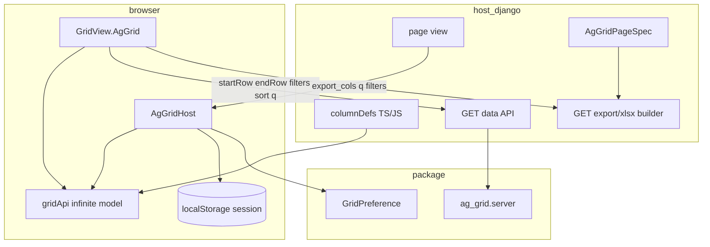
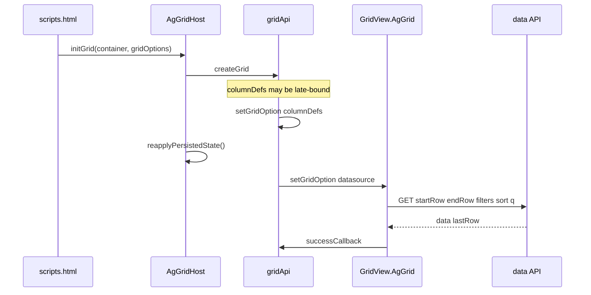
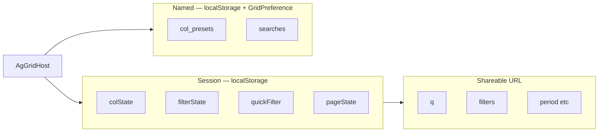

# grid-view-spec — LLM context bundle

> Auto-generated by `scripts/build_llm_context.py`. Do not edit by hand.
> Regenerate: `uv run python scripts/build_llm_context.py`

Package: **grid-view-spec** (PyPI) · Module: **grid_view_spec** · Docs: https://alpiua.github.io/grid-view-spec/

---


<!-- source: index.md -->

# Grid View Spec

**grid-view-spec** describes dashboard pages as a tree of blocks: tables, filters, KPIs, charts,
actions, and layout areas. The Python package `grid_view_spec` validates specs, renders HTML, and
exposes export hooks. Host applications supply **rows and business logic**; the spec describes
**structure only**.

The PyPI distribution is **`grid-view-spec`**. The Python package imports as `grid_view_spec`.

```bash
pip install "grid-view-spec[django]"
```

## What you build

```python
from grid_view_spec import GridViewSpec, validate_spec
from grid_view_spec.render import render_grid_view_spec

spec = GridViewSpec(id="orders", blocks=(...), layout=...)
validate_spec(spec)
html = render_grid_view_spec(spec, rows, host=host)
```

```django


```

One loader boots the page: `` → `GridView.bootScope()`.


KPI and chart **numbers** always come from Python `rows` — never from untrusted spec input.

## Documentation map

| Group | Start here |
|-------|------------|
| Install and first page | Getting started (see section: getting-started.md) |
| Concepts | Architecture overview (see section: concepts/overview.md) |
| Spec contract | GridViewSpec (see section: spec/index.md) |
| Blocks | Block catalog (see section: blocks/index.md) |
| Tables | Tables overview (see section: tables/index.md) |
| Filtering | Filter semantics (see section: filtering/semantics.md) |
| Visualization | KPI and charts (see section: visualization/kpi-charts.md) |
| Integration | Django (see section: integration/django.md) |
| Export | Page pattern (see section: export/page-pattern.md) |
| Tools | MCP server (see section: tools/mcp-server.md) |
| Reference | Python types (see section: reference/python-types.md) |

## Backends

| Backend | Use when |
|---------|----------|
| **Django** | Templates, `GridPreference`, export views |
| **Jinja2 / Starlette / FastAPI** | Headless HTML hosts |
| **Wire / MCP** | JSON storage, IDE validation |

Backends detail (see section: concepts/backends.md)

## Optional extras

| Extra | Purpose |
|-------|---------|
| `[pdf]` | WeasyPrint PDF export |
| `[mcp]` | `gridviewspec-mcp` CLI |
| `[starlette]` / `[fastapi]` | ASGI routes |

## Links

- [PyPI](https://pypi.org/project/grid-view-spec/)
- [GitHub](https://github.com/alpiua/grid-view-spec)
- Changelog (see section: changelog.md)
- Architecture reference (see section: maintainers/gridviewspec-architecture.md) (maintainers)


---


<!-- source: getting-started.md -->

# Getting started

Minimal **GridViewSpec** page on Django (same spec API works with Jinja2/Starlette — Backends (see section: concepts/backends.md)).

## Install

```bash
pip install "grid-view-spec[django]"
```

## Django setup

```python
INSTALLED_APPS = ["grid_view_spec.backends.django"]
```

```bash
python manage.py migrate grid_view_spec_django
```

Mount routes — Django integration (see section: integration/django.md):

```python
path("", include("grid_view_spec.backends.django.urls")),
```

## Page assets

```django


…


```

Charts: load ECharts in the host base template. AG-Grid pages load extra bundles automatically when the spec contains `backend="ag_grid"` tables — AG-Grid (see section: tables/ag-grid.md).

## First spec page

**1. View**

```python
from django.shortcuts import render
from grid_view_spec import GridViewSpec, validate_spec
from grid_view_spec.types.layout import GridViewArea, GridViewLayout
from grid_view_spec.types.table_v2 import GridViewColumn, GridViewTable

def orders_list(request):
    rows = [{"name": "Ada", "amount": 120}, {"name": "Bob", "amount": 85}]
    spec = GridViewSpec(
        id="orders",
        blocks=(
            GridViewTable(
                id="orders_table",
                backend="simple",
                columns=(
                    GridViewColumn(id="name", label="Customer", field="name"),
                    GridViewColumn(id="amount", label="Amount", field="amount", type="currency"),
                ),
            ),
        ),
        layout=GridViewLayout(root=GridViewArea(id="root", blocks=("orders_table",))),
    )
    result = validate_spec(spec)
    assert result.ok, [d.message for d in result.diagnostics]
    return render(request, "orders.html", {"spec": spec, "rows": rows})
```

**2. Template**

```django


```

Client sort, search, and column settings run via `gridviewspec.min.js` (`GridView.bootScope`).

## Validate

```python
result = validate_spec(spec)
assert result.ok, [d.message for d in result.diagnostics]
```

IDE: MCP server (see section: tools/mcp-server.md) → `gridview_validate`.

## Imports

| Need | Import |
|------|--------|
| Spec | `from grid_view_spec import GridViewSpec` |
| Render | `from grid_view_spec.render import render_grid_view_spec` |
| Wire | `from grid_view_spec.validate import spec_to_wire, spec_from_wire` |
| Django host | `from grid_view_spec.backends.django.host import DjangoGridViewHost` |

## Next steps

- Spec contract (see section: spec/index.md)
- Composer checklist (see section: blocks/composer.md)
- Page export pattern (see section: export/page-pattern.md)
- Architecture reference (see section: maintainers/gridviewspec-architecture.md)


---


<!-- source: concepts/overview.md -->

# Architecture overview

**grid-view-spec** separates three concerns:

1. **Data** — rows, querysets, and aggregates in the host application
2. **Spec** — declarative page structure (`GridViewSpec`: blocks + layout)
3. **Render** — HTML, assets, export pipelines, browser runtime

```
Host rows + GridViewSpec  →  render_grid_view_spec  →  HTML + asset plan
                                                      →  export (optional)
Browser: gridviewspec.min.js → GridView.bootScope()     →  tables, filters, KPI, charts
```

KPI and chart **values** always come from Python `rows`. The spec carries labels, wiring, and layout — not untrusted numbers.

## Core package (`grid_view_spec`)

| Area | Role |
|------|------|
| `types/` | Block dataclasses (`GridViewTable`, `GridViewFilters`, …) |
| `validate/` | Structural validation, wire encode/decode |
| `render/` | Jinja templates, block registry |
| `export/` | PDF/XLSX registry and HTML reports |
| `backends/django/` | Django host, views, ORM preferences |
| `backends/jinja2/`, `starlette/`, `fastapi/` | Non-Django HTML |
| `mcp/` | MCP tools — no framework imports |

Wire interchange: [`schema/grid-view-spec.v2.json`](https://github.com/alpiua/grid-view-spec/blob/main/schema/grid-view-spec.v2.json).

## Host vs package

| Host owns | Package owns |
|-----------|--------------|
| SQL/ORM, filters, authorization | Block templates and `cm-*` CSS |
| Building `GridViewSpec` in page loaders | `gridviewspec.min.js` runtime |
| Export builder functions | Export HTML assembly |
| Domain labels, URLs, data i18n | Package chrome i18n (`GridViewI18n`) |
| AG-Grid `columnDefs` and data API (when used) | `AgGridHost`, toolbar, persistence helpers |

See Data vs spec (see section: concepts/data-vs-spec.md) and Backends (see section: concepts/backends.md).

## Front-end bundle

Wheels ship pre-built assets under `grid_view_spec/static/grid_view_spec/`. Host pages load:

```django


```

One bundle boots column settings, KPI, charts, filter bar, simple tables, and spec roots (`GridView.bootScope` on load and HTMX swap).

AG-Grid pages load additional scripts — AG-Grid integration (see section: tables/ag-grid.md).

## Export flow

1. Page registers a builder key in `grid_view_spec.export.registry`
2. Browser links include `?builder=<key>` and current filter query params
3. Host view resolves the builder → PDF or XLSX response

Details: Export overview (see section: export/page-pattern.md).

## Related

- Block catalog (see section: blocks/index.md)
- Table backends (see section: tables/index.md)
- Maintainer deep spec (see section: maintainers/gridviewspec-architecture.md)


---


<!-- source: concepts/data-vs-spec.md -->

# Data vs spec

`GridViewSpec` is **structure only**. Row data never lives inside the spec.

## Rules

| In spec | Outside spec |
|---------|--------------|
| Block ids, column ids, labels | Row dicts / ORM rows |
| Filter schema and current state | Queryset filtering in Python |
| Chart axes and series keys | Numeric series values |
| `GridViewTable.datasource.endpoint` URL | API response bodies |
| Renderer ids (`badge`, `money`, …) | Renderer implementation (host JS registry) |

```python
# Correct: rows passed at render time
html = render_grid_view_spec(spec, rows, host=host)

# Wrong: embedding row data in blocks (except inline demos)
GridViewTable(rows=({"id": 1},))  # only for small static fixtures
```

## Page loader pattern

```text
request → page_data loader → rows + GridViewSpec → view → template
```

One loader should feed HTML render and export builders. See Page export pattern (see section: export/page-pattern.md).

## Dynamic columns

`GridViewTable.column_source` fetches **column definitions** at runtime (e.g. per-region price tiers), not row payloads. Rows still come from the host row API or server render path.

## Validation boundary

`validate_spec(spec)` checks structure, id uniqueness, toolbar XOR search, and policy gates. It does **not** validate business data in rows.


---


<!-- source: concepts/backends.md -->

# Host backends

Two different “backend” concepts appear in docs — do not mix them.

**Full contract:** Host contract — backends, GridViewHost, HTTP routes (see section: integration/host-contract.md)
(MCP: `gridview_catalog` → `host_backends`, `host_protocol`, `http_routes`).

## Render backends (HTTP / framework)

| Backend | Install | Render entry | Prefs | Export HTTP |
|---------|---------|--------------|-------|-------------|
| **Django** | `grid-view-spec` + `INSTALLED_APPS` | `` | ORM `GridPreference` + optional default `urls.py` | Host-mounted `export_*` + registry |
| **Jinja2** | `grid-view-spec` core | `render_html(spec, rows, host=…)` | Host `GridViewHost` | Host |
| **Starlette / FastAPI** | `[starlette]` / `[fastapi]` | `page_route()` / `mount_page()` | `InMemoryHost` (in-process); no default POST | Host |
| **Wire / MCP** | `[mcp]` | `spec_to_wire`, `gridview_validate` | N/A | N/A |

Django is one integration path. The spec contract is framework-agnostic.

## Table backends (`GridViewTable.backend`)

| Value | Meaning |
|-------|---------|
| `simple` | Server-rendered HTML `<table>`; client sort/search/filters |
| `ag_grid` | AG Grid Community + optional infinite datasource |

See Tables overview (see section: tables/index.md).

## Optional extras

| Extra | Purpose |
|-------|---------|
| `[pdf]` | WeasyPrint PDF export |
| `[xlsx]` | xlsxwriter |
| `[mcp]` | `gridviewspec-mcp` CLI |
| `[starlette]` / `[fastapi]` | ASGI page routes |


---


<!-- source: spec/index.md -->

# GridViewSpec contract

**GridViewSpec** is the page contract: a flat tuple of **blocks** plus a **layout** tree that places block ids into areas.

```python
@dataclass(frozen=True, slots=True)
class GridViewSpec:
    id: str
    meta: GridViewMeta = field(default_factory=GridViewMeta)
    config: GridViewConfig = field(default_factory=GridViewConfig)
    blocks: tuple[GridViewBlock, ...] = ()
    layout: GridViewLayout = field(default_factory=GridViewLayout)
```

Wire format: [`schema/grid-view-spec.v2.json`](https://github.com/alpiua/grid-view-spec/blob/main/schema/grid-view-spec.v2.json)

## Authoring rules

- Row data lives **outside** the spec — pass `rows` to `render_grid_view_spec`.
- Block ids are **globally unique** (including nested overlay/lazy specs).
- Layout references blocks by id only — never embeds block objects.
- One discriminator per block: `type`. Visual modes use `presentation`, not `kind` / `variant`.
- One toolbar search per table (XOR) — validation enforces this.
- Custom cells: `GridViewColumn.renderer` registry id — never inline JS in the spec.
- All spec values are JSON-serializable (`JsonValue`).

## Minimal example

```python
from grid_view_spec import GridViewSpec, validate_spec
from grid_view_spec.render import render_grid_view_spec
from grid_view_spec.types.layout import GridViewArea, GridViewLayout
from grid_view_spec.types.table_v2 import GridViewColumn, GridViewTable

spec = GridViewSpec(
    id="orders",
    blocks=(
        GridViewTable(
            id="orders_table",
            backend="simple",
            columns=(GridViewColumn(id="name", label="Name", field="name"),),
        ),
    ),
    layout=GridViewLayout(root=GridViewArea(id="root", blocks=("orders_table",))),
)
validate_spec(spec)
html = render_grid_view_spec(spec, rows, host=host)
```

## Block types (summary)

| Block | `type` | Role |
|-------|--------|------|
| `GridViewHeader` | `header` | Page/entity identity |
| `GridViewToolbar` | `toolbar` | Search, filter wiring, counters |
| `GridViewFilters` | `filters` | Filter bar schema + state |
| `GridViewActions` | `actions` | Export, buttons, links |
| `GridViewTable` | `table` | Simple or AG-Grid table |
| `GridViewKpi` | `kpi` | KPI strip |
| `GridViewCharts` | `charts` | ECharts block |
| `GridViewCards` | `cards` | Card grid |
| `GridViewGallery` | `gallery` | Image gallery |
| `GridViewForm` | `form` | Declarative form |
| `GridViewOverlay` | `overlay` | Modal / drawer |
| `GridViewTemplate` | `template` | Host template fragment |
| `GridViewTabs` | `tabs` | Tab areas |
| `GridViewNav` | `nav` | Breadcrumbs / back |
| `GridViewContent` | `content` | Formula, info, empty states |

Full catalog: Blocks (see section: blocks/index.md) or MCP `gridview_catalog`.

## Meta vs header

| Field | Use |
|-------|-----|
| `GridViewMeta.title` | Document/shell identity (tab title, SEO) |
| `GridViewHeader` block | **Visible** page heading in layout |
| `GridViewBlockBase.title` | Section heading for one block |

When a header block exists, it owns the visible page title.

## Config and lazy defaults

`GridViewConfig` controls renderer behavior (assets, lazy defaults, template shell override). Per-block lazy: `GridViewLazyBlock` on individual blocks.

## Related

- Layout (see section: spec/layout.md)
- Validation and wire (see section: spec/validation.md)
- Composer checklist (see section: blocks/composer.md)


---


<!-- source: spec/layout.md -->

# Layout

`GridViewLayout` is an area tree. Areas hold **block id lists**, not block objects.

```python
@dataclass(frozen=True, slots=True)
class GridViewLayout:
    root: GridViewArea = field(default_factory=lambda: GridViewArea(id="root"))

@dataclass(frozen=True, slots=True)
class GridViewArea:
    id: str
    type: Literal["stack", "grid", "sidebar", "split", "tabs", "modal", "table-card"] = "stack"
    blocks: tuple[str, ...] = ()
    areas: tuple[GridViewArea, ...] = ()
```

## Area types

| `type` | Use |
|--------|-----|
| `stack` | Vertical stack (default page body) |
| `grid` | CSS grid; column count in `extra` |
| `sidebar` | Main + aside |
| `split` | Resizable panes |
| `tabs` | Tab panels referencing nested areas |
| `table-card` | Fused toolbar + table in one card chrome |
| `modal` | Overlay shell placement |

## Table-card pattern

Two valid layouts (toolbar is always a **layout block**, never embedded in `GridViewTable`):

### Outside toolbar (recommended for page chrome)

```text
root stack
├── toolbar block   (target = table_id; filters/actions via block refs)
└── table-card area
    └── table block
```

`GridViewFilters` and `GridViewActions` are **not** separate layout blocks when the toolbar
references them — the toolbar template renders filter UI and action buttons inline.

### In-card toolbar (compact card)

```text
table-card area
├── toolbar block   (target = table_id)
└── table block
```

Page-wide chrome: place `GridViewToolbar` at layout root with `target=None`.

## Toolbar binding

`GridViewToolbar.target`:

- `None` — page-wide toolbar (filters, shared search)
- `"<table_id>"` — toolbar bound to one table (export sync, search scope)

Co-locating toolbar and table in one area does **not** auto-bind — `target` is always explicit.

## Nested overlays

`GridViewOverlay` may embed a nested `GridViewSpec`. Block ids must remain unique across the full tree.


---


<!-- source: spec/validation.md -->

# Validation and wire format

## Python validation

```python
from grid_view_spec import validate_spec

result = validate_spec(spec)
if not result.ok:
    raise SystemExit([d.message for d in result.diagnostics])
```

`validate_spec` returns a `GridViewResult` with `.ok`, `.diagnostics`, and `.spec` — it does **not** raise on errors. Check `result.ok` and inspect `result.diagnostics` to act on problems.

Checks include: unique block ids, layout references existing ids, one search per table, filter schema consistency, and optional `GridViewPolicy` gates (`strict_unknown_config`, trusted template modes).

## Wire JSON

```python
from grid_view_spec.validate import spec_from_wire, spec_to_wire

wire = spec_to_wire(spec)
restored = spec_from_wire(wire)
```

Schema: `schema/grid-view-spec.v2.json` in the repository.

## MCP tools

| Tool | Purpose |
|------|---------|
| `gridview_catalog` | Block types, registries, rules |
| `gridview_schema` | JSON Schema fragment |
| `gridview_examples` | Fixture specs by case id |
| `gridview_validate` | Diagnostics on wire JSON |
| `gridview_normalize` | Canonical spec shape |
| `gridview_apply_patch` | Atomic A2UI patch ops |

Install: MCP server (see section: tools/mcp-server.md). Contract file: `docs/grid-view-spec.mcp` (maintainer reference).

## A2UI projection

A2UI is an adapter over `GridViewSpec` — not a competing page builder. `apply_a2ui_patch` returns a new immutable spec; errors abort the whole patch.

Details: [Maintainer architecture](../maintainers/gridviewspec-architecture.md#a2ui-projection).


---


<!-- source: blocks/index.md -->

# Block catalog

All visible nodes live in `spec.blocks`. Layout places them by id.

## Chrome and navigation

| Block | Doc |
|-------|-----|
| `GridViewHeader`, `GridViewNav`, `GridViewEntity` | Header and navigation (see section: blocks/header-nav.md) |
| `GridViewToolbar`, `GridViewFilters`, `GridViewActions` | Toolbar, filters, actions (see section: blocks/toolbar-filters-actions.md) |

## Data presentation

| Block | Doc |
|-------|-----|
| `GridViewTable` | Tables (see section: tables/index.md) |
| `GridViewKpi`, `GridViewCharts` | KPI and charts (see section: visualization/kpi-charts.md) |
| `GridViewCards`, `GridViewGallery`, `GridViewImage` | Cards and gallery (see section: visualization/cards-gallery.md) |

## Interaction

| Block | Doc |
|-------|-----|
| `GridViewForm` | Forms (see section: blocks/forms.md) |
| `GridViewOverlay`, `GridViewTabs` | Overlays and tabs (see section: blocks/overlays-tabs.md) |
| `GridViewTemplate`, `GridViewContent` | Template and content (see section: blocks/template-content.md) |

## Shared block base

Every block inherits:

```python
class GridViewBlockBase:
    id: str
    type: str
    title: str = ""
    extra: Mapping[str, JsonValue] = field(default_factory=dict)
    style: GridViewStyle = field(default_factory=GridViewStyle)
    lazy: GridViewLazyBlock | None = None
```

Rare options use documented keys in `extra` (+ `strict_unknown_config` when enabled).

## Registries

Hosts extend behavior through **named ids** in the spec:

| Registry | Spec field |
|----------|------------|
| Cell renderers | `GridViewColumn.renderer` |
| Cell editors | `GridViewColumn.extra.editor` |
| Form validators | `GridViewValidator.kind="custom"` |
| Commit hooks | `GridViewTableEdit.commit_callback` |

Built-in renderers: `badge`, `tag`, `link`, `money`, `progress`, `date`, `boolean`, `image`, `thumbnail`.


---


<!-- source: blocks/composer.md -->

# Composer checklist

Quick routing when authoring a page:

| Need | Use |
|------|-----|
| Page identity | `GridViewHeader` |
| Entity facts (simple) | `GridViewEntity.facts` |
| Complex entity aside | `GridViewHeader.content` → `GridViewTemplate` id |
| Breadcrumbs | `GridViewNav` |
| Page-wide toolbar | `GridViewToolbar` at root, `target=None` |
| Table-bound toolbar | `GridViewToolbar` in `table-card`, `target=table_id` |
| Filters | `GridViewFilters` (`target=None` or scoped block id) |
| Search | `GridViewSearch` inside toolbar (one per table) |
| Commands / export | `GridViewActions` |
| Tabular data | `GridViewTable` |
| Dynamic columns | `GridViewTable.column_source` |
| Inline editing | `GridViewTable.edit` + `GridViewColumn.editable` |
| Custom cell | `GridViewColumn.renderer` |
| Column checklist filter | `GridViewColumn.filter` with `type="set"` |
| KPI / charts | `GridViewKpi`, `GridViewCharts` |
| Declarative form | `GridViewForm` |
| Bespoke wizard/UI | `GridViewTemplate` |
| Modal / drawer | `GridViewOverlay` |
| Placement | `GridViewLayout` + `GridViewArea` |

Hard separation:

- definitions → `spec.blocks`
- placement → `spec.layout`
- page filter schema → `GridViewFilters`
- toolbar → layout block, never embedded in table template


---


<!-- source: tables/index.md -->

# Tables overview

`GridViewTable` is the tabular data block. Choose a **table backend** by scale and cell complexity.

| Backend | When |
|---------|------|
| `simple` (see section: tables/simple-table.md) | Server HTML, up to a few thousand rows, declarative renderers |
| `ag_grid` (see section: tables/ag-grid.md) | Large/infinite datasets, custom `columnDefs`, heavy client filters |

```python
GridViewTable(
    id="records",
    backend="simple",  # or "ag_grid"
    columns=(GridViewColumn(id="name", label="Name", field="name"),),
    datasource=GridViewDataSource(endpoint="/api/records/"),  # ag_grid / remote
    settings=GridViewTableSettings(columns=True, presets=True),
)
```

## Shared table features (both backends)

| Feature | Spec surface |
|---------|--------------|
| Column definition | `GridViewColumn` |
| Multi-sort state | `GridViewTable.sort` (URL-synced) |
| Search scope | `GridViewTable.search_mode` + toolbar `GridViewSearch` |
| Column settings | `GridViewTable.settings` |
| Inline edit | `GridViewTable.edit` + `editable` columns |
| Dynamic columns | `GridViewTable.column_source` |
| Header groups | `GridViewTable.header` / `GridViewColumnGroup` |
| Row action | `GridViewTable.row_action` |
| Section rows | `__section__` row key + `section_label`; see [Simple table § Section rows](simple-table.md#section-rows) |

## Three chrome layers (do not mix)

1. `GridViewHeader` — page identity
2. `GridViewToolbar` — search, export, counters (layout block)
3. `GridViewTable.header` — `<thead>` column labels only

## Related

- Columns and renderers (see section: tables/columns.md)
- Inline editing (see section: tables/editing.md)
- Column settings (see section: tables/settings.md)
- Filtering (see section: filtering/semantics.md)
- Faceted filtering (see section: filtering/facets.md)
- Theming with CSS tokens (see section: integration/theming.md)


---


<!-- source: tables/simple-table.md -->

# Simple table (`backend="simple"`)

Server-rendered HTML table with client-side sort, search, column filters, and column settings.

```python
GridViewTable(
    id="orders_table",
    backend="simple",
    columns=(
        GridViewColumn(id="sku", label="SKU", field="sku", width="120px"),
        GridViewColumn(id="name", label="Name", field="name"),
        GridViewColumn(id="price", label="Price", field="price", type="currency", hidden=True),
    ),
    search_mode="global",  # global | per_column | disabled
    settings=GridViewTableSettings(columns=True, presets=True),
    striped=True,
    footer=GridViewTableFooter(row=True, label="Total", label_span=2),
    empty_message="No orders found",
)
```

Pass rows at render time — not inside the spec (except small fixtures).

## When to use

| Use `simple` | Use `ag_grid` |
|--------------|---------------|
| &lt; ~2–3k rows, server render OK | 10k+ rows, infinite model |
| Built-in renderers suffice | Custom `cellRenderer` in JS |
| Dashboard / report pages | Catalog, inventory, EMZ grids |

## Column options

| Field | Purpose |
|-------|---------|
| `id` | Stable column id (settings, export, filters) |
| `field` | Row dict key (default `""`; the simple-table renderer falls back to `id` when empty) |
| `type` | `text`, `number`, `currency`, `date`, `datetime`, `boolean`, `link` |
| `renderer` | Built-in or registered renderer id |
| `sortable`, `searchable`, `exportable` | Client/server behavior flags |
| `filter` | `GridViewFilter` (incl. `type="set"` checklist) |
| `pinned` | `left` / `right` |
| `editable` | With `GridViewTable.edit` |

See Columns and renderers (see section: tables/columns.md).

## Layout

```text
.cm-table-shell
  .cm-table-viewport
    table.cm-table
  .cm-col-filter-portal
```

Wide tables scroll inside the viewport. Toolbar lives in a `table-card` area — Layout (see section: spec/layout.md).

## Section rows

Rows with `__section__: True` render as full-width group headers inside the table body.

```python
rows = [
    {"__section__": True, "section_label": "Surgical"},
    {"name": "General surgery", "beds": 40},
    {"name": "Traumatology",    "beds": 28},
    {"__section__": True, "section_label": "Therapeutic"},
    {"name": "Cardiology",      "beds": 35},
]
```

### Filtering behaviour

When a filter is active the table hides section headers for sections that have no matching rows.

**`hide_sole_section_header`** (default `True`) — when only one section still has visible rows its header is also hidden (it is redundant: the search term already identifies the group). Set to `False` to always show the header of every section that has visible rows.

```python
GridViewTable(
    id="departments",
    backend="simple",
    hide_sole_section_header=False,  # keep section header even when it's the only one
    columns=(...),
)
```

## Export

Links with `data-cm-export-sync` and `data-cm-grid-id` receive `export_cols` from visible columns.

Export overview (see section: export/page-pattern.md) · XLSX (see section: export/xlsx.md)


---


<!-- source: tables/ag-grid.md -->

# AG-Grid integration

Extension layer for [AG Grid Community](https://www.ag-grid.com/) 31.x in Django: toolbar,
`AgGridHost`, session persistence, infinite-model HTTP contract, server XLSX sync.

| Component | Owner |
|-----------|-------|
| `gridApi`, `columnDefs`, cell renderers, filter components | Host |
| JSON data API, ORM field maps, row serialization | Host |
| `AgGridPageSpec`, XLSX column resolution | Host (spec) + package (helpers) |
| `AgGridHost`, toolbar, modal, search bar | Package |
| `GridView.AgGrid`, `grid_view_spec.backends.django.ag_grid` | Package |
| `GridPreference` (named presets, saved searches) | Package model; host mounts save URL |

## CDN pins (`conf.py`)

AG-Grid and SortableJS load from CDN on AG-Grid pages. Versions are **pinned in Django settings**, not hardcoded in templates — host apps can override for self-hosting or semver bumps without forking JS.

| Setting | Default | Purpose |
|---------|---------|---------|
| `GRID_VIEW_SPEC_AG_GRID_VERSION` | `31.3.4` | AG-Grid Community semver (jsDelivr URL built automatically) |
| `GRID_VIEW_SPEC_AG_GRID_CDN_URL` | *(built from version)* | Full script URL override (self-hosted mirror) |
| `GRID_VIEW_SPEC_SORTABLE_VERSION` | `1.15.2` | SortableJS for column-settings drag-reorder |
| `GRID_VIEW_SPEC_SORTABLE_CDN_URL` | *(built from version)* | Full Sortable script URL override |
| `GRID_VIEW_SPEC_ECHARTS_VERSION` | `5.5.1` | ECharts semver (host base template) |
| `GRID_VIEW_SPEC_ECHARTS_CDN_URL` | *(built from version)* | Full ECharts script URL override |

```python
# settings.py — optional overrides
GRID_VIEW_SPEC_AG_GRID_VERSION = "31.3.4"
# GRID_VIEW_SPEC_AG_GRID_CDN_URL = "https://static.myapp.example/vendor/ag-grid-community.min.js"
GRID_VIEW_SPEC_SORTABLE_VERSION = "1.15.2"
GRID_VIEW_SPEC_ECHARTS_VERSION = "5.5.1"
```

Host base template (charts):

```django
<script src="{{ echarts_cdn_url }}"></script>
{# or in view context: from grid_view_spec.backends.django.conf import echarts_cdn_url #}
```

Python helpers: `grid_view_spec.backends.django.conf.ag_grid_cdn_url()`, `sortable_cdn_url()`, `echarts_cdn_url()`.

## Architecture



## Infinite data API contract

### Response

```json
{
  "data": [
    { "id": 1, "sku": "ABC-001", "customer": "Ada" }
  ],
  "lastRow": 45000
}
```

| Field | Type | Rule |
|-------|------|------|
| `data` | `object[]` | One object per row; keys = `columnDefs[].field` / `colId` |
| `lastRow` | `int` | Total row count after server filters (not page size) |

Empty keys may be omitted in sparse rows; export uses `AgGridPageSpec` column order, not `Object.keys(row)`.

### Request query parameters

| Param | Source | Type | Purpose |
|-------|--------|------|---------|
| `startRow` | `createInfiniteDatasource` | int | Block start (0-based) |
| `endRow` | `createInfiniteDatasource` | int | Block end (exclusive) |
| `filters` | AG Grid `filterModel` | JSON object | Server-side column filters |
| `sort` | AG Grid sort model | JSON array | Server-side sort |
| `q` | Search bar (`manager._searchText`) | string | Quick search |
| `cols` | Visible columns | comma-separated | Multi-column search scope |
| `export_cols` | `syncExportHref` only | comma-separated | XLSX column ids (not sent on infinite fetch) |
| `action` | Host | string | e.g. `dictionary` for set-filter values |
| `field` | Host | string | Column id when `action=dictionary` |

Host-specific params (period, tab, …) pass via `getExtraParams` in JS and replay in export builders.

### Filter JSON (`filters` param)

Set filter (custom or AG set):

```json
{ "status": { "values": ["Active", "Pending"] } }
```

Text filter:

```json
{ "sku": { "filterType": "text", "type": "contains", "filter": "abc" } }
```

Supported text `type` values in `apply_grid_filters`: `contains`, `notContains`, `equals`, `notEqual`, `startsWith`, `endsWith`.

Pass `format_filter_value(col_id, display_value)` when DB values differ from filter labels.

### Sort JSON (`sort` param)

```json
[{ "colId": "registered_esoz", "sort": "desc" }]
```

Only the first entry is applied; host supplies `field_map: colId → ORM path`.

### Dictionary action

```
GET /api/products/?action=dictionary&field=record_match_status
→ { "values": ["…", "…"] }
```

Wire `dictionaryUrl` in `gridOptions.context`.

### Faceted set filter (package dictionary endpoint)

For counts that stay in sync with every other filter and search (exclude-own), use the
package-provided `api_column_filter_dictionary` route plus a registered `FacetSource`:

```
GET /grid/filter-dictionary/?grid=<grid_id>&field=<col_id>&<current params>
→ { "values": [{"value": "Adult", "count": 42}, …] }
```

```javascript
gridOptions.context = {
  gridId: "doctors",
  dictionaryUrl: "/grid/filter-dictionary/",
  // …
};
```

Register a `FacetSource` per grid at startup so the endpoint can resolve the filtered
source and count distinct values — see Faceted filtering (see section: filtering/facets.md) for the
full callback contract and an NSZU example. Mount the route via
`include("grid_view_spec.backends.django.urls")` — Django integration (see section: integration/django.md).

### Python: `InfiniteGridParams`

```python
from grid_view_spec.backends.django.ag_grid import (
    apply_grid_filters,
    apply_grid_sort,
    parse_infinite_params,
)

params = parse_infinite_params(request)  # default_page_size=100
# params.start_row, params.end_row, params.search_query
# params.visible_cols, params.filters, params.sort_model
# params.action, params.action_field
```

## AgGridPageSpec contract

```python
from grid_view_spec.types.ag_grid import AgGridColumnSpec, AgGridPageSpec

PRODUCTS_PAGE_SPEC = AgGridPageSpec(
    grid_id="products",
    columns=(
        AgGridColumnSpec("sku", "SKU"),
        AgGridColumnSpec("name", "Name"),
        AgGridColumnSpec("cost", "Cost", hide=True),
    ),
)
```

| `AgGridColumnSpec` field | Default | Meaning |
|--------------------------|---------|---------|
| `col_id` | — | AG Grid `colId` / row key |
| `label` | — | XLSX header, UI labels |
| `hide` | `False` | Default visibility when no live grid snapshot |
| `exportable` | `True` | Included in export resolution |

| `resolve_export_columns(spec, request)` input | Result |
|-----------------------------------------------|--------|
| `export_cols=a,b,c` (subset of exportable ids) | Those ids in request order |
| `export_cols` absent or empty | All columns with `exportable=True` and `hide=False` |

Constant: `EXPORT_COLS_PARAM = "export_cols"`.

## JavaScript contract

Load assets once per page (base template, outside HTMX swaps):

```django



```

AG Grid Community + SortableJS from CDN in the same base template.

### Boot sequence



```javascript
manager.gridApi.setGridOption("columnDefs", ProductColumns);
manager.reapplyPersistedState();
manager.gridApi.setGridOption(
  "datasource",
  GridView.AgGrid.createInfiniteDatasource({
    url: "/api/products-data/",
    manager: manager,
    getExtraParams: () => ({ period: "2025-01" }),
    onLastRow: (count) => { /* toolbar counter */ },
  })
);
```

### `gridOptions.context`

| Key | Default | Contract |
|-----|---------|----------|
| `gridId` | — | Equals `grid_id` in `scripts.html` and `GridPreference.grid_id` |
| `storageScope` | — | Suffix: `agGridState_{gridId}__{storageScope}` |
| `syncUrlState` | `true` | `history.replaceState` for `q`, `filters`, `urlPageStateKeys` |
| `urlPageStateKeys` | keys from `getPageState()` | Domain params mirrored to URL |
| `getPageState()` | — | Returns `{ period: ["2024-01"], … }` for filter bar |
| `applyPageState(state, opts)` | — | Restores domain filter bar |
| `onFilterChanged(manager)` | — | Hook after AG filter change (export sync) |
| `onDataReload(manager)` | — | Hook after manual search reload; otherwise export links are synced automatically |
| `restoreQuickFilter` | `true` | Restore search from localStorage when URL has no `q` |
| `dictionaryUrl` | — | Base URL for set-filter dictionary fetch |

### Export href sync

```javascript
GridView.AgGrid.syncExportHref(linkEl, manager, {
  getExtraParams: () => ({ period: "2025-01" }),
  exportColumns: true,  // writes export_cols (default true)
});
```

`syncExportHref` accepts either a runtime handle or a grid id string. `syncExportLinks`
updates every `[data-cm-export-sync][data-cm-grid-id="…"]` link for the grid.

```javascript
GridView.AgGrid.syncExportHref(linkEl, "products", {
  getExtraParams: () => ({ period: "2025-01" }),
});
GridView.AgGrid.syncExportLinks("products");
```

Call on first load and on filter/column/search changes; invoke again in link `onclick` before navigation.

| `syncExportHref` option | Default | Effect |
|-------------------------|---------|--------|
| `exportColumns` | `true` | Visible column ids → `export_cols` |
| `includeVisibleCols` | `false` | Also set `cols` on export URL |

## Page wiring

### Template (GridViewSpec v2)

```django



```

For hand-wired AG-Grid pages (without full spec render), load assets in base layout:

```django

{# … page body with #products-grid … #}


```

Column settings and export hrefs use `` with toolbar blocks.

### Host view

```python
import json
from grid_view_spec.backends.django.models import GridPreference

def products_view(request):
    presets, searches = {}, []
    if request.user.is_authenticated:
        pref = GridPreference.objects.filter(user=request.user, grid_id="products").first()
        if pref:
            presets, searches = pref.col_presets, pref.searches
    return render(request, "products.html", {
        "ag_grid_presets": json.dumps(presets),
        "ag_grid_searches": json.dumps(searches),
    })
```

### Save preferences URL (host-mounted)

Package ships `save_grid_settings` view; host registers it with name **`api_grid_preferences`**:

```python
from grid_view_spec.backends.django.views import save_grid_settings

urlpatterns = [
    path("api/grid/preferences/", save_grid_settings, name="api_grid_preferences"),
]
```

### XLSX link

```django
<a href=""
   id="products-xlsx"
   onclick="syncProductsExport();">XLSX</a>
```

```python
register_xlsx_export("products_page", build_products_xlsx_job, filename_fn=…)
```

## Persistence

Column settings UI lives in `grid-view.min.js` (`GridView.createColumnSettings`). `AgGridHost` delegates after `gridApi` init; Simple Table uses the DOM adapter. See Column settings (see section: tables/settings.md).

Three storage layers:



| Layer | Key / model | Contents |
|-------|-------------|----------|
| Session | `agGridState_{grid_id}` or `…__{storageScope}` | `colState`, `filterState`, `quickFilter`, `pageState` |
| Named presets | `GridPreference.col_presets` | User-named `getColumnState()` snapshots |
| Saved searches | `GridPreference.searches` | Quick-search bookmark strings |

Session layout auto-saves on column/filter/search/domain-filter changes. Named presets and searches save via `POST api_grid_preferences`. Last column layout is not auto-persisted to Django.

### Session JSON

```json
{
  "colState": [{ "colId": "name", "width": 220, "hide": false }],
  "filterState": { "customer": { "values": ["Ada"] } },
  "quickFilter": "uuid-fragment",
  "pageState": { "period": ["2024-01", "2024-02"] }
}
```

### Restore priority

| Field | Source order |
|-------|--------------|
| Quick search | URL `?q=` → localStorage |
| AG filters | URL `?filters=` (JSON) → localStorage |
| Domain filters | URL keys in `urlPageStateKeys` → `pageState` in localStorage |

Cross-tab: `storage` event on session key reapplies state and purges infinite cache.

See Saved preferences (see section: persistence/preferences.md) for `POST` body schema.

## Integration checklist

| # | Requirement |
|---|-------------|
| 1 | AG Grid + Sortable CDN in base template |
| 2 | `` once per page |
| 3 | `grid_id` = `context.gridId` = `GridPreference.grid_id` |
| 4 | `ag_grid_presets`, `ag_grid_searches` in view context |
| 5 | `api_grid_preferences` → `save_grid_settings`; `migrate grid_view_spec_django` |
| 6 | Data API: `{ data, lastRow }` + `parse_infinite_params` |
| 7 | XLSX: `AgGridPageSpec` + `resolve_export_columns` + `syncExportHref` |
| 8 | Late `columnDefs`: `reapplyPersistedState()` before datasource |

## Runtime constraints

| Rule | Detail |
|------|--------|
| HTMX | AG Grid CDN and bundle load outside swapped fragments |
| Search | Infinite model uses server `q`; not `quickFilterText` |
| Export | Server XLSX via registered builder — XLSX export (see section: export/xlsx.md) |
| License | AG Grid Community 31.x APIs only |

## Filtered KPI strip

```django

```

```javascript
GridView.bindGridKpis({ gridAdapter: GridView.createAgGridAdapter(gridApi) });
```

See KPI and charts (see section: visualization/kpi-charts.md).

## Reference: host integration

| Layer | Module |
|-------|--------|
| Spec | `dashboard/items/ag_grid/spec.py` |
| API | `ag_grid/api.py`, `queryset.py`, `fields.py`, `serializers.py` |
| XLSX | `export.py` — builder key `items_grid` |
| Columns | your frontend `columnDefs` |
| Templates | `_grid_options.html`, `_grid_scripts.html`, `_toolbar.html` |

Typical config: `grid_id="items"`, `storageScope="items-grid"`, data endpoint `GET /api/items/data/`.

## API reference

- Python types (see section: reference/python-types.md)
- JavaScript API (see section: reference/javascript.md)
- Template tags (see section: reference/template-tags.md)
- Saved preferences (see section: persistence/preferences.md)


---


<!-- source: filtering/semantics.md -->

# Filter semantics

Search and column filters use one matching contract across Simple Table, AG-Grid, exports, and the
browser. The same query string should produce the same visible rows on every surface.

## Search profiles

Each column declares how its filter popover behaves via `Column.column_filter`:

| Value | Use for | Syntax |
|-------|---------|--------|
| `default` | General text or value columns | text, phrases, smart combiners, numeric expressions, wildcards |
| `text` | Text-only columns | text, phrases, smart combiners, wildcards |
| `numeric` | Numeric columns | comparisons, ranges, wildcards |
| `list` | Checklist columns | set/list model plus expression support |
| `nosearch` | Actions, buttons, service columns | no filter UI; excluded from toolbar search |

Toolbar search uses the `toolbar` profile (same smart syntax as `default`, plus `label:term` scoping).

Aliases such as `column_text`, `set`, and `none` still work; new code should use the values above.

## Filter channels

| Channel | Request param | UI | Scope |
|---------|---------------|-----|-------|
| Toolbar search | `q` | Toolbar or table search input | Row haystack across visible searchable columns |
| Column expression | `col_q` (string per key) | Header popover | One column |
| Column list | `col_q` (set/list model) | Header checklist | One column |
| AG-Grid set filter | `filters` | SmartFilter checklist | One column |

FilterBar parameters such as `period` or `department` are **page-level** filters. Apply them in the
host loader before rows, KPIs, charts, and exports are built.

## Application order

Apply filters in this order on server and client:

1. Page-level FilterBar / queryset parameters  
2. Column `col_q` filters (AND across columns)  
3. Toolbar `q` on the row haystack  
4. AG-Grid set filters from `filters` (AND across columns)  

Simple Table client code applies `col_q` then `q`. Server export uses the same order through
`filter_table_for_request()` and `resolve_simple_table_for_export()`.

## Toolbar search (`q`)

Smart syntax:

| Syntax | Meaning |
|--------|---------|
| `alpha,beta` | OR groups (`/` and `\` also accepted outside quotes) |
| `alpha+beta` | AND inside one group |
| `-term` | Exclude term |
| `"literal phrase"` | Quoted literal |
| `>10`, `<=20`, `10..20` | Numeric comparison or inclusive range |
| `%fin%`, `oper%`, `%ions` | Contains, prefix, suffix wildcard |

Column scope is toolbar-only: `лікарів:10..20` limits that term to columns whose label matches.
Column popovers do not use `:` scoping because they are already bound to one column key.

## Column filters (`col_q`)

`col_q` is a JSON object keyed by column key. Values are expression strings or set/list models:

```text
col_q={"amount": ">1000", "name": "%Alpha%", "status": {"values": ["Open"]}}
```

Expression strings use the same parser as toolbar search, but the haystack is one cell.

## Set/list model

Shared by Simple Table list columns and AG-Grid SmartFilter:

```json
null
{"mode": "empty"}
{"mode": "non_empty"}
{"values": ["Alpha", "Beta"]}
{"values": ["Alpha"], "match": "any_token"}
```

| Model | Matches |
|-------|---------|
| `null` / missing | Filter inactive |
| `{"mode": "empty"}` | Blank, dash, or null cells |
| `{"mode": "non_empty"}` | Non-empty cells |
| `{"values": [...]}` | Selected values (`exact` or `any_token` per column) |

Use `Column(filter_match="any_token")` when a cell holds multiple space-separated tokens.

## Export parity

PDF, XLSX, and server-rendered tables should replay the same GET parameters: FilterBar params,
`q`, `col_q`, and `export_cols` for column visibility.

For Simple Table: `filter_table_for_request()` or `resolve_simple_table_for_export()`.
For flat artifacts: `resolve_artifact_table_for_export()`.

## Related

- Server filtering (see section: filtering/server.md) — host queryset integration  
- Faceted filtering (see section: filtering/facets.md) — option counts that stay in sync with every active filter
- Page export pattern (see section: export/page-pattern.md) — one loader for page and export  
- Simple table (see section: tables/simple-table.md) — column filter UI on v2 tables

## Conformance

Python and TypeScript implementations share JSON fixtures under `tests/fixtures/`. When behaviour
changes, update both sides and run `tests/test_filter_conformance.py` and
`npm run test:conformance` in `frontend/`.


---


<!-- source: export/page-pattern.md -->

# Host app: page loader → HTML / PDF / XLSX

**grid-view-spec** owns rendering and export HTTP views. Your Django app owns **domain data** and should expose **one loader per screen** so HTML, PDF, and XLSX never diverge.

## Responsibility split

| Layer | Host app | Package |
|-------|----------|---------|
| ORM / filters / rows | `load_*_page(request)` | — |
| `GridViewSpec` + rows | build in loader | types, validate, render |
| HTTP export routes | mount `grid_view_spec.backends.django.urls` (or explicit views) | views + registry |
| Builder registration | `AppConfig.ready()` | `register_pdf_export`, `register_xlsx_export` |
| Export links in spec | `GridViewExportAction` blocks or `export_*_href()` | pipeline + href helpers |
| AG-Grid data API | host JSON endpoint | `ag_grid` helpers, `AgGridPageSpec` |

## Recommended module layout

```
myapp/dashboard/entities/
  page_data.py      # load_entity_page(request) -> EntityPageData
  export.py         # register_*_exports()
  views.py            # render HTML only
```

Register once in `apps.py`:

```python
def ready(self):
    from myapp.dashboard.entities.export import register_entity_exports
    register_entity_exports()
```

## Step 1 — Frozen page dataclass

```python
from dataclasses import dataclass
from django.http import HttpRequest
from grid_view_spec import GridViewSpec

@dataclass(frozen=True, slots=True)
class EntityListPage:
    spec: GridViewSpec
    rows: tuple[dict[str, object], ...]
    export_title: str

def load_entity_list_page(request: HttpRequest) -> EntityListPage:
    rows, category = query_entities(request)
    spec = build_entity_list_spec(category)  # GridViewTable + filters in spec
    return EntityListPage(
        spec=spec,
        rows=tuple(rows),
        export_title=f"Entities — {category}",
    )
```

Parse **`request.GET` only in the loader**. Export and HTML both call `load_*_page(request)`.

## Step 2 — HTML view

```python
def entities_list(request):
    page = load_entity_list_page(request)
    return render(request, "entities/list.html", {
        "spec": page.spec,
        "rows": page.rows,
    })
```

```django


```

## Step 3 — Export builders

Builders receive `(host, ctx)` and return **`GridViewExportJob`**:

```python
from grid_view_spec.export.registry import (
    GridViewExportJob,
    register_pdf_export,
    register_xlsx_export,
)

def _entity_list_job(host, ctx):
    from grid_view_spec.backends.django.export import DjangoExportContext
    assert isinstance(ctx, DjangoExportContext)
    page = load_entity_list_page(ctx.request)
    return GridViewExportJob(
        spec=page.spec,
        rows=page.rows,
        table_id="entities_table",
    )

def register_entity_exports():
    register_pdf_export("entities_list", _entity_list_job)
    register_xlsx_export("entities_list", _entity_list_job)
```

Optional custom filenames:

```python
def pdf_filename(host, ctx, payload):
    return f"entities_{payload.spec.id}.pdf"

register_pdf_export("entities_list", _entity_list_job, filename_fn=pdf_filename)
```

## Step 4 — Export links in the spec

Prefer declarative actions on the page spec:

```python
from grid_view_spec.types.actions import GridViewExportAction, GridViewActions

GridViewActions(
    id="exports",
    items=(
        GridViewExportAction(
            id="xlsx",
            label="Excel",
            format="xlsx",
            target="entities_table",
            params={"builder": "entities_list"},
        ),
    ),
)
```

Or build URLs in Python:

```python
from grid_view_spec.backends.django.hrefs import export_xlsx_href

href = export_xlsx_href("entities_list", q=request.GET.get("q", ""))
```

## AG-Grid export

For `backend="ag_grid"` tables, the export builder still returns `GridViewExportJob` with the same spec/rows the HTML page uses. Replay filters from `ctx` (same GET params as the data API). Optional `export_cols` query param selects visible columns — see AG-Grid integration (see section: tables/ag-grid.md).

## Invariants

1. **Never put row data in URLs** — rebuild from ORM in the loader.
2. **One builder key per screen** — matches `?builder=` in export URLs.
3. **One loader** — HTML and export call the same `load_*_page`.
4. **Filter params in GET** — export context reads the same `q`, filter ids, and `export_cols` as the HTML view.

## Related

- PDF export (see section: export/pdf.md)
- XLSX export (see section: export/xlsx.md)
- Getting started (see section: getting-started.md)
- Host contract (see section: integration/host-contract.md)


---


<!-- source: reference/python-types.md -->

# Python types — public import map

Import from **`grid_view_spec`** at host boundaries. Do not copy type trees locally.

## Core spec

```python
from grid_view_spec import GridViewSpec, validate_spec
from grid_view_spec.types.table_v2 import GridViewTable, GridViewColumn, GridViewColumnGroup
from grid_view_spec.types.filters_v2 import GridViewFilters, GridViewFilter
from grid_view_spec.types.actions import GridViewExportAction, GridViewActions
from grid_view_spec.types.layout import GridViewLayout, GridViewArea
from grid_view_spec.types.json import JsonObject, JsonValue, RowDict
```

## Export

```python
from grid_view_spec.export.registry import (
    GridViewExportJob,
    register_pdf_export,
    register_xlsx_export,
)
from grid_view_spec.export.xlsx import XlsxReport, XlsxSheet
```

Builders: `(GridViewHost, ExportContextLike) → GridViewExportJob`.

## Django backend

```python
from grid_view_spec.backends.django.host import DjangoGridViewHost
from grid_view_spec.backends.django.export import DjangoExportContext
from grid_view_spec.backends.django.ag_grid import (
    InfiniteGridParams,
    parse_infinite_params,
    apply_grid_filters,
    apply_grid_sort,
    parse_active_col_ids,
)
from grid_view_spec.types.ag_grid import AgGridColumnSpec, AgGridPageSpec
from grid_view_spec.backends.django.hrefs import export_pdf_href, export_xlsx_href
from grid_view_spec.backends.django.models import GridPreference
```

## Search (ORM)

```python
from grid_view_spec.backends.django.search import apply_queryset_search
from grid_view_spec.search.smart import parse_smart_query, apply_smart_queryset_search
from grid_view_spec.search.column import parse_column_filters
```

## Render

```python
from grid_view_spec.render import render_grid_view_spec, build_render_context
```

Strict typing: package ships `py.typed`; run `basedpyright --warnings` on host code that constructs specs.


---


<!-- source: reference/template-tags.md -->

# Template tags

Load with ``.

## Page assets (unified loader)

One tag loads CSS or JS; `render_grid_view_spec` marks AG-Grid/chart requirements on the request.

| Tag | Where |
|-----|-------|
| `` | `<head>` |
| `` | before `</body>` — loads `gridviewspec.min.js`, optional AG-Grid/charts |

HTMX partial reload after the main JS bundle already ran:

```django

```

## GridViewSpec

```django

```

Lazy HTMX blocks: `/grid/lazy/` — Django integration (see section: integration/django.md).

## CDN helpers

| Tag | Purpose |
|-----|---------|
| `` | SortableJS (column settings) |
| `` | AG-Grid Community |
| `` | Apache ECharts |

## Export URLs

| Tag | Purpose |
|-----|---------|
| `` | PDF export GET URL |
| `` | XLSX export GET URL |

Prefer **`GridViewExportAction`** in the spec. Python: `grid_view_spec.backends.django.hrefs`.

## Related

- Getting started (see section: getting-started.md)
- JavaScript reference (see section: reference/javascript.md)


---


<!-- source: reference/javascript.md -->

# JavaScript API

Pre-built bundles ship under `grid_view_spec/static/grid_view_spec/`. The main entry is **`gridviewspec.min.js`**
(global `GridView`). Host projects do not need Node at runtime.

## Boot

After ``, one script initializes the page:

| API | Purpose |
|-----|---------|
| `GridView.bootScope(scope?)` | Scan a DOM subtree (default `document`) and boot tables, filters, KPI, charts, column settings, and GridViewSpec roots |
| `GridView.boot(root?)` | Boot one element, or re-run scope boot when omitted |

`DOMContentLoaded` and HTMX `afterSwap` call `GridView.bootScope()`. Do not load separate chart, KPI,
or artifact boot scripts.

## Loading scripts

### GridViewSpec pages

```django


```

Load order:

1. Inline — `GridView.preferencesUrl`, `GridViewI18n`  
2. `gridviewspec.min.js` — unified runtime  

Inclusion tags (`render_grid_view_spec`, …) only **mark** which optional bundles a page
needs; the actual ``<script>``/``<link>`` tags are emitted by ````.
Always call it once per page (CSS in ``<head>`` + JS before ``</body>``).

**Globals the host must provide** (before the bundle):

| Global | Required for |
|--------|----------------|
| `echarts` | Charts |
| `Sortable` | Column drag-reorder in settings modal |

Use `` and `` or your own CDN links.

### AG-Grid pages

Load CDN scripts, `ag-grid-host.js`, and boot JSON — see AG-Grid integration (see section: tables/ag-grid.md).

## GridView.init

Used by chat panels and SPAs that receive a resolved spec or table root:

```javascript
var disconnect = GridView.init({
  root: document,
  artifact: payload,
  gridAdapter: adapter,
});
```

Initializes simple tables, KPI strips, charts, and optional AG-Grid bindings. `disconnect()` removes
listeners.

## AG-Grid infinite model

```javascript
GridView.AgGrid.createInfiniteDatasource({
  url: "/api/my-grid-data/",
  gridId: "my-grid",
  getExtraParams: function () { return { period: "2024-01" }; },
});

GridView.AgGrid.syncExportHref(linkEl, "my-grid", { exportColumns: true });
GridView.AgGrid.syncExportLinks("my-grid");
```

| API | Purpose |
|-----|---------|
| `createInfiniteDatasource(options)` | Wire AG-Grid infinite `getRows` to your JSON API |
| `buildInfiniteQueryParams(...)` | Serialize block params, filters, sort, search |
| `syncExportHref(linkEl, gridId, options)` | Copy filters, sort, `q`, `col_q`, `export_cols` into export URL |
| `syncExportLinks(gridId, options)` | Update all `[data-cm-export-sync]` links |
| `GridView.byId.get(gridId)` | Runtime handle (`AgGridHost` or column settings) |
| `GridView.createColumnSettings(...)` | Column settings for AG-Grid or Simple Table |

Toolbar markup uses `data-cm-grid-id`, `data-cm-col-action`, `data-cm-grid-action`, and
`data-cm-grid-search` — no inline JS required.

`AgGridHost` persists filters, columns, and search to `localStorage` and optionally mirrors them in
the URL. See [AG-Grid — Persistence](../tables/ag-grid.md#persistence).

## AG-Grid adapter (filtered KPI / charts)

```javascript
var adapter = GridView.createAgGridAdapter(gridApi);
GridView.bindGridKpis({ root: document, gridAdapter: adapter });
GridView.bindGridFilteredCharts(document, adapter);
```

| Method | Purpose |
|--------|---------|
| `getRows()` | Visible rows after filter/sort |
| `onChange(cb)` | Subscribe to model updates |

For static rows: `GridView.staticRowsAdapter(rowsArray)`.

## KPI helpers

| API | Purpose |
|-----|---------|
| `GridView.resolveKpis(specs, rows)` | Client-side aggregates |
| `GridView.Kpi.initKpiStrip(root, kpis, columns)` | Render resolved KPI cards |
| `GridView.bindGridKpis({ gridAdapter })` | Wire `[data-cm-grid-kpi]` strips |

## Charts

| API | Purpose |
|-----|---------|
| `GridView.initChart(el, config, rows)` | Mount one ECharts instance |
| `GridView.initAllCharts(scope)` | Scan `[data-cm-chart-config]` |
| `GridView.buildEchartsOption(config, rows)` | Build ECharts option object |
| `GridView.bindGridFilteredCharts(scope, adapter)` | Charts with `data_source: grid_filtered` |

Requires global `echarts`.

## Simple Table

```javascript
GridView.SimpleTable.initAll(scope);
```

Usually called automatically from `GridView.bootScope()`.

## Search and filters

Client matching must stay aligned with Python search modules. Conformance fixtures live under
`tests/fixtures/`; run `npm run test:conformance` in `frontend/` and pytest filter tests after
behaviour changes. See Filter semantics (see section: filtering/semantics.md).

## i18n

```javascript
GridView.i18n.t("search.placeholder", "Search…");
```

Translations ship in `grid_view_spec/locale/`. The bundle injects `window.GridViewI18n` before
`gridviewspec.min.js`.

## Maintainer build

```bash
cd frontend && npm ci && npm run build
```

Commit regenerated files under `src/grid_view_spec/static/grid_view_spec/`. CI checks for drift.

### Generated wire types

TypeScript wire/authoring types are generated from `schema/grid-view-spec.v2.json` (the single
source of truth). After editing the schema, regenerate and commit the output:

```bash
cd frontend && npm run gen:types   # writes src/types/generated/grid-view-spec.ts
```

Import them from the `frontend/src/types/spec.ts` barrel. Drift is enforced by
`npm run gen:types:check` (also in `scripts/ci-gate.sh`) and `tests/test_ts_schema_parity.py`.


---


<!-- source: guides/i18n.md -->

# Internationalization (i18n)

**grid-view-spec** is host-agnostic: UI chrome uses dotted msgids (`column_settings.title`, `export.pdf`, …) in Django templates and the JS catalog.

## Requirements

1. Add `grid_view_spec.backends.django` to `INSTALLED_APPS` (loads `grid_view_spec/locale/`).
2. Set `LANGUAGE_CODE` and enable `LocaleMiddleware` in the host project.
3. Include `` once per page (injects `GridViewI18n` before bundle scripts).

Optional host overrides: add the same msgids under the host `LOCALE_PATHS`.

## Two surfaces, one catalog

| Surface | Pattern | Example |
|---------|---------|---------|
| Django templates | `` | Modal shell, export buttons, filter bar |
| JavaScript | `window.GridViewI18n` via `GridView.i18n.t(key, fallback)` | Dynamic modal groups, multiselect labels |

All JS keys are listed in `grid_view_spec.backends.django.i18n.JS_I18N_KEYS` (canonical list in `grid_view_spec.i18n`) and compiled into `locale/*/LC_MESSAGES/django.po`.

After editing `.po` files:

```bash
django-admin compilemessages -l en -l uk
```

## Host-owned labels

**Table/chart/KPI column labels** and filter option text come from the host app (`GridViewSpec` blocks, filter schemas). Use plain `str` for export column labels in builders.

Package i18n covers **grid chrome only** (toolbars, modals, export buttons, empty states).

## Column settings + export

Column settings UI uses the same msgids as the modal. Export column order/visibility uses the `export_cols` URL param — Server filtering (see section: filtering/server.md).

## Do not

- Hardcode locale-specific strings in package templates or JS.
- Use English sentence msgids for new strings — prefer dotted keys in `grid_view_spec/i18n.py`.
- Use `gettext_lazy` on exported table column labels in XLSX/PDF builders.


---


<!-- source: changelog.md -->

# Changelog

## 2.0.1 — 2026-08-03

### Added

- Faceted filtering: `GridViewFilters.facets` recompute each filter's options + counts on the currently filtered table (exclude-own). `FacetSource` registry + `compute_row_facets` (rows) / `compute_queryset_facets` (Django ORM) + package route `api_column_filter_dictionary` for AG-Grid set filters. `GridViewFilterOption.count` / `.disabled` carry counts; wire round-trips. See Faceted filtering (see section: filtering/facets.md).
- CSS unification across table backends: one `--cm-*` / `--cm-table-*` / `--ag-*` token bridge; both `simple` and `ag_grid` tables follow the same palette. See Theming with CSS tokens (see section: integration/theming.md).
- `GridViewFilters`: `navigate_on_change`, `fragment_endpoint` / `fragment_target` / `fragment_swap` for HTMX fragment refresh.
- `GridViewTable.hide_sole_section_header` (default `True`): when filtering leaves rows in exactly one section the section header is automatically hidden (it is redundant). Set to `False` to keep the header visible. See [Simple table § Section rows](tables/simple-table.md#section-rows).
- Documented `__section__` / `section_label` row keys for group-header rows in simple tables.
- `GridViewToolbar.clear_all`: built-in “clear all filters and search” action.
- JSON Schema (`grid-view-spec.v2.json`): `GridViewFilterOption` def (`value`, `label`, `children`, `exclusive`, `meta`, `count`, `disabled`); `GridViewFilters.facets` / `navigate_on_change` / `fragment_*`.
- MCP `gridview_catalog`: `api_column_filter_dictionary` route + facet rules.
- **Generated TypeScript types** from `schema/grid-view-spec.v2.json` (single source of truth):
  `npm run gen:types` → `frontend/src/types/generated/`, re-exported from `frontend/src/types/spec.ts`.
  Drift gate: `npm run gen:types:check` (in `scripts/ci-gate.sh`) + `tests/test_ts_schema_parity.py`.
- Schema ↔ types sync: `$defs` for `GridViewCounter`, `GridViewFilterOption`, `GridViewTablePagination`,
  `GridViewCardGroup(s)`, `GridViewValidator`, `GridViewFieldCondition`, `GridViewFieldset`,
  `GridViewField`; `GridViewToolbar.reload`/`clear_all`; header `presentation="section"`; chart
  `data_source` value `grid_filtered`; set-filter `match` enum aligned to `exact`/`any_token`.
- Validation diagnostics: `editable_without_edit`, `edit_commit_xor`, `gallery_no_source` (warning),
  `image_no_url`, `unknown_validator_kind`, `pattern_requires_value`, `custom_validator_missing_name`,
  `form_field_duplicate_name`, `fieldset_unknown_field`, `invalid_block_target`, `trusted_css_vars_denied`.

### Fixed

- MCP catalog now advertises all package-builtin renderers (`chip`, `period_pills`, `select`);
  these are recognized by `validate_spec` (`BUILTIN_RENDERERS`). Guarded by a catalog↔builtin test.
- Commerce stock grid: the “Wholesale prices” selector rebuilds columns via `column_source`
  (no full page reload); toolbar facet filters refresh the AG datasource with fresh URL state
  (filter-bar syncs the URL before notifying listeners). Computed price columns are not
  server-filterable (`agFilter: "none"`), and unresolvable column filters no-op instead of erroring.

## 2.0.0

**2026-06-11** — GridViewSpec release.

### Changed

- Published the package as `grid-view-spec`.
- Standardized the public Python module as `grid_view_spec`.
- Consolidated pages, rendering, assets, validation, and export around the typed `GridViewSpec` contract.
- Moved Django integration under `grid_view_spec.backends.django`.
- Updated template tags to ``.
- Shipped PDF/XLSX export through package-owned export pipelines.
- Django preferences use the `grid_view_spec_gridpreference` table.


---
