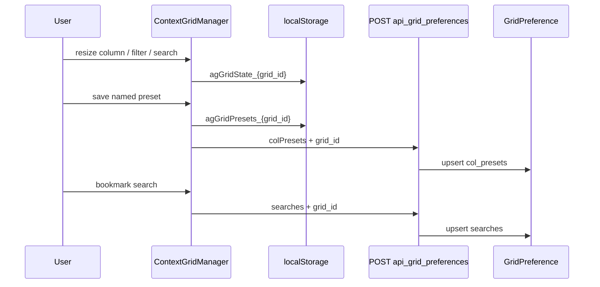

# Saved preferences

Named column presets and saved quick-search bookmarks for AG-Grid pages. Session state
(columns, filters, search, domain `pageState`) lives in `localStorage` — see
[AG-Grid integration — Persistence](../tables/ag-grid.md#persistence).



## GridPreference model

| Field | Type | Constraint |
|-------|------|------------|
| `user` | FK → `AUTH_USER_MODEL` | Owner |
| `grid_id` | `CharField(100)` | Matches `scripts.html` `grid_id` and `context.gridId` |
| `col_presets` | JSON object | `{ "Preset name": [ colState, … ] }` |
| `searches` | JSON list of strings | Quick-search bookmarks |

Unique: `(user, grid_id)`.

## Host setup

```bash
python manage.py migrate grid_view_spec_django
```

```python
from grid_view_spec.backends.django.views import save_grid_prefs

urlpatterns = [
    path("api/grid/preferences/", save_grid_prefs, name="api_grid_preferences"),
]
```

URL name **`api_grid_preferences`** is required — `scripts.html` resolves it with ``.

View context for initial load:

```python
return render(request, "page.html", {
    "ag_grid_presets": json.dumps(presets),   # "{}" or preset dict
    "ag_grid_searches": json.dumps(searches), # "[]" or string list
})
```

## Save API contract

| | |
|---|---|
| Method | `POST` |
| URL | Host-defined; name must be `api_grid_preferences` |
| Auth | `login_required` |
| Content-Type | `application/json` |

### Request body

```json
{
  "grid_id": "products",
  "colPresets": {
    "Finance view": [{ "colId": "name", "hide": false, "width": 220 }]
  },
  "searches": ["north region", "priority"]
}
```

| Field | Required | Semantics |
|-------|----------|-----------|
| `grid_id` | yes | Target grid |
| `colPresets` | no | Full replacement of named presets when present |
| `searches` | no | Full replacement of search list when present |

`colPresets` values are AG Grid `getColumnState()` arrays.

### Responses

| Status | Body |
|--------|------|
| `200` | `{"status": "ok"}` |
| `400` | `{"status": "error", "message": "Invalid JSON"}` |
| `400` | `{"status": "error", "message": "Missing grid_id parameter"}` |

Anonymous users: session state in `localStorage` only; save API returns login redirect.

## Security

| Concern | Behavior |
|---------|----------|
| Write scope | Authenticated user; row keyed by `(user, grid_id)` |
| Read scope | View loads prefs for `request.user` only |
| Row-level data | Package stores layout JSON only; host validates sensitive grids |
